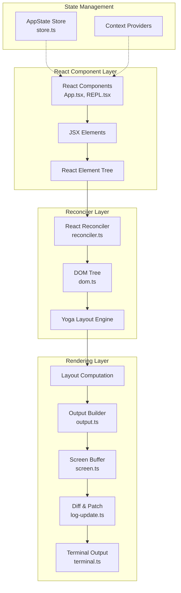

Claude Code 项目采用 **React + Ink** 架构构建终端用户界面，实现了类似 Web 应用的组件化开发体验，同时针对终端环境的特殊约束进行了深度优化。该架构将 React 的声明式编程模型与终端的高性能渲染相结合，通过自定义 React Reconciler、Yoga 布局引擎和双缓冲渲染机制，打造出响应流畅、功能丰富的交互式 CLI 应用。

## 核心架构设计

### 架构概览

React + Ink 终端 UI 的核心架构基于 **三层抽象模型**：React 组件层负责声明式 UI 定义，自定义 Reconciler 层管理组件树到终端 DOM 的映射，渲染引擎层处理布局计算和终端输出。这种分层设计使得业务逻辑与渲染实现解耦，同时保持了 React 生态的完整兼容性。

**React Reconciler 自定义渲染器**是该架构的核心创新。标准的 React 在 Web 环境中使用 ReactDOM 渲染器，将组件树转换为 DOM 节点；而 Ink 实现了专用的 Reconciler，将 React 组件树转换为终端专用的虚拟 DOM 结构（DOMElement 和 TextNode）。这种虚拟 DOM 不是浏览器的 HTML DOM，而是专门为终端渲染优化的数据结构，包含了样式信息、布局属性和 Yoga 布局节点的引用。

Sources: [reconciler.ts](src/ink/reconciler.ts#L1-L100)

### 双缓冲渲染机制

Ink 采用了 **双缓冲渲染（Double Buffering）** 技术来消除终端输出的闪烁问题。系统维护两个 Frame 对象：`frontFrame` 和 `backFrame`。`frontFrame` 保存当前显示在终端上的屏幕状态，`backFrame` 用于构建下一帧的内容。渲染流程如下：React 组件更新触发 Reconciler 的 commit 阶段，更新虚拟 DOM 树；Yoga 引擎计算布局，生成每个组件在终端中的精确位置和尺寸；渲染器遍历布局树，将内容写入 `backFrame` 的 Screen Buffer；Diff 算法比较 `frontFrame` 和 `backFrame` 的差异，生成最小化的 ANSI 转义序列；最终将差异应用到终端，并交换 `frontFrame` 和 `backFrame` 的引用。

这种双缓冲机制确保了终端内容的原子性更新：用户永远不会看到部分渲染的中间状态，每次屏幕更新都是完整的一帧。同时，Diff 算法只输出变化的单元格，大幅减少了终端写入的数据量，在高频率更新场景（如 spinner 动画、实时日志）中显著提升性能。

Sources: [ink.tsx](src/ink/ink.tsx#L45-L200)

### 状态管理模式

项目采用了 **极简的发布-订阅模式** 实现状态管理，而非使用 Redux 或 MobX 等第三方库。核心的 `createStore` 函数实现非常精简：维护一个状态对象和监听器集合，`setState` 方法接收更新函数，计算新状态，并在状态变化时通知所有订阅者。这种设计避免了复杂的状态管理库带来的学习成本和性能开销，同时完全兼容 React 的 Concurrent Mode 和批量更新机制。

`AppState` 是全局状态的顶层容器，包含了会话信息、消息列表、工具权限上下文、UI 状态等所有运行时数据。`AppStateProvider` 组件在组件树顶部提供状态访问，通过 React Context API 将 Store 实例传递给所有子组件。子组件通过 `useAppState` hook 订阅状态变化，当状态更新时自动重新渲染。

Sources: [store.ts](src/state/store.ts#L1-L35), [AppState.tsx](src/state/AppState.tsx#L1-L100)

## 渲染流程深度解析

### 组件树到终端输出的完整路径

渲染流程从 React 组件的更新开始，经过五个核心阶段的转换，最终输出到终端。首先是 **Reconciler 阶段**：React 组件的 state 或 props 变化触发更新，React 调度器启动 Reconciler 的工作循环。Reconciler 通过 `createInstance`、`appendChildNode` 等回调函数创建虚拟 DOM 节点，构建完整的组件树。每个 DOM 节点包含样式对象、事件处理器、Yoga 布局节点的引用等信息。

Sources: [reconciler.ts](src/ink/reconciler.ts#L95-L100)

接下来是 **布局计算阶段**：Yoga 引擎递归遍历组件树，根据 Flexbox 属性（flexDirection、flexGrow、alignItems 等）计算每个节点的位置和尺寸。Yoga 是 Facebook 开源的跨平台布局引擎，使用 C++ 实现并通过 WebAssembly 编译为 JavaScript，性能接近原生。布局计算的结果存储在每个节点的 `yogaNode` 属性中，包括 `getComputedLeft()`、`getComputedTop()`、`getComputedWidth()`、`getComputedHeight()` 等信息。

Sources: [dom.ts](src/ink/dom.ts#L1-L100)

然后是 **渲染阶段**：`renderNodeToOutput` 函数递归遍历布局树，将每个可见节点渲染到 Output 对象。Output 是一个操作收集器，记录所有的写入、裁剪、清除等操作。对于文本节点，调用 `wrapText` 进行自动换行处理，使用 Grapheme Segmenter 正确分割 Unicode 字符。对于 Box 节点，处理边框渲染、背景填充、滚动区域等特性。

Sources: [render-node-to-output.ts](src/ink/render-node-to-output.ts#L1-L100)

紧接着是 **Screen Buffer 构建**：Output 将收集的操作应用到 Screen Buffer。Screen 是一个二维数组，每个单元格存储字符值、样式 ID、超链接信息。为了优化内存使用，Screen 使用了三个对象池：`StylePool` 池化 ANSI 样式代码，`CharPool` 池化字符串，`HyperlinkPool` 池化超链接 URL。相同样式的单元格共享同一个样式 ID，避免重复存储 ANSI 转义序列。

Sources: [screen.ts](src/ink/screen.ts#L1-L120), [output.ts](src/ink/output.ts#L1-L100)

最后是 **Diff 和输出阶段**：LogUpdate 模块比较前后两帧的 Screen Buffer，生成最小化的 ANSI 转义序列。Diff 算法逐行比较，对于相同的行直接跳过，对于变化的行生成定位序列（CSI H）、样式序列和清除序列。最终通过 `writeDiffToTerminal` 函数将差异写入 stdout，触发终端的实际渲染。

### 性能优化策略

项目实施了多层次的性能优化，确保在终端环境下实现流畅的交互体验。**对象池化技术**通过 StylePool、CharPool、HyperlinkPool 三个池化器，显著减少了内存分配和垃圾回收的压力。StylePool 使用 Map 缓存样式序列，相同组合的样式只存储一份。CharPool 对 ASCII 字符使用 Int32Array 直接索引，避免 Map 查找的开销。

**增量渲染优化**基于脏节点标记机制：当组件更新时，只有受影响的节点被标记为 dirty。渲染器在渲染时跳过未标记的子树，直接从缓存的 Screen Buffer 中复制内容。结合 Yoga 布局的缓存机制，稳定状态下的帧渲染时间可控制在 10ms 以内。

**双缓冲的智能 Diff 算法**通过单元格级别的比较，而非字符级别，避免了大量字符串操作。Screen Buffer 将每个单元格的样式 ID 和字符 ID 存储为整数，比较整数相等性远快于比较字符串。同时，Diff 算法支持区域优化：对于连续变化的区域，生成批量清除和写入操作，减少 ANSI 转义序列的数量。

## 组件系统架构

### 基础组件设计

Ink 提供了一组基础组件，构建了终端 UI 的基石。**Box 组件**是布局的核心，类似于 Web 中的 `div` 元素，支持完整的 Flexbox 布局属性。Box 的实现通过 Yoga 引擎解析样式，计算子元素的排列。关键属性包括 flexDirection（控制子元素排列方向）、flexGrow 和 flexShrink（控制弹性伸缩）、flexWrap（控制换行行为）、padding 和 margin（控制间距）。

Box 组件还实现了交互功能：`tabIndex` 属性使组件可参与焦点循环，`onClick` 处理鼠标点击，`onMouseEnter` 和 `onMouseLeave` 实现悬停效果。这些交互特性依赖于终端的鼠标追踪模式，仅在 `<AlternateScreen>` 组件内部生效。

Sources: [Box.tsx](src/ink/components/Box.tsx#L1-L100)

**Text 组件**负责文本渲染，支持颜色、加粗、斜体、下划线等样式。Text 的关键特性是智能换行：`wrap` 属性控制换行策略，包括 "wrap"（自动换行）、"truncate"（截断）、"truncate-middle"（中间截断，保留首尾）。文本渲染时，首先使用 `stringWidth` 计算文本的显示宽度（考虑宽字符如中文占 2 列），然后根据容器宽度和 wrap 策略进行分割。

Sources: [Text.tsx](src/ink/components/Text.tsx#L1-L100)

**主题系统**通过 ThemeProvider 实现全局主题管理。ThemeProvider 维护当前主题设置，支持 "light"、"dark" 和 "auto" 三种模式。在 "auto" 模式下，系统监听终端的主题变化事件（通过 OSC 11 查询），动态切换配色方案。ThemedBox 和 ThemedText 组件根据当前主题选择语义化的颜色，如 "primary"、"secondary"、"success"、"error" 等，而非硬编码 ANSI 颜色代码。

Sources: [ThemeProvider.tsx](src/components/design-system/ThemeProvider.tsx#L1-L100)

### 业务组件层次

在基础组件之上，项目构建了丰富的业务组件库，遵循 **组件分层原则**。**容器组件**负责状态管理和数据获取，如 REPL.tsx 管理整个会话的生命周期，Messages.tsx 处理消息列表的虚拟滚动。**展示组件**专注于 UI 渲染，从 props 接收数据，如 Message.tsx 渲染单条消息，Spinner.tsx 显示加载动画。**交互组件**封装用户输入逻辑，如 PromptInput.tsx 处理文本输入、历史记录、自动补全，PermissionRequest.tsx 管理权限确认流程。

组件层次结构清晰体现了职责分离：顶层是 **App.tsx**，提供全局 Context（FpsMetricsProvider、StatsProvider、AppStateProvider）。中间层是 **屏幕组件**（REPL.tsx、ResumeConversation.tsx），管理页面级状态和生命周期。底层是 **UI 组件**（PromptInput、Messages、PermissionRequest），实现具体功能和交互。

Sources: [App.tsx](src/components/App.tsx#L1-L56), [REPL.tsx](src/screens/REPL.tsx#L1-L150)

## 交互处理机制

### 键盘输入处理

终端键盘输入的处理比 Web 环境复杂得多，需要处理原始的转义序列和特殊按键。**useInput hook** 是输入处理的核心接口，封装了终端的 raw mode 设置和事件监听。当 hook 激活时，调用 `setRawMode(true)` 将终端切换到原始模式，此时终端不再缓冲输入，应用程序直接接收每个按键的原始序列。

InputEvent 对象包含解析后的信息：`input` 是输入的字符或字符串，`key` 对象包含修饰键状态和特殊按键标识。例如，方向键会产生类似 `\x1b[A` 的转义序列，useInput 的解析器将其转换为 `{ upArrow: true }`。对于组合键，如 Ctrl+C，解析为 `{ ctrl: true, input: 'c' }`。

useInput 的实现特别注意了 **监听器顺序稳定性**：使用 `useEventCallback` 保持回调引用稳定，避免 isActive 状态变化导致监听器重新注册，从而破坏 `stopImmediatePropagation()` 的调用顺序。这确保了多个组件同时监听输入时，优先级的正确处理。

Sources: [use-input.ts](src/ink/hooks/use-input.ts#L1-L93)

### 鼠标交互与选择

在支持鼠标追踪的终端中，Ink 实现了完整的鼠标交互功能。**AlternateScreen 组件**激活终端的替代屏幕缓冲和鼠标追踪模式（DECSET 1003），在这种模式下，终端报告鼠标移动、点击、滚动等事件。App.tsx 中的 `handleMouseEvent` 处理所有鼠标事件，通过 `hit-test.ts` 模块的 `dispatchClick` 和 `dispatchHover` 函数，将屏幕坐标转换为组件事件。

文本选择功能模拟了原生终端的行为：用户按住鼠标左键拖动，创建文本选择区域。选择状态存储在 Ink 实例的 `selection` 对象中，包含锚点、焦点和选择范围。渲染时，`applySelectionOverlay` 在 Screen Buffer 上反转选择区域的颜色，产生高亮效果。用户按下 Ctrl+Shift+C 或 Cmd+C 时，`getSelectedText` 提取选中区域的纯文本内容，写入剪贴板。

Sources: [ink.tsx](src/ink/ink.tsx#L123-L145)

### 终端焦点管理

**FocusManager** 实现了类似 DOM 的焦点管理机制，支持 Tab 键循环焦点、程序化焦点设置、焦点事件冒泡。每个可聚焦组件（设置 tabIndex >= 0）在渲染时注册到焦点链表，FocusManager 维护当前焦点节点和焦点顺序。

焦点变化触发 `onFocus` 和 `onBlur` 事件，支持事件捕获和冒泡阶段。这实现了复杂的焦点依赖逻辑：例如，当对话框打开时，焦点自动移到对话框；关闭时恢复到之前的焦点位置。`useTerminalFocus` hook 监听终端窗口的焦点状态（通过终端的焦点事件报告），在终端失去焦点时暂停动画等高开销操作。

Sources: [focus.ts](src/ink/focus.js)

## 实际应用案例分析

### REPL 界面实现

REPL.tsx 是整个应用的核心界面，展示了 React + Ink 架构在实际场景中的应用。组件结构分为四层：顶层是 **全局 Context Provider**（KeybindingSetup、GlobalKeybindingHandlers），提供快捷键和全局事件处理；第二层是 **布局容器**（Box with flexDirection="column"），定义垂直布局结构；第三层是 **功能区组件**（Messages、PromptInput、StatusLine），分别处理消息显示、用户输入、状态栏；底层是 **浮动层组件**（PermissionRequest、Dialog），通过绝对定位叠加在主界面上。

REPL 组件管理复杂的状态交互：消息列表通过 `useAppState` 订阅全局状态，响应式更新；用户输入通过 `PromptInput` 组件处理，支持多行输入、历史记录、自动补全；权限请求通过 `PermissionRequest` 组件展示，用户确认后触发工具执行。所有这些状态变化都通过 React 的状态管理和生命周期钩子协调，确保 UI 的一致性。

Sources: [REPL.tsx](src/screens/REPL.tsx#L1-L150)

### PromptInput 组件解析

PromptInput 是一个高度复杂的交互组件，实现了智能输入体验。组件内部状态包括输入缓冲区（支持多行）、光标位置、历史记录索引、自动补全候选等。**输入缓冲管理**使用 `useInputBuffer` hook，实现类似文本编辑器的功能：插入字符、删除字符、换行处理、光标移动。

**历史记录系统**通过 `useArrowKeyHistory` hook 实现：上箭头键导航历史记录，下箭头键回到最新输入。历史记录存储在文件系统中，支持跨会话持久化。**自动补全功能**通过 `useTypeahead` hook 实现：根据输入上下文提供文件路径、命令、MCP 服务器等补全建议，使用模糊匹配算法。

**特殊触发器**是 PromptInput 的亮点功能：输入 `@` 符号触发文件选择器，输入 `/` 触发命令菜单，输入 `#` 触发思考模式。这些触发器通过检测输入字符和光标位置，动态激活对应的 UI 模式，提供上下文相关的操作入口。所有交互逻辑都封装在自定义 hooks 中，保持组件代码的清晰和可测试性。

Sources: [PromptInput.tsx](src/components/PromptInput/PromptInput.tsx#L1-L100)

## 架构优势与权衡

React + Ink 架构在终端环境下展现了显著优势：**组件化开发模型**使得复杂的 UI 可以分解为可复用的组件，降低了维护成本；**声明式编程范式**通过描述 UI 应该是什么样子，而非如何更新，减少了状态管理的复杂度；**生态系统兼容性**允许使用 React 的工具链、调试工具和类型系统，提升开发效率。

然而，该架构也面临 **终端环境的特殊约束**：**有限的渲染能力**（只有文本和 ANSI 颜色，无图形元素）限制了 UI 的表现力；**性能敏感性**要求每个渲染帧控制在毫秒级，任何性能退化都会立即被用户感知；**终端兼容性问题**需要处理不同终端模拟器的行为差异，增加了测试和维护成本。

项目通过精心设计的架构平衡了这些因素：渲染引擎针对性能进行极致优化，组件系统提供足够抽象层次，同时保持对底层能力的访问。这使得 Claude Code 能够在终端环境中实现媲美桌面应用的交互体验，同时保持 CLI 工具的轻量和高效。