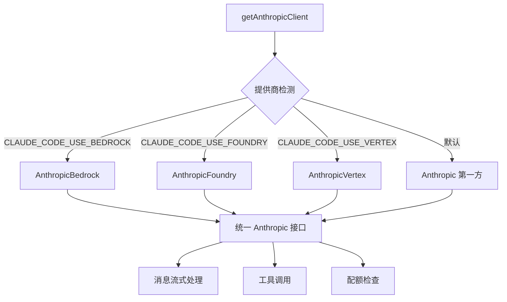
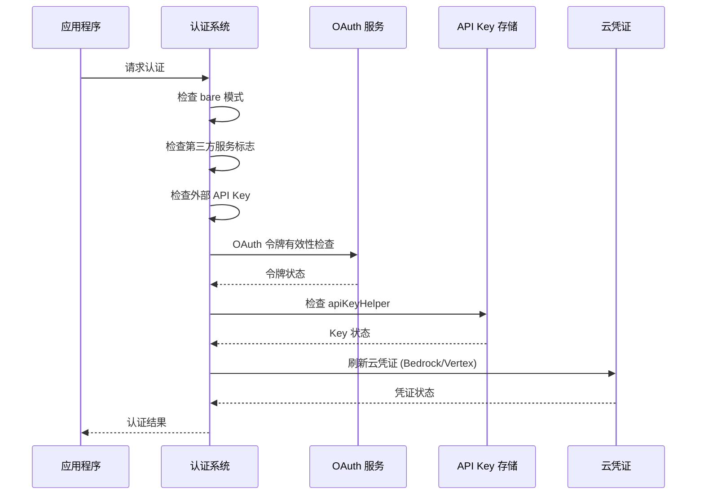
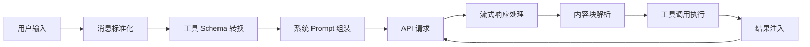
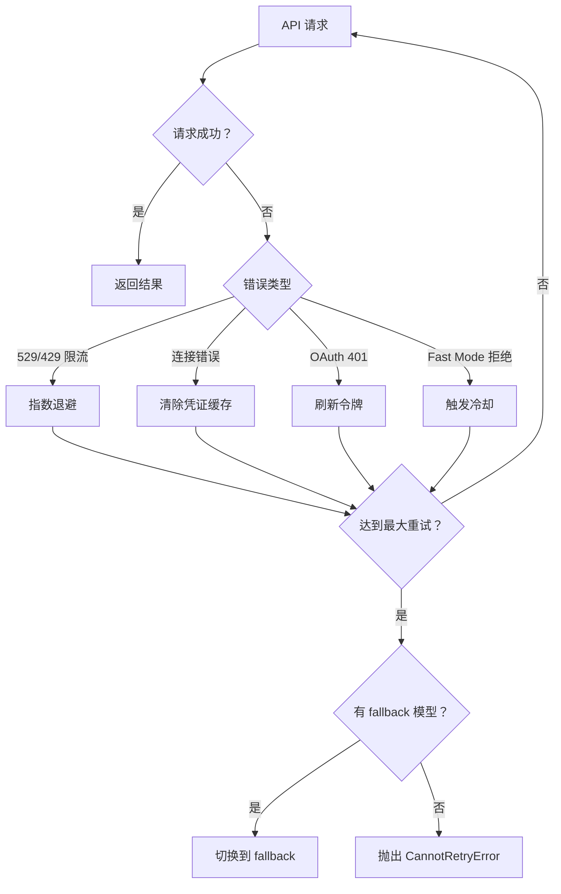
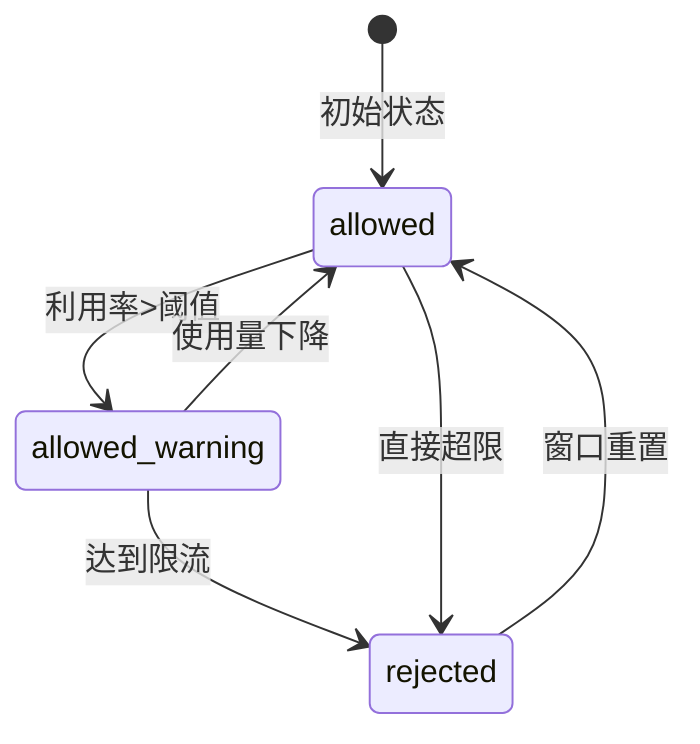

本文档深入解析 Claude Code 项目与 Anthropic SDK 的集成架构，涵盖 API 客户端设计、多提供商支持、认证机制、消息处理流程、错误恢复策略及限流管理。理解这一层对于扩展 API 功能、调试集成问题或实现自定义 API 行为至关重要。

## API 客户端架构

Claude Code 采用**多态客户端架构**，通过统一的接口抽象支持多种 AI 服务提供商。核心客户端工厂位于 [`client.ts`](src/services/api/client.ts#L88-L190)，根据环境变量动态选择底层 SDK 实现。



客户端配置包含以下关键要素：

| 配置项 | 说明 | 默认值 |
|--------|------|--------|
| `defaultHeaders` | 自定义请求头，包含会话 ID 和应用标识 | `x-app: cli` |
| `maxRetries` | 最大重试次数 | 10 |
| `timeout` | 请求超时时间 | 600000ms (10 分钟) |
| `dangerouslyAllowBrowser` | 允许浏览器环境 | `true` |
| `fetchOptions` | 代理配置选项 | 根据环境配置 |

Sources: [client.ts](src/services/api/client.ts#L88-L152)

## 多 API 提供商支持

系统支持四种 API 提供商，通过环境变量进行切换：

### 提供商检测逻辑

[`providers.ts`](src/utils/model/providers.ts#L6-L14) 实现了提供商检测的核心逻辑：

```typescript
export function getAPIProvider(): APIProvider {
  return isEnvTruthy(process.env.CLAUDE_CODE_USE_BEDROCK)
    ? 'bedrock'
    : isEnvTruthy(process.env.CLAUDE_CODE_USE_VERTEX)
      ? 'vertex'
      : isEnvTruthy(process.env.CLAUDE_CODE_USE_FOUNDRY)
        ? 'foundry'
        : 'firstParty'
}
```

### 各提供商配置对比

| 提供商 | 环境变量 | 认证方式 | 区域配置 |
|--------|----------|----------|----------|
| **第一方 Anthropic** | 无（默认） | OAuth / API Key | `ANTHROPIC_BASE_URL` |
| **AWS Bedrock** | `CLAUDE_CODE_USE_BEDROCK` | AWS 凭证 | `AWS_REGION` / `ANTHROPIC_SMALL_FAST_MODEL_AWS_REGION` |
| **Azure Foundry** | `CLAUDE_CODE_USE_FOUNDRY` | API Key / Azure AD | `ANTHROPIC_FOUNDRY_RESOURCE` |
| **Google Vertex** | `CLAUDE_CODE_USE_VERTEX` | GCP 凭证 | `CLOUD_ML_REGION` / `VERTEX_REGION_*` |

Sources: [providers.ts](src/utils/model/providers.ts#L1-L41) [client.ts](src/services/api/client.ts#L32-L71)

## 认证机制

认证系统位于 [`auth.ts`](src/utils/auth.ts#L100-L149)，支持多种认证方式的自动检测和切换。

### 认证优先级链



### 认证源检测

系统按以下优先级检测认证源：

1. **Bare 模式**：仅允许 `apiKeyHelper`，忽略 OAuth
2. **环境变量**：`ANTHROPIC_AUTH_TOKEN`
3. **远程会话**：`CLAUDE_CODE_OAUTH_TOKEN`
4. **文件描述符**：`CLAUDE_CODE_OAUTH_TOKEN_FILE_DESCRIPTOR`
5. **配置助手**：`apiKeyHelper` 配置
6. **Keychain**：macOS 钥匙串存储
7. **云凭证**：AWS/GCP 自动凭证发现

Sources: [auth.ts](src/utils/auth.ts#L100-L200)

## 消息处理流程

消息处理是 API 集成的核心，涉及消息标准化、工具 schema 转换和响应解析。

### 消息流向



### 工具 Schema 转换

[`api.ts`](src/utils/api.ts#L119-L200) 中的 `toolToAPISchema` 函数负责将内部工具定义转换为 Anthropic API 格式：

| 转换步骤 | 说明 |
|----------|------|
| Schema 缓存 | 基于工具名和输入 schema 生成缓存键，防止 mid-session 变化 |
| Swarm 字段过滤 | 当 Agent Swarms 未启用时，过滤相关字段 |
| Strict 模式 | 根据 feature flag 和模型能力添加 `strict: true` |
| 流式优化 | 对直连 API 启用 `eager_input_streaming` |
| 缓存控制 | 添加 `cache_control` 用于 prompt 缓存优化 |

Sources: [api.ts](src/utils/api.ts#L119-L200) [messages.ts](src/utils/messages.ts#L1-L200)

## 错误处理与重试机制

系统实现了分层的错误处理策略，包括错误分类、智能重试和降级回退。

### 错误分类体系

[`errors.ts`](src/services/api/errors.ts#L54-L198) 定义了多种错误类型：

| 错误类型 | 识别模式 | 处理策略 |
|----------|----------|----------|
| **Prompt Too Long** | `prompt is too long: X tokens > Y` | 触发 compact |
| **Media Size Error** | `image exceeds maximum` / PDF 限制 | 剥离媒体后重试 |
| **Invalid API Key** | `Not logged in` | 提示 `/login` |
| **OAuth Token Revoked** | `OAuth token revoked` | 提示重新认证 |
| **Org Disabled** | `disabled organization` | 提示更新环境变量 |
| **529 Overloaded** | HTTP 529 状态码 | 指数退避重试 |

### 重试机制设计

[`withRetry.ts`](src/services/api/withRetry.ts#L170-L200) 实现了智能重试：



### 重试配置参数

| 参数 | 默认值 | 说明 |
|------|--------|------|
| `DEFAULT_MAX_RETRIES` | 10 | 最大重试次数 |
| `MAX_529_RETRIES` | 3 | 529 错误最大重试次数 |
| `BASE_DELAY_MS` | 500 | 基础延迟毫秒 |
| `PERSISTENT_MAX_BACKOFF_MS` | 300000 | 持久重试最大退避 (5 分钟) |

Sources: [withRetry.ts](src/services/api/withRetry.ts#L52-L125) [errors.ts](src/services/api/errors.ts#L54-L198)

## 限流与配额管理

[`claudeAiLimits.ts`](src/services/claudeAiLimits.ts#L122-L197) 实现了复杂的限流检测和配额管理系统。

### 限流类型

| 限流类型 | 标识 | 说明 |
|----------|------|------|
| `five_hour` | 5h | 5 小时会话限流 |
| `seven_day` | 7d | 7 天周期限流 |
| `seven_day_opus` | - | Opus 模型专属限流 |
| `seven_day_sonnet` | - | Sonnet 模型专属限流 |
| `overage` | - | 额外使用量限流 |

### 配额状态流转



### 早期预警机制

系统实现了基于利用率的早期预警：

| 限流窗口 | 阈值配置 | 触发条件 |
|----------|----------|----------|
| **5 小时** | 利用率 90% + 时间进度 72% | 快速消耗警告 |
| **7 天** | 利用率 75%/50%/25% + 时间进度 60%/35%/15% | 多级预警 |

Sources: [claudeAiLimits.ts](src/services/claudeAiLimits.ts#L53-L143)

## API 日志与遥测

[`logging.ts`](src/services/api/logging.ts#L171-L200) 实现了完整的 API 查询日志和遥测系统。

### 日志事件类型

| 事件名 | 触发时机 | 关键指标 |
|--------|----------|----------|
| `tengu_api_query` | 请求发送前 | 模型、消息数、temperature |
| `tengu_api_success` | 请求成功 | 输入/输出 tokens、延迟 |
| `tengu_api_error` | 请求失败 | 错误类型、状态码 |
| `tengu_api_duration` | 请求完成 | 总耗时、首 token 时间 |

### 网关检测

系统自动检测 AI 网关并记录：

```typescript
const GATEWAY_FINGERPRINTS = {
  litellm: { prefixes: ['x-litellm-'] },
  helicone: { prefixes: ['helicone-'] },
  portkey: { prefixes: ['x-portkey-'] },
  cloudflare-ai-gateway: { prefixes: ['cf-aig-'] },
  kong: { prefixes: ['x-kong-'] },
  braintrust: { prefixes: ['x-bt-'] },
}
```

Sources: [logging.ts](src/services/api/logging.ts#L66-L139)

## 远程会话消息适配

[`sdkMessageAdapter.ts`](src/remote/sdkMessageAdapter.ts#L28-L140) 处理 CCR（Claude Code Remote）后端与本地 REPL 之间的消息格式转换。

### 消息类型映射

| SDK 消息类型 | REPL 消息类型 | 转换逻辑 |
|--------------|---------------|----------|
| `SDKAssistantMessage` | `AssistantMessage` | 直接映射内容块 |
| `SDKPartialAssistantMessage` | `StreamEvent` | 提取流式事件 |
| `SDKResultMessage` | `SystemMessage` | 根据 subtype 转换 |
| `SDKToolProgressMessage` | `SystemMessage` | 格式化为进度提示 |
| `SDKCompactBoundaryMessage` | `SystemCompactBoundaryMessage` | 转换 compact 元数据 |

Sources: [sdkMessageAdapter.ts](src/remote/sdkMessageAdapter.ts#L28-L140)

## Beta 功能与特性标志

系统通过 beta headers 和 feature flags 控制实验性功能：

### 常用 Beta Headers

| Header | 用途 | 启用条件 |
|--------|------|----------|
| `prompt-caching-2024-07-31` | Prompt 缓存 | 默认启用 |
| `context-management-2025-06-18` | 上下文管理 | 订阅用户 |
| `effort-2025-05-22` | Effort 级别控制 | 支持模型 |
| `fast-mode-2025-04-29` | Fast Mode | 订阅用户 |
| `thinking-2025-05-22` | Thinking 模式 | 支持模型 |
| `structured-outputs-2025-04-29` | 结构化输出 | 支持模型 |

Sources: [betas.ts](src/utils/betas.ts#L1-L100) [claude.ts](src/services/api/claude.ts#L134-L143)

## 最佳实践与调试建议

### 调试 API 问题

1. **启用调试日志**：设置 `CLAUDE_CODE_DEBUG=1` 查看详细 API 交互
2. **检查认证源**：运行 `/status` 命令查看当前认证状态
3. **验证提供商配置**：检查环境变量是否正确设置
4. **监控限流状态**：观察状态栏的配额指示器

### 性能优化

| 优化项 | 方法 | 预期收益 |
|--------|------|----------|
| **Prompt 缓存** | 保持系统 prompt 稳定 | 减少 50-80% 延迟 |
| **工具 Schema 缓存** | 避免 mid-session 变化 | 减少请求大小 |
| **连接复用** | 保持长连接 | 减少握手开销 |
| **批量工具调用** | 合并相关工具 | 减少 round-trips |

### 常见问题排查

| 问题 | 可能原因 | 解决方案 |
|------|----------|----------|
| 401 错误 | OAuth 令牌过期 | 运行 `/login` |
| 529 错误 | API 过载 | 等待或切换到 Sonnet |
| Prompt too long | 上下文超限 | 运行 `/compact` |
| Invalid API key | Key 错误或组织禁用 | 检查环境变量 |

---

**下一步阅读**：
- [MCP（模型上下文协议）集成](12-mcp-mo-xing-shang-xia-wen-xie-yi-ji-cheng) — 了解如何扩展工具系统
- [权限系统与安全控制](13-quan-xian-xi-tong-yu-an-quan-kong-zhi) — 深入理解工具调用权限
- [远程会话与 Bridge 模式](23-yuan-cheng-hui-hua-yu-bridge-mo-shi) — 探索分布式执行架构