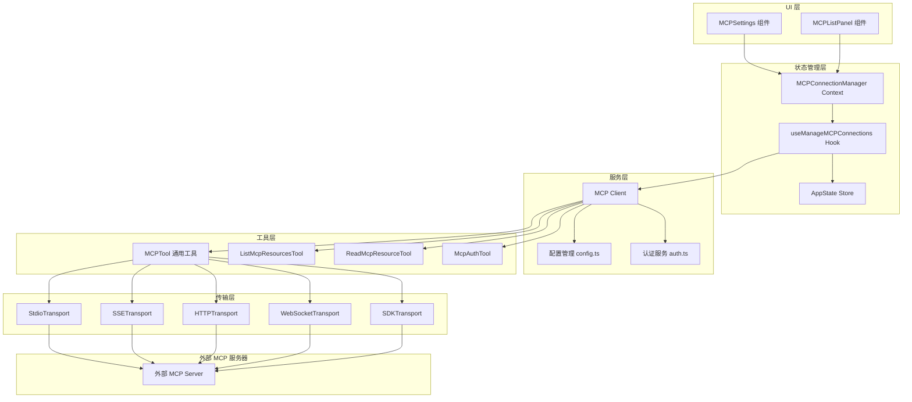
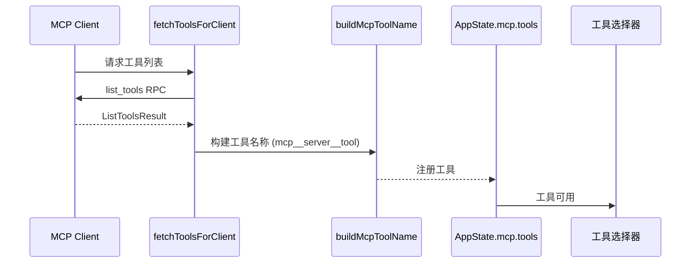
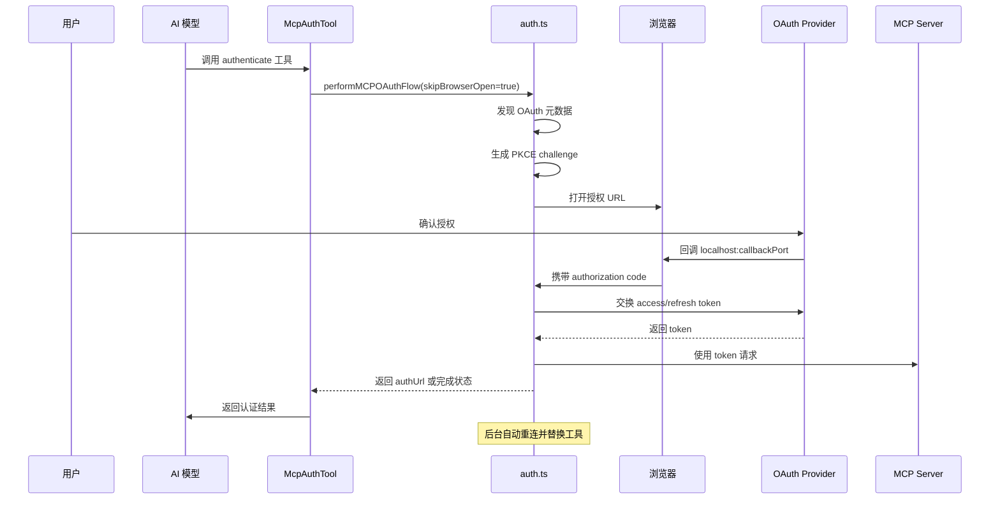
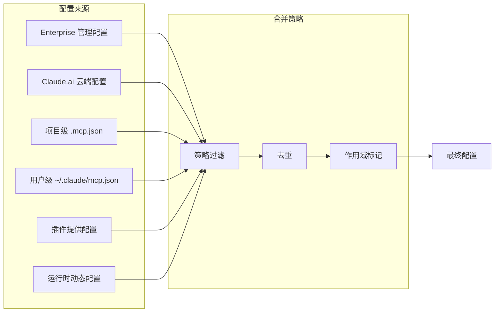

本文档深入解析 Claude Code 中 **MCP（Model Context Protocol，模型上下文协议）** 的集成架构与实现机制。MCP 是 Anthropic 定义的开放协议，用于标准化 AI 模型与外部工具/数据源之间的交互。本文档面向高级开发者，涵盖连接管理、工具暴露、资源访问、认证流程等核心模块。

## 架构总览

MCP 集成采用分层架构设计，从底层的传输协议到上层的 React 状态管理形成完整的数据流：



**核心设计原则**：
- **传输抽象**：通过 `@modelcontextprotocol/sdk` 统一多种传输协议
- **连接池管理**：LRU 缓存 + 自动重连机制
- **工具动态注册**：服务器连接后动态暴露工具到 AppState
- **认证解耦**：OAuth 流程独立于工具调用，支持静默认证

Sources: [client.ts](src/services/mcp/client.ts#L1-L100), [types.ts](src/services/mcp/types.ts#L1-L100), [MCPConnectionManager.tsx](src/services/mcp/MCPConnectionManager.tsx#L1-L73)

## 传输协议支持

MCP 客户端支持多种传输协议，每种协议对应不同的使用场景和配置方式：

| 传输类型 | 配置 Schema | 适用场景 | 关键特性 |
|---------|------------|---------|---------|
| `stdio` | McpStdioServerConfig | 本地进程通信 | 通过子进程启动服务器，支持 env 环境变量注入 |
| `sse` | McpSSEServerConfig | 远程服务器 | Server-Sent Events，支持 OAuth 认证 |
| `http` | McpHTTPServerConfig | 流式 HTTP | Streamable HTTP 协议，支持 OAuth |
| `ws` | McpWebSocketServerConfig | WebSocket 连接 | 双向通信，支持自定义 headers |
| `sse-ide` | McpSSEIDEServerConfig | IDE 集成 | 内部专用，携带 ideName 标识 |
| `ws-ide` | McpWebSocketIDEServerConfig | IDE WebSocket | 内部专用，支持 authToken |
| `sdk` | McpSdkServerConfig | SDK 内置服务器 | 直接暴露内部工具为 MCP 工具 |
| `claudeai-proxy` | McpClaudeAIProxyServerConfig | Claude.ai 代理 | 通过 CCR 代理访问云端 MCP |

**配置示例（stdio 类型）**：
```typescript
{
  type: "stdio",
  command: "node",
  args: ["./mcp-server.js"],
  env: { API_KEY: "xxx" }
}
```

**配置示例（SSE 类型）**：
```typescript
{
  type: "sse",
  url: "https://mcp.example.com/sse",
  headers: { "Authorization": "Bearer xxx" },
  oauth: {
    clientId: "xxx",
    callbackPort: 8888
  }
}
```

Sources: [types.ts](src/services/mcp/types.ts#L20-L150), [config.ts](src/services/mcp/config.ts#L1-L100)

## 连接生命周期管理

### 连接状态机

MCP 服务器连接经历以下状态流转：

```mermaid
stateDiagram-v2
    [*] --> disabled: 配置加载
    disabled --> connecting: 启用服务器
    connecting --> connected: 连接成功
    connecting --> failed: 连接失败
    connected --> needs-auth: 收到 401
    connected --> failed: 连接断开
    failed --> connecting: 重试/手动重连
    needs-auth --> connecting: 完成认证
    connected --> disabled: 用户禁用
```

### 核心连接管理流程

`useManageMCPConnections` Hook 是连接管理的核心，负责：

1. **配置加载**：从多源（global/project/enterprise/claudeai）合并 MCP 配置
2. **连接初始化**：根据配置创建 Client 实例并建立连接
3. **工具/资源/命令发现**：连接成功后获取服务器能力并注册到 AppState
4. **通知处理**：监听 `tools/list_changed`、`resources/list_changed` 等通知
5. **自动重连**：SSE 连接断开时指数退避重连（最大 5 次，初始 1s，最大 30s）

```typescript
// 连接管理核心逻辑摘要
export function useManageMCPConnections(
  dynamicMcpConfig,
  isStrictMcpConfig
) {
  // 1. 监听配置变化
  useEffect(() => {
    // 2. 过滤被策略禁用的服务器
    const filtered = filterMcpServersByPolicy(...)
    // 3. 去重 claude.ai 服务器
    const deduped = dedupClaudeAiMcpServers(...)
    // 4. 建立/更新连接
    initializeConnections(deduped)
  }, [dynamicMcpConfig, _pluginReconnectKey])
  
  // 5. 暴露重连和切换接口
  return { reconnectMcpServer, toggleMcpServer }
}
```

Sources: [useManageMCPConnections.ts](src/services/mcp/useManageMCPConnections.ts#L100-L200), [client.ts](src/services/mcp/client.ts#L200-L400)

### 连接缓存与失效

`ensureConnectedClient` 函数使用 `memoizeWithLRU` 缓存连接实例，缓存失效触发条件：

- 收到 `onclose` 事件
- 收到 `resources/list_changed` 通知
- 收到 `tools/list_changed` 通知
- 会话过期（404 + JSON-RPC code -32001）

```typescript
// 会话过期检测
export function isMcpSessionExpiredError(error: Error): boolean {
  const httpStatus = 'code' in error ? error.code : undefined
  if (httpStatus !== 404) return false
  // MCP servers return: {"error":{"code":-32001,"message":"Session not found"}}
  return String(error).includes('"code":-32001')
}
```

Sources: [client.ts](src/services/mcp/client.ts#L130-L160), [useManageMCPConnections.ts](src/services/mcp/useManageMCPConnections.ts#L200-L300)

## 工具系统暴露机制

### 动态工具注册

MCP 服务器连接成功后，其提供的工具会动态注册到全局工具池：



**工具命名规范**：`mcp__{serverName}__{toolName}`

这种前缀设计使得：
- 工具来源可追溯
- 服务器禁用时可批量移除（`reject(tools, t => t.name.startsWith(prefix))`）
- 避免与内置工具命名冲突

### MCPTool 核心实现

`MCPTool` 是调用 MCP 工具的通用包装器，其关键特性：

```typescript
export const MCPTool = buildTool({
  isMcp: true,
  name: 'mcp',  // 运行时被覆盖为实际工具名
  maxResultSizeChars: 100_000,
  async call() { /* 实际调用逻辑在 mcpClient.ts 中注入 */ },
  renderToolUseMessage,
  renderToolResultMessage,
  // ...
})
```

**结果处理流程**：
1. 调用 `client.request({ method: 'tools/call', params: { name, arguments } })`
2. 解析 `CallToolResultSchema`
3. 处理二进制内容（保存到磁盘，返回路径）
4. 截断超大输出（`truncateMcpContentIfNeeded`）
5. 持久化工具结果（`persistToolResult`）

Sources: [MCPTool.ts](src/tools/MCPTool/MCPTool.ts#L1-L78), [client.ts](src/services/mcp/client.ts#L400-L600)

## 资源访问机制

MCP 资源是服务器暴露的只读数据源（如文档、数据库记录、API 响应）。系统提供两个专用工具：

### ListMcpResourcesTool

列出所有可用资源，支持按服务器过滤：

```typescript
// 输入 Schema
z.object({
  server: z.string().optional().describe('Optional server name to filter')
})

// 输出 Schema
z.array(z.object({
  uri: z.string(),
  name: z.string(),
  mimeType: z.string().optional(),
  description: z.string().optional(),
  server: z.string()
}))
```

**缓存策略**：`fetchResourcesForClient` 使用 LRU 缓存，在以下情况失效：
- 连接关闭
- 收到 `resources/list_changed` 通知

Sources: [ListMcpResourcesTool.ts](src/tools/ListMcpResourcesTool/ListMcpResourcesTool.ts#L1-L124)

### ReadMcpResourceTool

读取指定 URI 的资源内容，支持文本和二进制：

```typescript
// 输入 Schema
z.object({
  server: z.string().describe('The MCP server name'),
  uri: z.string().describe('The resource URI to read')
})

// 二进制处理逻辑
if ('blob' in c) {
  const persisted = await persistBinaryContent(
    Buffer.from(c.blob, 'base64'),
    c.mimeType,
    persistId
  )
  return { blobSavedTo: persisted.filepath, ... }
}
```

**二进制内容处理**：
- Base64 解码为 Buffer
- 根据 MIME 类型生成文件扩展名
- 保存到临时目录
- 返回文件路径而非 base64 字符串（避免污染上下文）

Sources: [ReadMcpResourceTool.ts](src/tools/ReadMcpResourceTool/ReadMcpResourceTool.ts#L1-L159), [mcpOutputStorage.ts](src/utils/mcpOutputStorage.ts#L1-L100)

## OAuth 认证流程

MCP 支持 RFC 8628 标准的 OAuth 2.0 授权流程，主要用于 SSE/HTTP 传输的远程服务器。

### 认证架构



### 核心认证组件

| 组件 | 职责 |
|-----|------|
| `ClaudeAuthProvider` | 实现 `OAuthClientProvider` 接口，管理 token 存储 |
| `performMCPOAuthFlow` | 执行完整 OAuth 流程，包括发现、授权、token 交换 |
| `McpAuthTool` | 伪工具，触发认证流程并返回授权 URL |
| `xaa.ts` | Cross-App Access (XAA) 实现，支持企业 IdP 集成 |

### Token 刷新机制

```typescript
// 刷新失败原因追踪（用于分析）
type MCPRefreshFailureReason =
  | 'metadata_discovery_failed'
  | 'no_client_info'
  | 'no_tokens_returned'
  | 'invalid_grant'
  | 'transient_retries_exhausted'
  | 'request_failed'

// 非标准错误代码归一化（Slack 等）
const NONSTANDARD_INVALID_GRANT_ALIASES = new Set([
  'invalid_refresh_token',
  'expired_refresh_token',
  'token_expired',
])
```

**刷新策略**：
- 收到 401 时自动刷新
- `invalid_grant` 错误使 token 失效，需重新认证
- 指数退避重试（最多 5 次）

Sources: [auth.ts](src/services/mcp/auth.ts#L1-L200), [McpAuthTool.ts](src/tools/McpAuthTool/McpAuthTool.ts#L1-L150)

## 配置系统

### 配置来源优先级

MCP 配置从多个来源合并，优先级如下：



### 配置作用域类型

```typescript
type ConfigScope = 
  | 'local'      // 当前工作目录
  | 'user'       // 用户全局
  | 'project'    // 项目级
  | 'dynamic'    // 运行时动态添加
  | 'enterprise' // 企业管理
  | 'claudeai'   // Claude.ai 云端
  | 'managed'    // 策略管理
```

### 策略控制

企业环境可通过策略限制 MCP 服务器：

```typescript
// 策略过滤逻辑
function filterMcpServersByPolicy(
  servers: Record<string, ScopedMcpServerConfig>,
  policy: McpPolicy
): Record<string, ScopedMcpServerConfig> {
  // 1. 检查 allowlist
  // 2. 检查 blocklist
  // 3. 检查 channel 权限
  // 4. 检查 plugin-only 限制
}
```

Sources: [config.ts](src/services/mcp/config.ts#L100-L300), [types.ts](src/services/mcp/types.ts#L1-L30)

## 命令系统

`/mcp` 命令提供交互式服务器管理：

| 子命令 | 参数 | 功能 |
|-------|------|------|
| `/mcp` | 无 | 打开 MCP 设置界面 |
| `/mcp enable` | [server-name] | 启用服务器（默认全部） |
| `/mcp disable` | [server-name] | 禁用服务器（默认全部） |
| `/mcp reconnect` | server-name | 强制重连指定服务器 |
| `/mcp no-redirect` | 无 | 绕过重定向（测试用） |

**命令实现流程**：
```typescript
export async function call(onDone, _context, args) {
  if (args) {
    const parts = args.trim().split(/\s+/)
    if (parts[0] === 'enable' || parts[0] === 'disable') {
      return <MCPToggle action={parts[0]} target={...} onComplete={onDone} />
    }
    if (parts[0] === 'reconnect' && parts[1]) {
      return <MCPReconnect serverName={parts[1]} onComplete={onDone} />
    }
  }
  return <MCPSettings onComplete={onDone} />
}
```

Sources: [mcp.tsx](src/commands/mcp/mcp.tsx#L1-L85), [index.ts](src/commands/mcp/index.ts#L1-L13)

## MCP 服务器模式（作为服务端）

Claude Code 还可作为 MCP 服务器被其他客户端调用，通过 `entrypoints/mcp.ts` 实现：

```typescript
export async function startMCPServer(cwd, debug, verbose) {
  const server = new Server(
    { name: 'claude/tengu', version: MACRO.VERSION },
    { capabilities: { tools: {} } }
  )
  
  // 暴露工具列表
  server.setRequestHandler(ListToolsRequestSchema, async () => {
    const tools = getTools(toolPermissionContext)
    return { tools: await Promise.all(tools.map(...)) }
  })
  
  // 处理工具调用
  server.setRequestHandler(CallToolRequestSchema, async ({ params }) => {
    const tool = findToolByName(tools, name)
    const result = await tool.call(args, toolUseContext, ...)
    return { content: [{ type: 'text', text: jsonStringify(result.data) }] }
  })
  
  const transport = new StdioServerTransport()
  await server.connect(transport)
}
```

**使用场景**：
- 在 IDE 插件中嵌入 Claude Code 工具能力
- 作为其他 AI 系统的工具后端
- 构建工具编排管道

Sources: [mcp.ts](src/entrypoints/mcp.ts#L1-L197)

## 错误处理与诊断

### 错误类型层次

```typescript
// 认证错误
class McpAuthError extends Error {
  serverName: string
}

// 会话过期
class McpSessionExpiredError extends Error {
  // 触发条件：404 + JSON-RPC code -32001
}

// 工具调用错误
class McpToolCallError extends TelemetrySafeError {
  mcpMeta?: { _meta?: Record<string, unknown> }
}
```

### 诊断日志

```typescript
// 调试日志
logMCPDebug(serverName, 'OAuth complete, reconnected with N tool(s)')

// 错误日志
logMCPError(serverName, errorMessage(error))

// 遥测事件
logEvent('tengu_mcp_oauth_refresh_failure', {
  reason: 'invalid_grant',
  serverName,
  transport
})
```

Sources: [client.ts](src/services/mcp/client.ts#L100-L180), [auth.ts](src/services/mcp/auth.ts#L50-L100)

## 与相关模块的集成关系

| 模块 | 集成点 | 说明 |
|-----|-------|------|
| [技能系统与插件架构](20-ji-neng-xi-tong-yu-cha-jian-jia-gou) | 插件可提供 MCP 服务器配置 | 插件通过 `getPluginMcpServers` 注入配置 |
| [权限系统与安全控制](13-quan-xian-xi-tong-yu-an-quan-kong-zhi) | 工具权限检查 | MCP 工具调用前经过 `checkPermissions` |
| [应用状态管理架构](9-ying-yong-zhuang-tai-guan-li-jia-gou) | AppState.mcp | 存储 clients/tools/commands/resources |
| [工具系统设计与编排](5-gong-ju-xi-tong-she-ji-yu-bian-pai) | 工具池注册 | MCP 工具动态加入全局工具池 |

## 最佳实践

### 开发 MCP 服务器

1. **遵循协议规范**：使用官方 `@modelcontextprotocol/sdk`
2. **实现健康检查**：暴露 `/health` 端点（SSE/HTTP）
3. **合理设置超时**：工具调用建议 < 30s
4. **错误元数据**：在 `_meta` 中携带调试信息

### 配置管理

1. **敏感信息**：使用 env 变量而非硬编码
2. **项目级配置**：将 `.mcp.json` 加入 `.gitignore`（如含密钥）
3. **版本控制**：提交不含敏感信息的配置模板

### 调试技巧

1. **启用调试日志**：设置 `DEBUG=mcp` 环境变量
2. **检查连接状态**：`/mcp` 查看服务器状态
3. **手动重连**：`/mcp reconnect <server>` 强制刷新
4. **查看工具列表**：调用 `listMcpResources` 验证连接

---

**下一步阅读**：
- 深入工具实现：[工具系统设计与编排](5-gong-ju-xi-tong-she-ji-yu-bian-pai)
- 开发自定义服务器：[MCP 服务器开发](29-mcp-fu-wu-qi-kai-fa)
- 插件集成：[技能系统与插件架构](20-ji-neng-xi-tong-yu-cha-jian-jia-gou)