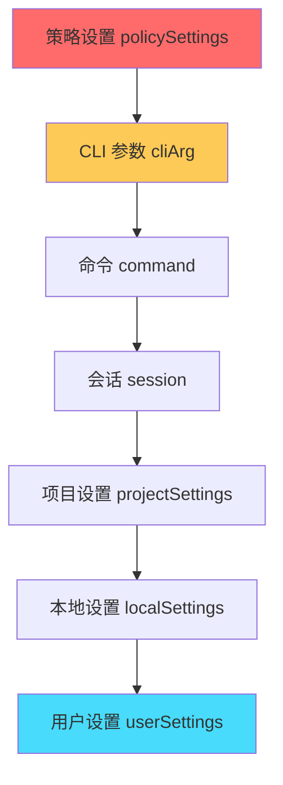
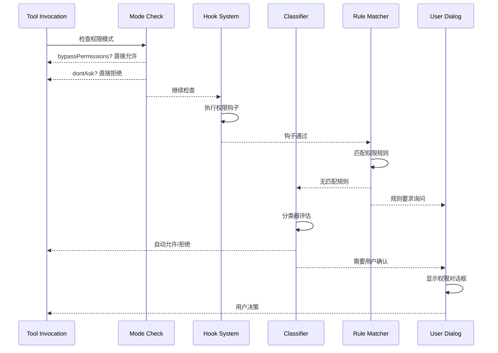
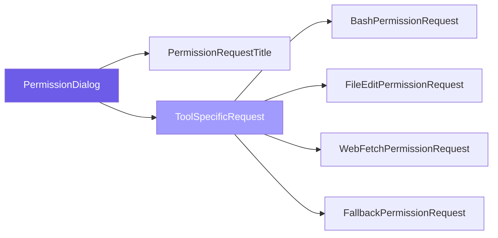

权限系统是 Claude Code 的核心安全机制，负责在执行潜在危险操作前进行用户确认和策略控制。该系统采用多层次架构，结合**规则匹配**、**分类器自动决策**和**交互式确认**三种机制，在保证安全性的同时优化用户体验。

## 权限模式与行为

系统定义了六种权限模式，每种模式对应不同的自动化级别：

| 模式 | 符号 | 说明 | 适用场景 |
|------|------|------|----------|
| `default` | - | 默认模式，所有危险操作需确认 | 日常开发 |
| `plan` | ⏸️ | 计划模式，仅生成计划不执行 | 方案评审 |
| `acceptEdits` | ⏵⏵ | 自动接受当前工作目录内的编辑 | 可信项目 |
| `bypassPermissions` | ⏵⏵ | 绕过所有权限检查（红色警告） | 完全信任环境 |
| `dontAsk` | ⏵⏵ | 不询问直接拒绝危险操作 | 只读场景 |
| `auto` | ⏵⏵ | 自动模式，使用分类器智能决策 | Anthropic 内部 |

Sources: [PermissionMode.ts](src/utils/permissions/PermissionMode.ts#L35-L85)

权限行为分为三种基本类型：`allow`（允许）、`deny`（拒绝）、`ask`（询问）。这些行为可以配置为不同作用域：用户设置、项目设置、本地设置、策略设置、CLI 参数、命令或会话级别。

Sources: [permissions.ts](src/types/permissions.ts#L23-L28)

## 权限规则系统

### 规则格式与解析

权限规则采用 `ToolName(content)` 格式，其中：
- **工具级规则**：`Bash`（适用于所有 Bash 命令）
- **内容级规则**：`Bash(npm install)`（仅匹配特定命令）
- **通配符规则**：`Bash(npm *)`（匹配 npm 开头的所有命令）
- **MCP 规则**：`mcp__server__tool`（MCP 服务器工具权限）

系统支持转义字符处理，括号内容中的 `(` 和 `)` 需用 `\(` 和 `\)` 转义。例如：`Bash(python -c "print\\(1\\)")` Sources: [permissionRuleParser.ts](src/utils/permissions/permissionRuleParser.ts#L35-L115)

### 规则优先级与来源

规则按以下来源优先级加载（从高到低）：



当启用 `allowManagedPermissionRulesOnly` 策略时，仅策略设置的规则生效，其他来源被忽略。这对于企业环境中的集中权限管理非常关键。Sources: [permissionsLoader.ts](src/utils/permissions/permissionsLoader.ts#L28-L42)

### 规则验证

系统提供完整的规则验证机制，包括：
- **括号匹配检查**：确保未转义的括号成对出现
- **工具名格式验证**：标准工具需以大写字母开头
- **MCP 规则特殊处理**：MCP 规则不支持括号内容
- **Bash 前缀规则验证**：`:*` 必须位于末尾
- **文件路径工具验证**：支持 glob 模式匹配

Sources: [permissionValidation.ts](src/utils/settings/permissionValidation.ts#L43-L120)

## 权限决策流程

### 核心决策架构

权限决策采用分层检查机制：



Sources: [permissions.ts](src/utils/permissions/permissions.ts#L1-L100)

### 交互式权限处理

当需要用户确认时，系统进入交互式流程：

1. **队列管理**：将权限请求推入确认队列，支持并发请求处理
2. **异步检查**：在后台运行分类器和钩子检查，与用户交互并行
3. **原子决议**：使用 `resolve-once` 机制防止多次决议
4. **持久化选项**：用户可选择将决策保存为永久规则
5. **反馈收集**：支持用户输入拒绝原因，用于改进分类器

Sources: [interactiveHandler.ts](src/hooks/toolPermission/handlers/interactiveHandler.ts#L45-L150)

### 分类器系统

Bash 分类器是权限系统的智能组件，负责自动评估命令安全性：

**分类器规则类型**：
- **Yolo 白名单工具**：只读工具（FileRead、Grep、Glob 等）自动允许
- **提示规则**：基于命令模式的静态规则匹配
- **AST 分析**：解析 Bash AST 进行语义安全检查
- **前缀匹配**：支持 `git:*` 形式的命令前缀规则

**拒绝跟踪机制**：
- 连续拒绝达到 3 次或总拒绝达到 20 次时，自动回退到交互式确认
- 成功执行后重置连续拒绝计数器

Sources: [classifierDecision.ts](src/utils/permissions/classifierDecision.ts#L25-L60)
Sources: [denialTracking.ts](src/utils/permissions/denialTracking.ts#L12-L35)

## 沙盒安全控制

### 沙盒运行时配置

沙盒系统提供进程级隔离，配置包括：

| 配置项 | 说明 | 示例 |
|--------|------|------|
| `network.allowedDomains` | 允许的网络域名 | `["api.example.com"]` |
| `network.deniedDomains` | 拒绝的网络域名 | `["internal.corp"]` |
| `filesystem.allowRead` | 允许读取的路径 | `["/home/user/project/**"]` |
| `filesystem.denyWrite` | 禁止写入的路径 | `["/etc/**", "/usr/**"]` |
| `ignoreViolations` | 是否忽略违规 | `false` |

Sources: [sandbox-adapter.ts](src/utils/sandbox/sandbox-adapter.ts#L1-L50)

### 路径模式解析

系统支持多种路径表示方式：

- `//path`：绝对路径（从文件系统根目录）
- `/path`：相对于设置文件目录
- `~/path`：用户主目录（由沙盒运行时处理）
- `./path` 或 `path`：相对路径

沙盒网络权限请求通过独立对话框处理，支持"不再询问"选项（除非策略禁止）。Sources: [sandbox-adapter.ts](src/utils/sandbox/sandbox-adapter.ts#L85-L130)
Sources: [SandboxPermissionRequest.tsx](src/components/permissions/SandboxPermissionRequest.tsx#L1-L80)

## 权限 UI 组件

### 权限对话框架构

权限对话框采用统一的设计模式：



每个工具类型有专门的请求组件，提供针对性的上下文信息和预览。Sources: [PermissionDialog.tsx](src/components/permissions/PermissionDialog.tsx#L1-L30)

### 规则管理界面

权限规则管理界面提供以下功能：

- **分类标签页**：最近拒绝、允许规则、询问规则、拒绝规则、工作区目录
- **规则搜索**：支持按工具名或内容过滤
- **规则详情**：显示规则来源和描述
- **删除确认**：防止误删重要规则
- **策略规则保护**：托管策略规则不可修改

Sources: [PermissionRuleList.tsx](src/components/permissions/rules/PermissionRuleList.tsx#L1-L100)

## 远程会话权限桥接

在远程会话（Bridge 模式）场景下，权限系统需要跨设备同步：

**桥接机制**：
- 本地 CLI 接收远程 CCR 容器的权限请求
- 通过 WebSocket 将请求转发到移动设备
- 用户在设备上确认，决策回传到本地
- 支持请求 ID 追踪和超时处理

**合成消息**：
远程工具调用没有真实的 AssistantMessage，系统创建合成消息以满足类型要求。对于本地未知的工具（如远程 MCP 工具），创建工具存根路由到回退权限请求。Sources: [remotePermissionBridge.ts](src/remote/remotePermissionBridge.ts#L1-L50)

## 设置持久化

### 权限更新操作

系统支持多种权限更新类型：

| 操作类型 | 说明 | 持久化位置 |
|----------|------|------------|
| `addRules` | 添加新规则 | 用户/项目/本地设置 |
| `replaceRules` | 替换某行为的所有规则 | 用户/项目/本地设置 |
| `removeRules` | 删除指定规则 | 用户/项目/本地设置 |
| `setMode` | 更改权限模式 | 用户/项目/本地设置 |
| `addDirectories` | 添加工作目录 | 用户/项目/本地设置 |
| `removeDirectories` | 移除工作目录 | 用户/项目/本地设置 |

Sources: [PermissionUpdate.ts](src/utils/permissions/PermissionUpdate.ts#L45-L150)

### 设置文件结构

权限规则存储在设置文件的 `permissions` 字段中：

```json
{
  "permissions": {
    "allow": ["Bash(npm install)", "Bash(npm run build)"],
    "deny": ["Bash(rm -rf /)"],
    "ask": ["Bash(sudo *)"]
  }
}
```

系统支持从多个来源合并规则，并在保存时保留未识别的字段。Sources: [permissionsLoader.ts](src/utils/permissions/permissionsLoader.ts#L60-L90)

## 安全最佳实践

### 企业环境配置

对于企业部署，建议采用以下配置：

1. **启用托管规则独占**：设置 `allowManagedPermissionRulesOnly: true`
2. **集中管理沙盒域**：配置 `sandbox.network.allowManagedDomainsOnly: true`
3. **限制写入路径**：使用 `sandbox.filesystem.denyWrite` 保护关键目录
4. **审计日志**：启用权限决策日志记录用于合规审计

Sources: [sandbox-adapter.ts](src/utils/sandbox/sandbox-adapter.ts#L105-L125)

### 开发者建议

- **最小权限原则**：仅允许必要的命令模式，避免使用工具级通配符
- **项目级规则**：使用项目设置而非用户设置，便于团队共享
- **定期审查**：通过规则管理界面审查已保存的规则
- **测试规则**：新规则创建后验证匹配行为是否符合预期

## 相关页面

完成权限系统学习后，建议继续阅读：

- [设置管理与持久化](14-she-zhi-guan-li-yu-chi-jiu-hua) — 深入了解设置系统架构
- [Shell 与 Bash 工具](16-shell-yu-bash-gong-ju) — 了解 Bash 工具的安全检查机制
- [远程会话与 Bridge 模式](23-yuan-cheng-hui-hua-yu-bridge-mo-shi) — 学习远程权限同步