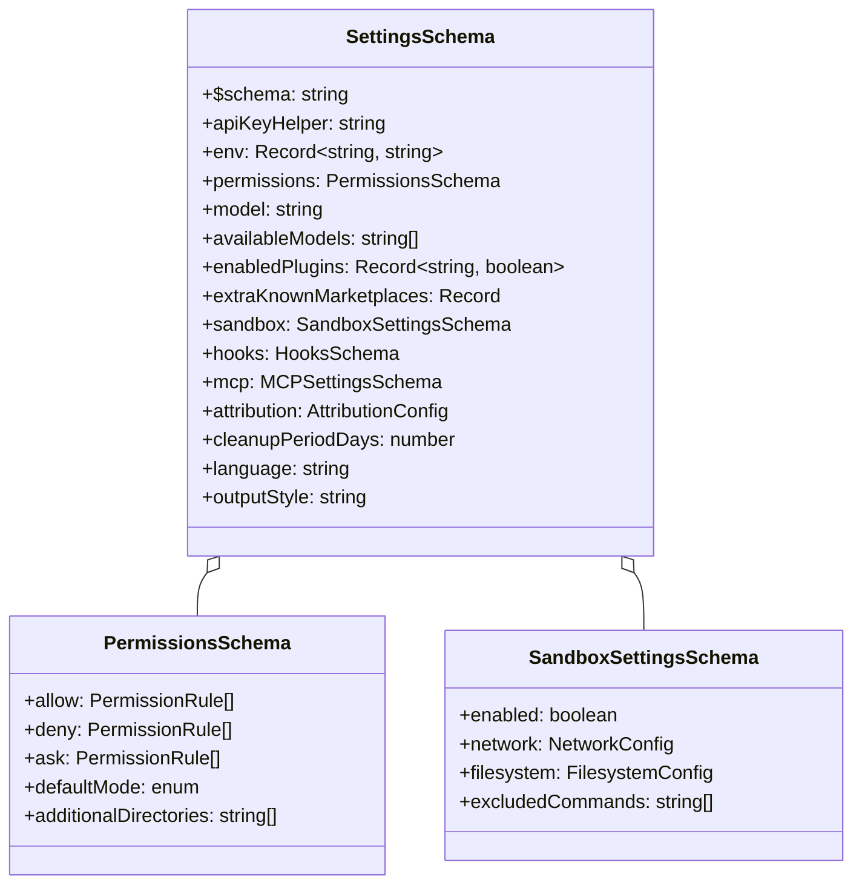
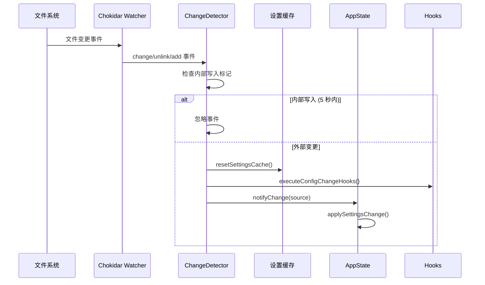

本文档详细解析 Claude Code 的设置管理系统架构，涵盖设置来源、优先级机制、持久化策略、验证体系以及跨设备同步机制。设置系统是 Claude Code 配置管理的核心基础设施，支持从个人用户到企业级部署的多层次配置需求。

## 设置来源与优先级架构

Claude Code 采用**多层级设置来源**设计，不同来源的设置按照明确定义的优先级进行合并。这种设计允许在个人偏好、项目规范和企业策略之间建立清晰的覆盖关系。

### 设置来源层次

系统定义了五种设置来源，按优先级从低到高排列：

| 来源 | 标识符 | 文件路径 | 用途 | 可编辑性 |
|------|--------|----------|------|----------|
| 用户设置 | `userSettings` | `~/.claude/settings.json` | 全局个人偏好 | ✅ 可编辑 |
| 项目设置 | `projectSettings` | `.claude/settings.json` | 团队共享配置 | ✅ 可编辑 |
| 本地设置 | `localSettings` | `.claude/settings.local.json` | 本地临时配置（自动加入 gitignore） | ✅ 可编辑 |
| 命令行标志 | `flagSettings` | 临时文件或内联 | 单次会话覆盖 | ❌ 只读 |
| 策略设置 | `policySettings` | 多源合并 | 企业强制策略 | ❌ 只读 |

设置合并遵循**后者覆盖前者**的原则，高优先级来源的设置值会覆盖低优先级来源的相同键值。对于对象类型字段，系统执行深度合并（deep merge）；对于数组类型，执行去重连接操作 [`settingsMergeCustomizer`](src/utils/settings/settings.ts#L517-L527)。


### 策略设置的"首个来源获胜"机制

`policySettings` 来源采用特殊的**"首个来源获胜"**（first source wins）策略，从以下四个子来源中选择第一个有内容的来源：

1. **远程管理设置**（最高优先级）- 从企业 API 获取
2. **MDM 管理员设置** - macOS plist 或 Windows HKLM 注册表
3. **本地管理文件** - `/etc/claude-code/managed-settings.json` 或平台等效路径
4. **HKCU 用户注册表**（最低优先级）- Windows HKCU 注册表

这种设计确保企业策略的单一来源权威性，避免多个策略源之间的冲突 [`getSettingsForSourceUncached`](src/utils/settings/settings.ts#L314-L347)。

Sources: [src/utils/settings/constants.ts](src/utils/settings/constants.ts#L1-L50), [src/utils/settings/settings.ts](src/utils/settings/settings.ts#L314-L347), [src/utils/settings/settings.ts](src/utils/settings/settings.ts#L517-L527)

## 设置文件结构与 Schema 验证

所有设置文件必须遵循统一的 JSON Schema 规范，使用 Zod 进行运行时验证。Schema 设计遵循向后兼容原则，确保版本升级不会破坏现有配置。

### 核心 Schema 结构

设置 Schema 采用懒加载模式定义，支持动态特性开关。主要配置类别包括：



### 验证与错误处理

设置文件加载时执行严格的 Zod 验证，但采用**容错策略**：

- **无效权限规则**：单独标记警告，不拒绝整个文件
- **未知字段**：通过 `.passthrough()` 保留，不报错
- **类型错误**：记录验证错误，使用默认值
- **JSON 语法错误**：拒绝加载，返回错误信息

验证错误被收集并返回给调用方，允许系统在有部分配置错误的情况下继续运行 [`validateSettingsFileContent`](src/utils/settings/validation.ts#L174-L200)。

### 向后兼容性保证

Schema 变更遵循严格的兼容性规则：

| ✅ 允许的操作 | ❌ 禁止的操作 |
|--------------|--------------|
| 添加新可选字段 | 删除已有字段 |
| 添加新枚举值 | 删除枚举值 |
| 放宽验证条件 | 收紧验证条件 |
| 使用联合类型迁移 | 重命名字段（无保留） |

系统提供向后兼容性测试套件，确保 Schema 变更不会破坏现有配置 [`SettingsSchema`](src/utils/settings/types.ts#L230-L260)。

Sources: [src/utils/settings/types.ts](src/utils/settings/types.ts#L230-L260), [src/utils/settings/validation.ts](src/utils/settings/validation.ts#L174-L200), [src/utils/settings/types.ts](src/utils/settings/types.ts#L1-L50)

## 持久化机制与文件管理

### 设置文件路径解析

系统根据平台和环境变量动态解析设置文件路径：

```typescript
// 用户设置路径
~/.claude/settings.json          // 标准模式
~/.claude/cowork_settings.json   // 协作模式

// 项目设置路径
$PROJECT/.claude/settings.json        // 共享配置
$PROJECT/.claude/settings.local.json  // 本地配置（自动 gitignore）

// 管理设置路径（平台相关）
/Library/Application Support/ClaudeCode/managed-settings.json  // macOS
C:\Program Files\ClaudeCode\managed-settings.json              // Windows
/etc/claude-code/managed-settings.json                         // Linux
```

管理设置支持 **drop-in 目录**模式，`managed-settings.d/` 目录中的 JSON 文件按字母顺序合并，允许多个策略片段独立管理 [`getManagedFilePath`](src/utils/settings/managedPath.ts#L1-L35)。

### 写入操作与内部标记

设置写入采用以下流程：

1. **标记内部写入**：调用 `markInternalWrite()` 记录时间戳
2. **读取现有设置**：绕过缓存获取最新磁盘状态
3. **合并更新**：使用 `mergeWith` 执行深度合并
4. **写入文件**：原子写入并刷新到磁盘
5. **清除缓存**：调用 `resetSettingsCache()` 使变更生效

内部写入标记机制防止变更检测器将系统自身的写入误判为外部变更，避免无限循环 [`updateSettingsForSource`](src/utils/settings/settings.ts#L427-L495)。

### Git 忽略管理

`localSettings` 源的文件（`.claude/settings.local.json`）在创建时会自动添加到项目的 `.gitignore` 文件中，确保本地敏感配置不会被提交到版本控制系统 [`updateSettingsForSource`](src/utils/settings/settings.ts#L477-L482)。

Sources: [src/utils/settings/managedPath.ts](src/utils/settings/managedPath.ts#L1-L35), [src/utils/settings/settings.ts](src/utils/settings/settings.ts#L427-L495), [src/utils/settings/settings.ts](src/utils/settings/settings.ts#L477-L482)

## 变更检测与热重载

### 文件系统监控

系统使用 `chokidar` 库监控设置文件变更，支持实时热重载：



### 防抖动与稳定性处理

文件监控包含多层稳定性保护：

| 机制 | 参数 | 目的 |
|------|------|------|
| 写入稳定性阈值 | 1000ms | 等待文件写入完成 |
| 稳定性轮询间隔 | 500ms | 检查文件大小是否稳定 |
| 内部写入窗口 | 5000ms | 忽略系统自身写入 |
| 删除宽限期 | 1700ms | 处理删除 - 重建模式 |

### MDM 设置轮询

由于注册表和 plist 文件无法通过文件系统事件监控，系统采用**定时轮询**机制：

- **轮询间隔**：30 分钟
- **比较策略**：序列化后比较 JSON 字符串
- **变更检测**：发现差异时触发完整重载流程 [`changeDetector`](src/utils/settings/changeDetector.ts#L1-L50)

Sources: [src/utils/settings/changeDetector.ts](src/utils/settings/changeDetector.ts#L1-L50), [src/utils/settings/internalWrites.ts](src/utils/settings/internalWrites.ts#L1-L38), [src/utils/settings/changeDetector.ts](src/utils/settings/changeDetector.ts#L45-L75)

## 设备管理（MDM）集成

### 平台特定实现

企业部署可通过操作系统级别的设备管理机制强制下发配置：

| 平台 | 配置位置 | 权限要求 |
|------|----------|----------|
| macOS | `/Library/Managed Preferences/com.anthropic.claudecode.plist` | root |
| Windows | `HKLM\SOFTWARE\Policies\ClaudeCode` | 管理员 |
| Windows | `HKCU\SOFTWARE\Policies\ClaudeCode` | 用户（最低优先级） |
| Linux | 不支持 MDM，使用文件模式 | - |

### MDM 读取架构

MDM 设置读取采用异步启动 + 同步缓存模式：

1. **启动阶段**：`startMdmSettingsLoad()` 触发后台子进程读取
2. **等待加载**：`ensureMdmSettingsLoaded()` 确保首次读取完成
3. **缓存访问**：`getMdmSettings()` 从内存缓存返回结果
4. **定期刷新**：变更检测器每 30 分钟刷新一次

macOS 使用 `plutil` 命令读取 plist，Windows 使用 `reg query` 命令读取注册表，输出统一解析为 JSON 格式 [`getMdmSettings`](src/utils/settings/mdm/settings.ts#L1-L100)。

Sources: [src/utils/settings/mdm/settings.ts](src/utils/settings/mdm/settings.ts#L1-L100), [src/utils/settings/mdm/rawRead.ts](src/utils/settings/mdm/rawRead.ts#L1-L50)

## 远程设置同步服务

### 同步架构

设置同步服务支持跨设备同步用户配置和记忆文件：

```mermaid
graph TB
    subgraph Local["本地环境"]
        A[~/.claude/settings.json]
        B[~/.claude/CLAUDE.md]
        C[.claude/settings.local.json]
    end
    
    subgraph Sync["同步服务"]
        D[uploadUserSettingsInBackground]
        E[downloadUserSettings]
        F[applyRemoteEntriesToLocal]
    end
    
    subgraph Remote["远程 API"]
        G[/api/claude_code/user_settings]
    end
    
    A --> D
    B --> D
    D -->|PUT| G
    G -->|GET| E
    E --> F
    F --> A
    F --> B
    
    style Remote fill:#e3f2fd
    style Sync fill:#fff3e0
```

### 同步触发条件

| 场景 | 触发时机 | 方向 |
|------|----------|------|
| 交互式 CLI 启动 | `preAction` 后台执行 | 上传 |
| CCR 模式启动 | `runHeadless()` 触发 | 下载 |
| `/reload-plugins` | 用户命令 | 强制下载 |

### 同步键值定义

同步服务使用扁平的键值存储结构：

```typescript
const SYNC_KEYS = {
  USER_SETTINGS: '~/.claude/settings.json',
  USER_MEMORY: '~/.claude/CLAUDE.md',
  projectSettings: (projectId: string) => 
    `projects/${projectId}/.claude/settings.local.json`,
  projectMemory: (projectId: string) => 
    `projects/${projectId}/CLAUDE.local.md`,
}
```

### 认证与 eligibility

同步服务支持两种认证模式：

- **API Key 用户**：所有用户都有资格
- **OAuth 用户**：仅 Enterprise/C4E 和 Team 订阅者有资格

API 失败时采用**开放失败**（fail-open）策略，不影响主流程继续执行 [`uploadUserSettingsInBackground`](src/services/settingsSync/index.ts#L1-L80)。

Sources: [src/services/settingsSync/index.ts](src/services/settingsSync/index.ts#L1-L80), [src/services/settingsSync/types.ts](src/services/settingsSync/types.ts#L1-L68), [src/services/remoteManagedSettings/index.ts](src/services/remoteManagedSettings/index.ts#L1-L100)

## 缓存策略与性能优化

### 三级缓存体系

系统实现三层缓存以减少磁盘 I/O：

| 缓存层级 | 作用域 | 失效触发 |
|----------|--------|----------|
| 会话缓存 | 全局合并设置 | `resetSettingsCache()` |
| 来源缓存 | 每来源设置 | `resetSettingsCache()` |
| 文件解析缓存 | 每文件解析结果 | `resetSettingsCache()` |

```typescript
// 缓存结构
sessionSettingsCache: SettingsWithErrors | null      // 合并结果
perSourceCache: Map<SettingSource, SettingsJson>     // 来源级
parseFileCache: Map<string, ParsedSettings>          // 文件级
```

### 缓存失效场景

缓存在以下情况下被清除：

- 设置文件外部变更（变更检测器触发）
- 执行 `/reload-plugins` 命令
- 插件初始化完成
- Hooks 配置刷新
- `--add-dir` 命令执行

### 启动优化

MDM 设置读取在 `main.tsx` 模块求值时即启动，与模块加载并行执行，减少启动延迟。远程设置加载承诺在 `init.ts` 中初始化，其他系统可等待其完成后再初始化 [`startMdmSettingsLoad`](src/utils/settings/mdm/settings.ts#L60-L90)。

Sources: [src/utils/settings/settingsCache.ts](src/utils/settings/settingsCache.ts#L1-L81), [src/utils/settings/mdm/settings.ts](src/utils/settings/mdm/settings.ts#L60-L90), [src/services/remoteManagedSettings/index.ts](src/services/remoteManagedSettings/index.ts#L50-L90)

## 应用状态集成

### React Hook 集成

React 组件通过 `useSettings()` Hook 访问设置，支持响应式更新：

```typescript
// hooks/useSettings.ts
export function useSettings(): ReadonlySettings {
  return useAppState(s => s.settings)
}
```

### 设置变更应用

设置变更通过 `applySettingsChange()` 函数应用到应用状态：

1. 重新读取磁盘设置
2. 重新加载权限规则
3. 更新 Hooks 配置快照
4. 同步权限上下文
5. 推送新状态到 AppState

该函数同时支持交互式模式和 headless/SDK 模式，确保两种模式下策略变更都能正确应用 [`applySettingsChange`](src/utils/settings/applySettingsChange.ts#L1-L93)。

### 权限规则同步

设置变更后，系统自动：

- 重新加载所有权限规则
- 同步权限规则到工具权限上下文
- 检查并移除危险的 Bash 允许规则（Ant 环境）
- 应用绕过权限模式禁用状态
- 转换计划自动模式配置

Sources: [src/hooks/useSettings.ts](src/hooks/useSettings.ts#L1-L18), [src/utils/settings/applySettingsChange.ts](src/utils/settings/applySettingsChange.ts#L1-L93)

## 下一步阅读

- 深入理解权限规则配置：[权限系统与安全控制](13-quan-xian-xi-tong-yu-an-quan-kong-zhi)
- 了解插件系统如何读取设置：[技能系统与插件架构](20-ji-neng-xi-tong-yu-cha-jian-jia-gou)
- 查看 MCP 服务器配置：[MCP（模型上下文协议）集成](12-mcp-mo-xing-shang-xia-wen-xie-yi-ji-cheng)
- 学习如何开发自定义命令：[自定义命令开发指南](28-zi-ding-yi-ming-ling-kai-fa-zhi-nan)