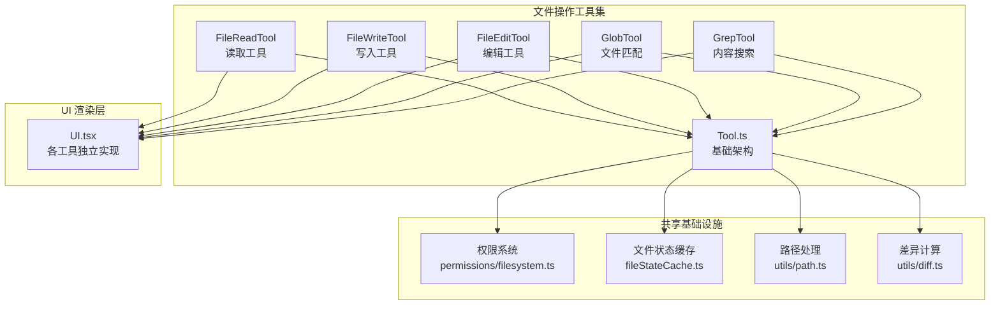
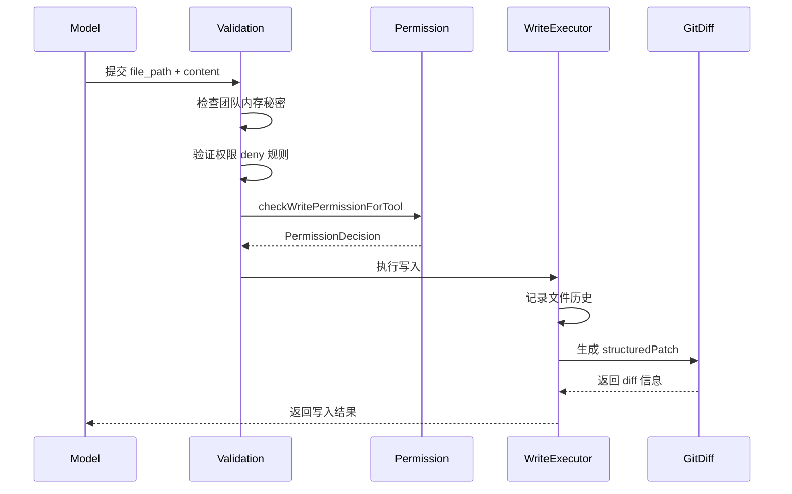
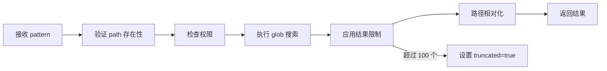
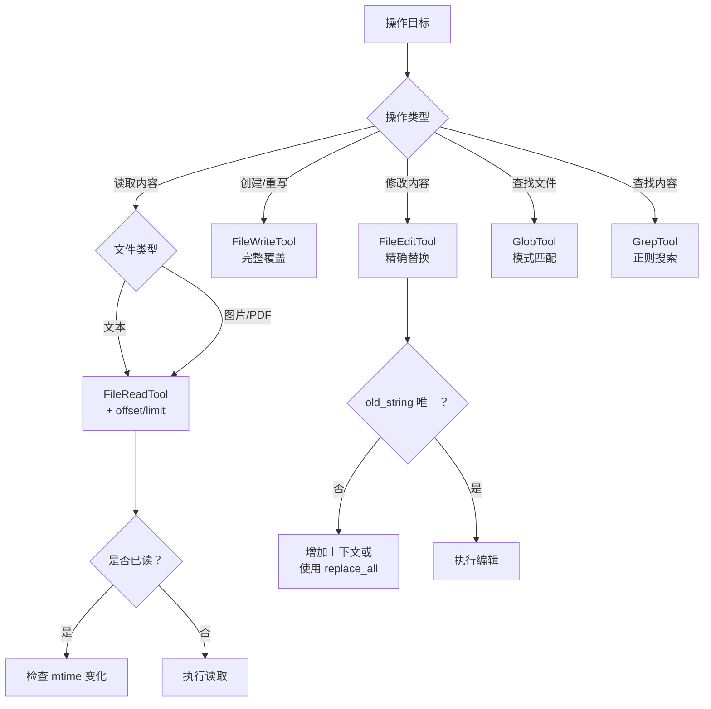

文件操作工具集是 Claude Code 与本地文件系统交互的核心组件，提供了从基础读写到高级搜索的完整能力。本页面深入解析五个核心文件操作工具的设计原理、实现机制与使用模式。

## 工具架构总览

文件操作工具遵循统一的工具定义模式，通过 `buildTool` 工厂函数构建，每个工具包含输入/输出 Schema、权限检查、验证逻辑、执行方法和 UI 渲染组件。



**架构特点**：
- **统一接口**：所有工具实现 `ToolDef` 接口，确保行为一致性
- **权限前置**：在执行前通过 `checkPermissions` 进行权限验证
- **状态追踪**：通过 `readFileState` 追踪文件读取状态，避免重复读取
- **差异优化**：编辑操作生成 structured patch，最小化 token 消耗

Sources: [Tool.ts](src/Tool.ts#L1-L100), [tools.ts](src/tools.ts#L1-L50)

## FileReadTool：智能文件读取

### 核心功能

FileReadTool 是文件操作的基础，支持多种文件类型的智能读取：

| 文件类型 | 处理方式 | 特性 |
|---------|---------|------|
| 文本文件 | 带行号格式返回 | 支持 offset/limit 分页读取 |
| 图片文件 | Base64 编码 + 视觉呈现 | 自动压缩以适应 token 限制 |
| PDF 文件 | 分页提取 | 最大 20 页/次，需指定 pages 参数 |
| Jupyter Notebook | 单元格解析 | 保留代码、文本和可视化输出 |

### 读取限制机制

读取操作受双重限制保护：

```
┌─────────────────────────────────────────────────────────────┐
│                    FileReadTool 限制层级                      │
├─────────────────────────────────────────────────────────────┤
│  maxSizeBytes (默认 256 KB)                                  │
│  ├─ 检查时机：读取前 stat 调用                                │
│  ├─ 检查对象：文件总大小（非读取片段）                         │
│  └─ 超限行为：抛出 MaxFileReadTokenExceededError            │
├─────────────────────────────────────────────────────────────┤
│  maxTokens (默认 25000)                                      │
│  ├─ 检查时机：读取后 token 计数                               │
│  ├─ 检查对象：实际输出 token 数                               │
│  └─ 超限行为：抛出异常，建议使用 offset/limit               │
└─────────────────────────────────────────────────────────────┘
```

限制优先级：环境变量 > GrowthBook 特性标志 > 硬编码默认值

### 文件不变检测

为避免重复读取消耗 token，工具实现了文件不变检测机制：

```typescript
// 读取时间戳追踪
const readTimestamp = toolUseContext.readFileState.get(fullFilePath)
if (!readTimestamp || readTimestamp.isPartialView) {
  // 需要重新读取
}
// 如果文件 mtime 未变化，返回 FILE_UNCHANGED_STUB
```

当检测到文件自上次读取后未修改时，返回简短提示而非完整内容，显著节省上下文空间。

Sources: [FileReadTool.ts](src/tools/FileReadTool/FileReadTool.ts#L1-L100), [limits.ts](src/tools/FileReadTool/limits.ts#L1-L93), [prompt.ts](src/tools/FileReadTool/prompt.ts#L1-L50)

## FileWriteTool：文件创建与覆盖

### 工作流程

FileWriteTool 用于创建新文件或完全覆盖现有文件：



### 输出结构

写入操作返回详细的变更追踪信息：

```typescript
type Output = {
  type: 'create' | 'update'           // 操作类型
  filePath: string                     // 文件路径
  content: string                      // 写入内容
  structuredPatch: Hunk[]              // 结构化差异
  originalFile: string | null          // 原始内容（新建为 null）
  gitDiff?: GitDiff                    // Git 差异信息（可选）
}
```

### 安全校验

写入前执行多层安全检查：

1. **团队内存秘密检查**：防止敏感信息写入团队记忆文件
2. **权限规则匹配**：检查路径是否匹配 deny 规则
3. **UNC 路径保护**：跳过 UNC 路径的 fs 操作，防止 NTLM 凭证泄露
4. **文件修改检测**：验证文件在读取后未被外部修改

Sources: [FileWriteTool.ts](src/tools/FileWriteTool/FileWriteTool.ts#L1-L150), [prompt.ts](src/tools/FileWriteTool/prompt.ts#L1-L19)

## FileEditTool：精确字符串替换

### 编辑策略

FileEditTool 采用精确字符串替换策略，通过 `old_string` 和 `new_string` 定义变更：

```typescript
type FileEditInput = {
  file_path: string          // 绝对路径
  old_string: string         // 要替换的原文本
  new_string: string         // 替换后的新文本
  replace_all: boolean       // 是否替换所有匹配项
}
```

### 编辑约束

| 约束类型 | 说明 | 错误码 |
|---------|------|--------|
| 预读要求 | 编辑前必须使用 Read 工具读取文件 | - |
| 字符串唯一性 | `old_string` 必须在文件中唯一 | 1 |
| 实际变更 | `old_string` 和 `new_string` 必须不同 | 1 |
| 文件大小 | 文件不得超过 1 GiB | 10 |
| 权限规则 | 路径不得匹配 deny 规则 | 2 |

### 引号规范化处理

工具实现了智能引号规范化，解决模型输出与文件实际内容的引号差异：

```typescript
//  curly quotes → straight quotes 映射
normalizeQuotes(str: string): string {
  return str
    .replaceAll(''', "'")   // 左单引号
    .replaceAll('', "'")   // 右单引号
    .replaceAll('"', '"')   // 左双引号
    .replaceAll('"', '"')   // 右双引号
}
```

当检测到文件使用 curly quotes 而模型使用 straight quotes 时，自动应用 `preserveQuoteStyle` 函数，确保 `new_string` 保持文件原有的排版风格。

### 差异生成

编辑成功后生成结构化差异：

```typescript
structuredPatch: Array<{
  oldStart: number      // 原文件起始行
  oldLines: number      // 原文件删除行数
  newStart: number      // 新文件起始行
  newLines: number      // 新文件添加行数
  lines: string[]       // 差异行（+/- 前缀）
}>
```

Sources: [FileEditTool.ts](src/tools/FileEditTool/FileEditTool.ts#L1-L150), [types.ts](src/tools/FileEditTool/types.ts#L1-L86), [utils.ts](src/tools/FileEditTool/utils.ts#L1-L100), [prompt.ts](src/tools/FileEditTool/prompt.ts#L1-L29)

## GlobTool：文件模式匹配

### 功能定义

GlobTool 使用 glob 模式匹配文件名，支持通配符搜索：

```typescript
inputSchema = {
  pattern: string,      // glob 模式，如 "*.ts", "**/*.tsx"
  path?: string         // 搜索目录（可选，默认为 cwd）
}

outputSchema = {
  durationMs: number,    // 执行耗时
  numFiles: number,      // 匹配文件数
  filenames: string[],   // 文件路径数组
  truncated: boolean     // 是否被截断（限制 100 个）
}
```

### 执行流程



### 使用建议

- **精确模式**：使用 `**/*.ts` 而非 `*` 减少无关匹配
- **路径限定**：指定 `path` 参数缩小搜索范围
- **结果截断**：超过 100 个结果时自动截断，建议使用更具体的模式

Sources: [GlobTool.ts](src/tools/GlobTool/GlobTool.ts#L1-L199), [prompt.ts](src/tools/GlobTool/prompt.ts#L1-L20)

## GrepTool：正则内容搜索

### 核心能力

GrepTool 基于 ripgrep 实现高性能正则搜索，提供三种输出模式：

| 模式 | 参数值 | 输出内容 | 适用场景 |
|-----|--------|---------|---------|
| 内容模式 | `content` | 匹配行及上下文 | 查看具体匹配内容 |
| 文件模式 | `files_with_matches` | 文件路径列表 | 定位相关文件 |
| 计数模式 | `count` | 匹配数量统计 | 评估匹配规模 |

### 输入参数详解

```typescript
inputSchema = {
  pattern: string,           // 正则表达式
  path?: string,             // 搜索路径（默认 cwd）
  glob?: string,             // 文件过滤模式
  output_mode?: enum,        // 输出模式
  '-B'?: number,             // 匹配前行数
  '-A'?: number,             // 匹配后行数
  '-C'?: number,             // 匹配前后行数
  '-n'?: boolean,            // 显示行号
  '-i'?: boolean,            // 忽略大小写
  type?: string,             // 文件类型（js, py, rust 等）
  head_limit?: number,       // 结果限制（默认 250）
  offset?: number,           // 跳过前 N 条结果
  multiline?: boolean        // 多行匹配模式
}
```

### 默认排除策略

自动排除版本控制系统目录，减少搜索噪音：

```typescript
const VCS_DIRECTORIES_TO_EXCLUDE = [
  '.git', '.svn', '.hg', '.bzr', '.jj', '.sl'
]
```

### 结果限制机制

默认应用 250 条结果限制，防止上下文膨胀：

```typescript
const DEFAULT_HEAD_LIMIT = 250

function applyHeadLimit<T>(items: T[], limit?: number, offset = 0) {
  if (limit === 0) return { items: items.slice(offset) } // 0 = 无限制
  const effectiveLimit = limit ?? DEFAULT_HEAD_LIMIT
  const wasTruncated = items.length - offset > effectiveLimit
  return {
    items: items.slice(offset, offset + effectiveLimit),
    appliedLimit: wasTruncated ? effectiveLimit : undefined
  }
}
```

Sources: [GrepTool.ts](src/tools/GrepTool/GrepTool.ts#L1-L200), [prompt.ts](src/tools/GrepTool/prompt.ts#L1-L19)

## 工具选择决策树

根据操作目标选择合适工具：



## 权限系统集成

所有文件操作工具通过统一的权限检查框架：

```typescript
// 权限检查流程
async checkPermissions(input, context): Promise<PermissionDecision> {
  const appState = context.getAppState()
  return checkWritePermissionForTool(  // 或 checkReadPermissionForTool
    ToolName,
    input,
    appState.toolPermissionContext,
  )
}
```

权限规则来源：
- **alwaysAllowRules**：自动允许的路径模式
- **alwaysDenyRules**：自动拒绝的路径模式
- **alwaysAskRules**：需要确认的路径模式

Sources: [constants/tools.ts](src/constants/tools.ts#L1-L113), [permissions/filesystem.ts](src/utils/permissions/filesystem.ts#L1-L50)

## 最佳实践

### 读取大文件

```
❌ 直接读取 10000 行文件
✅ 使用 offset=1, limit=500 分块读取
✅ 先用 GrepTool 定位目标区域再读取
```

### 编辑文件

```
❌ old_string 包含过多上下文
✅ 使用 2-4 行唯一标识的最小字符串
✅ 使用 replace_all 进行全局替换
```

### 搜索文件

```
❌ pattern: "*" 全局搜索
✅ pattern: "**/*.ts" 限定类型
✅ 添加 path: "src/" 限定目录
```

## 相关页面

- [工具系统设计与编排](5-gong-ju-xi-tong-she-ji-yu-bian-pai) — 了解工具系统的整体架构
- [Shell 与 Bash 工具](16-shell-yu-bash-gong-ju) — 学习命令行文件操作
- [权限系统与安全控制](13-quan-xian-xi-tong-yu-an-quan-kong-zhi) — 深入权限机制
- [Git 版本控制工具](19-git-ban-ben-kong-zhi-gong-ju) — 文件版本管理