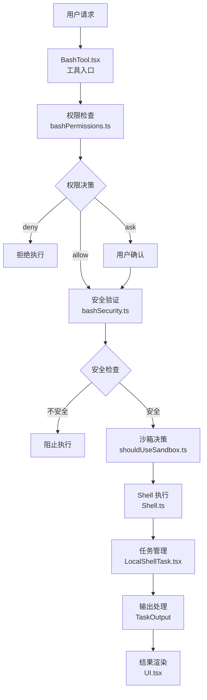
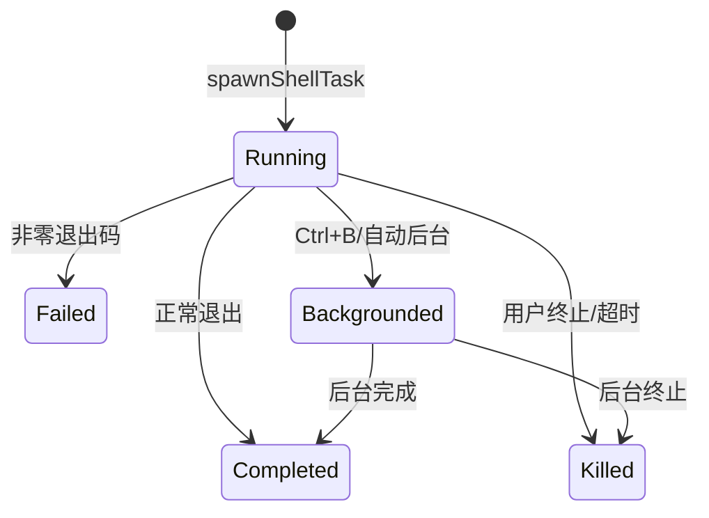

Shell 与 Bash 工具是 Claude Code 执行系统命令的核心机制，提供了安全、可控的 shell 命令执行能力。该工具不仅支持基本的命令执行，还包含多层安全防护、权限控制、沙箱隔离和智能后台执行等功能。

## 核心架构

Bash 工具系统采用分层架构设计，从用户请求到命令执行经历多个处理阶段：



**工具定义层** ([BashTool.tsx](src/tools/BashTool/BashTool.tsx#L420-L545))：定义工具的输入输出 schema、权限检查逻辑、UI 渲染方法。

**权限控制层** ([bashPermissions.ts](src/tools/BashTool/bashPermissions.ts#L1-L100))：基于规则匹配和分类器决策，确定命令是否需要用户批准。

**安全验证层** ([bashSecurity.ts](src/tools/BashTool/bashSecurity.ts#L1-L100))：使用 tree-sitter AST 分析检测危险模式，如命令注入、进程替换等。

**执行引擎层** ([Shell.ts](src/utils/Shell.ts#L181-L200)、[ShellCommand.ts](src/utils/ShellCommand.ts#L114-L200))：负责实际的进程生成、输出捕获和超时控制。

**任务管理层** ([LocalShellTask.tsx](src/tasks/LocalShellTask/LocalShellTask.tsx#L173-L200))：管理命令的生命周期，支持后台执行和状态追踪。

Sources: [BashTool.tsx](src/tools/BashTool/BashTool.tsx#L420-L545) [bashPermissions.ts](src/tools/BashTool/bashPermissions.ts#L1-L100) [bashSecurity.ts](src/tools/BashTool/bashSecurity.ts#L1-L100) [Shell.ts](src/utils/Shell.ts#L181-L200) [LocalShellTask.tsx](src/tasks/LocalShellTask/LocalShellTask.tsx#L173-L200)

## 权限系统

Bash 工具的权限系统采用三级决策模型：**allow**（允许）、**ask**（询问）、**deny**（拒绝）。决策过程结合了规则匹配、语义分析和分类器评估。

### 权限决策流程

| 阶段 | 检查内容 | 决策依据 |
|------|----------|----------|
| 规则匹配 | 命令前缀/精确匹配 | 用户配置的 permission rules |
| 语义分析 | cd+git 组合、多目录切换 | 防止裸仓库攻击等安全场景 |
| 分类器 | 命令行为模式识别 | ANT 用户专用的智能分类 |
| 安全验证 | AST 危险节点检测 | tree-sitter 结构分析 |

权限规则支持通配符匹配和前缀提取。例如 `Bash(git *)` 匹配所有 git 命令，`Bash(docker ps:*)` 匹配 docker ps 及其子命令 [[bashPermissions.ts](src/tools/BashTool/bashPermissions.ts#L200-L250)]。

对于复合命令（如 `cmd1 && cmd2 | cmd3`），系统会分割并独立检查每个子命令。如果任一子命令被拒绝，整个命令将被拒绝 [[bashCommandHelpers.ts](src/tools/BashTool/bashCommandHelpers.ts#L23-L100)]。

### 特殊安全规则

**cd+git 组合检测**：当命令同时包含 `cd` 和 `git` 时，需要用户批准。这是为了防止裸仓库 fsmonitor 绕过攻击 [[bashCommandHelpers.ts](src/tools/BashTool/bashCommandHelpers.ts#L49-L82)]。

**多目录切换限制**：单个命令中包含多个 `cd` 操作需要批准，确保用户清楚目录变更 [[bashCommandHelpers.ts](src/tools/BashTool/bashCommandHelpers.ts#L32-L47)]。

**分段命令权限**：管道分隔的命令（`cmd1 | cmd2`）会分别检查每个段落的权限，防止通过管道绕过安全检查 [[bashCommandHelpers.ts](src/tools/BashTool/bashCommandHelpers.ts#L158-L200)]。

Sources: [bashPermissions.ts](src/tools/BashTool/bashPermissions.ts#L200-L250) [bashCommandHelpers.ts](src/tools/BashTool/bashCommandHelpers.ts#L23-L100) [bashCommandHelpers.ts](src/tools/BashTool/bashCommandHelpers.ts#L49-L82)

## 安全验证机制

安全验证层使用 tree-sitter-bash 解析器对命令进行 AST 分析，采用**故障关闭**（fail-closed）设计原则：任何无法理解的节点类型都会导致命令被标记为"过于复杂"，需要用户手动批准 [[ast.ts](src/utils/bash/ast.ts#L1-L50)]。

### 危险模式检测

[bashSecurity.ts](src/tools/BashTool/bashSecurity.ts#L16-L41) 定义了多种危险模式的正则检测：

| 模式类型 | 检测内容 | 风险说明 |
|----------|----------|----------|
| 命令替换 | `$()`、`\$\{}` | 可能执行任意代码 |
| 进程替换 | `<()`、`>()` | 绕过文件路径检查 |
| Zsh 扩展 | `=cmd`、`zmodload` | 可能加载危险模块 |
| 输入重定向 | `<<<` | 可能注入恶意内容 |
| 控制字符 | 换行符、Unicode 空白 | 可能混淆命令解析 |

### AST 安全分析

AST 分析器维护了一个**允许列表**，只处理已知安全的节点类型。关键设计特性：

```typescript
// 结构型节点（递归遍历）
const STRUCTURAL_TYPES = new Set([
  'program', 'list', 'pipeline', 'redirected_statement'
])

// 危险节点（直接拒绝）
const DANGEROUS_TYPES = new Set([
  'command_substitution', 'process_substitution',
  'for_statement', 'while_statement', 'if_statement'
])
```

对于环境变量引用，系统区分**安全环境变量**（如 `$HOME`、`$PWD`、`$USER`）和普通变量。安全环境变量的值由 shell/OS 控制，引用它们是安全的 [[ast.ts](src/utils/bash/ast.ts#L125-L150)]。

**占位符机制**：对于命令替换 `$()` 和追踪变量，系统使用占位符（`__CMDSUB_OUTPUT__`、`__TRACKED_VAR__`）保持 argv 清洁，避免多行 heredoc 内容污染路径提取 [[ast.ts](src/utils/bash/ast.ts#L68-L96)]。

Sources: [bashSecurity.ts](src/tools/BashTool/bashSecurity.ts#L16-L41) [ast.ts](src/utils/bash/ast.ts#L1-L50) [ast.ts](src/utils/bash/ast.ts#L125-L150) [ast.ts](src/utils/bash/ast.ts#L68-L96)

## 沙箱隔离

沙箱功能提供了额外的安全层，将命令执行限制在隔离环境中。是否使用沙箱由 [shouldUseSandbox.ts](src/tools/BashTool/shouldUseSandbox.ts#L21-L100) 决定。

### 沙箱排除规则

某些命令默认排除在沙箱之外，通过配置项控制：

- **动态配置**：ANT 用户可通过 feature flag 配置排除的命令和子串
- **用户配置**：通过 `settings.sandbox.excludedCommands` 设置

排除检查会处理复合命令，将 `docker ps && curl evil.com` 分割为独立子命令分别检查。系统还会迭代地剥离环境变量前缀和包装器命令（如 `timeout`、`stdbuf`），确保 `FOO=bar bazel run` 能正确匹配 `bazel:*` 规则 [[shouldUseSandbox.ts](src/tools/BashTool/shouldUseSandbox.ts#L64-L100)]。

### 沙箱实现

沙箱通过以下机制实现隔离：

1. **临时目录重定向**：使用独立的 `TMPDIR` 防止访问主系统临时文件
2. **文件系统限制**：限制可访问的目录范围
3. **网络访问控制**：可选的网络隔离策略

Sources: [shouldUseSandbox.ts](src/tools/BashTool/shouldUseSandbox.ts#L21-L100) [shouldUseSandbox.ts](src/tools/BashTool/shouldUseSandbox.ts#L64-L100)

## 命令执行引擎

执行引擎负责实际的进程生成和管理，核心实现在 [Shell.ts](src/utils/Shell.ts#L44-L200) 和 [ShellCommand.ts](src/utils/ShellCommand.ts#L114-L200)。

### Shell 选择策略

系统按以下优先级选择 shell：

1. `CLAUDE_CODE_SHELL` 环境变量覆盖
2. `SHELL` 环境变量（仅限 bash/zsh）
3. 系统路径搜索（`/bin/bash`、`/usr/bin/zsh` 等）

```typescript
async function findSuitableShell(): Promise<string> {
  // 1. 检查环境变量覆盖
  const shellOverride = process.env.CLAUDE_CODE_SHELL
  
  // 2. 检查用户 SHELL 偏好
  const env_shell = process.env.SHELL
  
  // 3. 使用 which 定位可用 shell
  const [zshPath, bashPath] = await Promise.all([which('zsh'), which('bash')])
}
```

### 执行选项

| 选项 | 说明 | 默认值 |
|------|------|--------|
| `timeout` | 命令超时时间（毫秒） | 30 分钟 |
| `onProgress` | 进度回调函数 | - |
| `preventCwdChanges` | 防止目录变更 | false |
| `shouldUseSandbox` | 启用沙箱 | 动态决定 |
| `shouldAutoBackground` | 自动后台执行 | false |
| `onStdout` | 实时 stdout 回调 | - |

### 进程管理

[ShellCommand.ts](src/utils/ShellCommand.ts#L114-L200) 实现了进程生命周期管理：

- **状态追踪**：`running` → `completed`/`killed`/`backgrounded`
- **超时处理**：支持自动后台或终止
- **资源清理**：StreamWrapper 防止内存泄漏
- **大小监控**：后台任务输出文件超过阈值时自动终止

Sources: [Shell.ts](src/utils/Shell.ts#L44-L200) [ShellCommand.ts](src/utils/ShellCommand.ts#L114-L200) [shellProvider.ts](src/utils/shell/shellProvider.ts#L1-L34)

## 任务管理与后台执行

LocalShellTask 管理 shell 命令的任务生命周期，支持前台执行、后台执行和监控模式。

### 任务状态流转



### 后台执行机制

后台执行通过 `run_in_background` 参数触发，支持以下场景：

- **用户主动后台**：按 `Ctrl+B` 将所有前台命令移至后台
- **自动后台**：长时间运行的阻塞命令在 Assistant 模式下自动后台（15 秒预算）
- **监控模式**：Monitor 工具专用的流式输出模式

后台任务完成后会发送通知，包含输出文件路径和退出状态 [[LocalShellTask.tsx](src/tasks/LocalShellTask/LocalShellTask.tsx#L105-L172)]。

### 停滞检测

系统实现了停滞看门狗机制，检测命令是否卡在交互式提示：

```typescript
const PROMPT_PATTERNS = [
  /\(y\/n\)/i,      // (Y/n), (y/N)
  /\[y\/n\]/i,      // [Y/n], [y/N]
  /\(yes\/no\)/i,
  /\b(?:Do you|Would you|Shall I)\b.*\? *$/i
]
```

当输出停滞 45 秒且尾部匹配提示模式时，系统会发送通知建议用户使用管道输入或非交互标志 [[LocalShellTask.tsx](src/tasks/LocalShellTask/LocalShellTask.tsx#L28-L104)]。

Sources: [LocalShellTask.tsx](src/tasks/LocalShellTask/LocalShellTask.tsx#L105-L172) [LocalShellTask.tsx](src/tasks/LocalShellTask/LocalShellTask.tsx#L28-L104)

## UI 渲染与输出处理

UI 层负责命令的显示和结果渲染，核心实现在 [UI.tsx](src/tools/BashTool/UI.tsx#L85-L150)。

### 命令显示优化

- **行截断**：超过 2 行或 160 字符的命令会被截断显示
- **sed 特殊处理**：sed 就地编辑命令显示为文件路径而非完整命令
- **注释标签提取**：从命令注释中提取可读标签用于全屏模式 [[UI.tsx](src/tools/BashTool/UI.tsx#L99-L130)]

### 搜索结果折叠

系统识别搜索/读取类命令，在 UI 中折叠显示：

| 类别 | 命令 |
|------|------|
| 搜索 | `find`, `grep`, `rg`, `ag`, `ack`, `locate`, `which`, `whereis` |
| 读取 | `cat`, `head`, `tail`, `less`, `more`, `wc`, `stat`, `file`, `jq`, `awk` |
| 列表 | `ls`, `tree`, `du` |
| 静默 | `mv`, `cp`, `rm`, `mkdir`, `chmod`, `touch`, `cd` |

管道命令的所有部分都必须是搜索/读取命令，整个命令才会被标记为可折叠 [[BashTool.tsx](src/tools/BashTool/BashTool.tsx#L59-L150)]。

### 大输出处理

当输出超过阈值时，系统使用持久化存储：

1. 输出写入磁盘文件（`getTaskOutputPath(taskId)`）
2. 生成预览（前 N 字节）
3. 构建 `<persisted-output>` 消息供模型读取
4. UI 显示完整输出（从文件流式读取）[[BashTool.tsx](src/tools/BashTool/BashTool.tsx#L588-L599)]

Sources: [UI.tsx](src/tools/BashTool/UI.tsx#L85-L150) [BashTool.tsx](src/tools/BashTool/BashTool.tsx#L59-L150) [BashTool.tsx](src/tools/BashTool/BashTool.tsx#L588-L599)

## 特殊命令处理

### sed 就地编辑

sed 命令（如 `sed -i 's/old/new/g' file.txt`）被特殊处理为文件编辑操作：

- **解析**：[sedEditParser.ts](src/tools/BashTool/sedEditParser.ts) 提取文件路径和替换内容
- **执行**：直接调用文件编辑逻辑而非实际执行 sed
- **显示**：UI 显示为文件编辑而非 shell 命令
- **版本追踪**：集成文件历史记录功能 [[BashTool.tsx](src/tools/BashTool/BashTool.tsx#L350-L419)]

### Git 操作指令

Bash 工具包含详细的 Git 操作指令（[prompt.ts](src/tools/BashTool/prompt.ts#L42-L150)）：

- **提交规范**：禁止使用 `--no-verify`、`--no-gpg-sign` 等跳过钩子的选项
- **提交消息**：使用 HEREDOC 确保格式正确
- **PR 创建**：通过 `gh` 命令创建，包含测试计划清单
- **安全协议**：禁止强制推送到 main/master，禁止使用 `-i` 交互标志

Sources: [BashTool.tsx](src/tools/BashTool/BashTool.tsx#L350-L419) [prompt.ts](src/tools/BashTool/prompt.ts#L42-L150)

## 相关页面

- [工具系统设计与编排](5-gong-ju-xi-tong-she-ji-yu-bian-pai) — 了解工具系统的整体架构
- [权限系统与安全控制](13-quan-xian-xi-tong-yu-an-quan-kong-zhi) — 深入学习权限决策机制
- [任务管理与并发控制](6-ren-wu-guan-li-yu-bing-fa-kong-zhi) — 任务调度与生命周期管理
- [Git 版本控制工具](19-git-ban-ben-kong-zhi-gong-ju) — Git 相关工具的详细实现