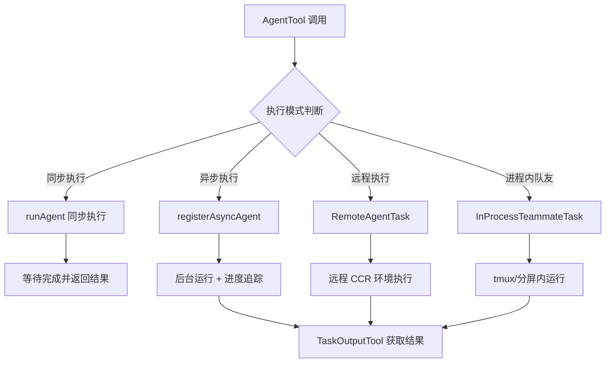
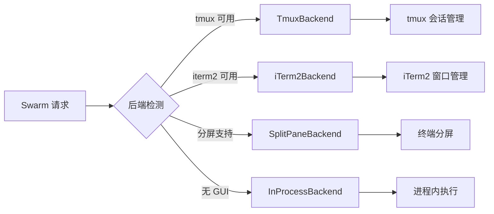
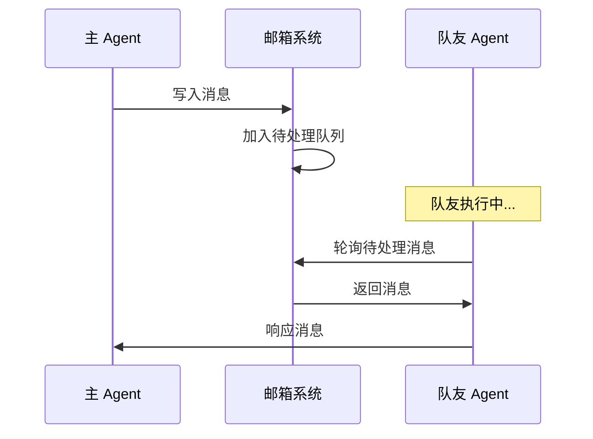
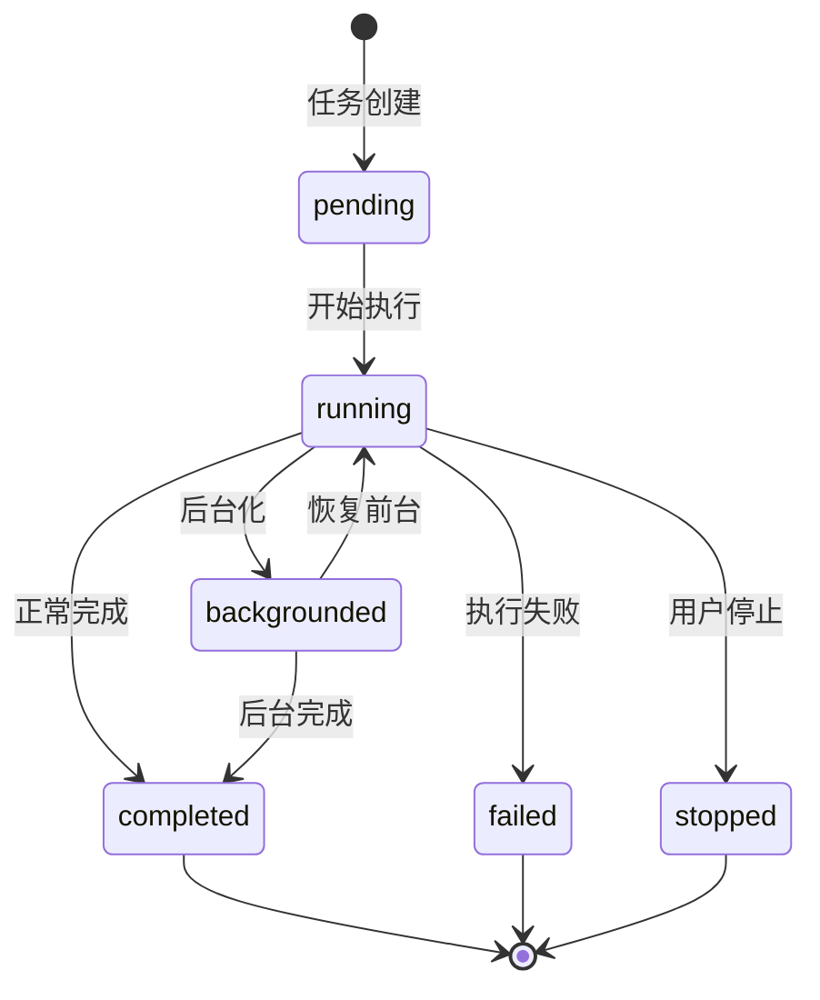
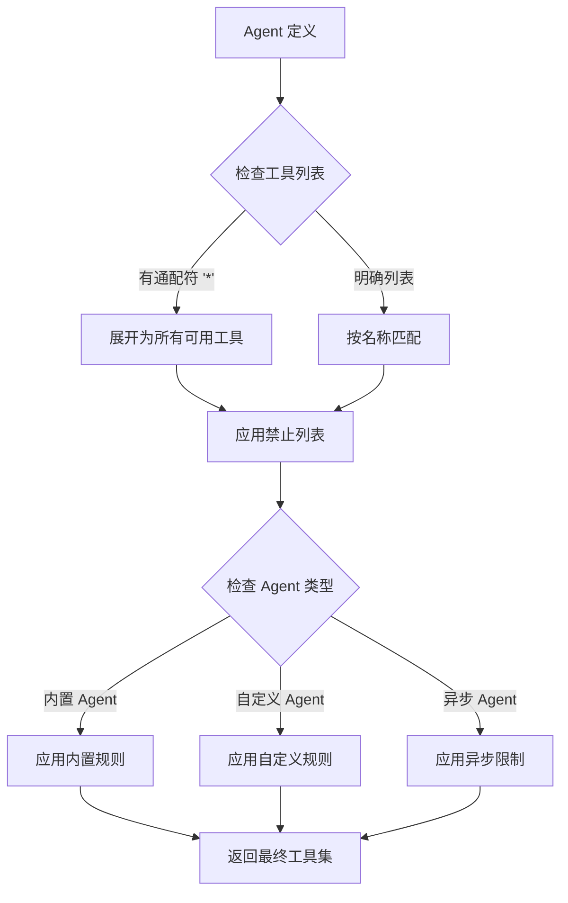
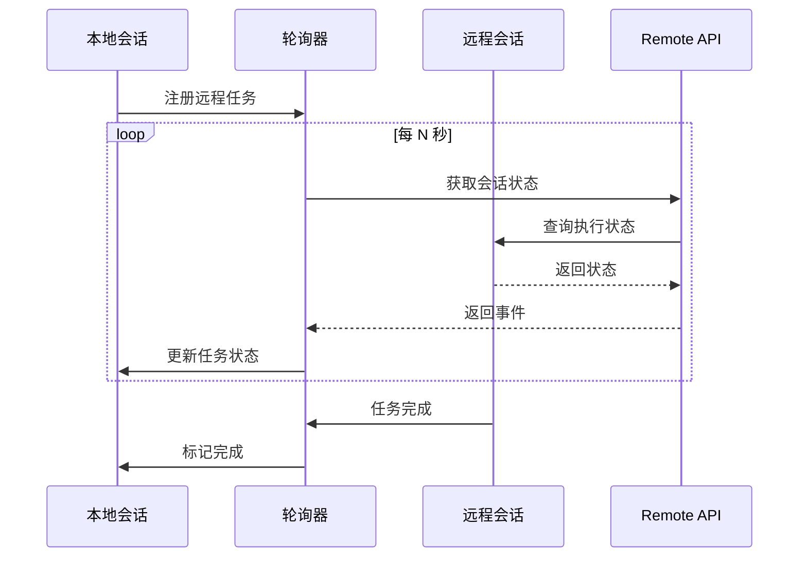
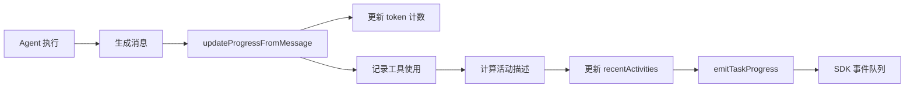
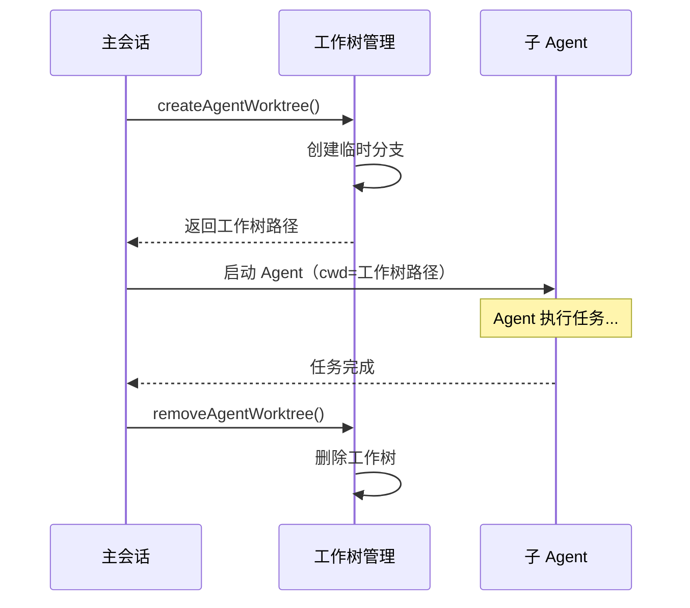
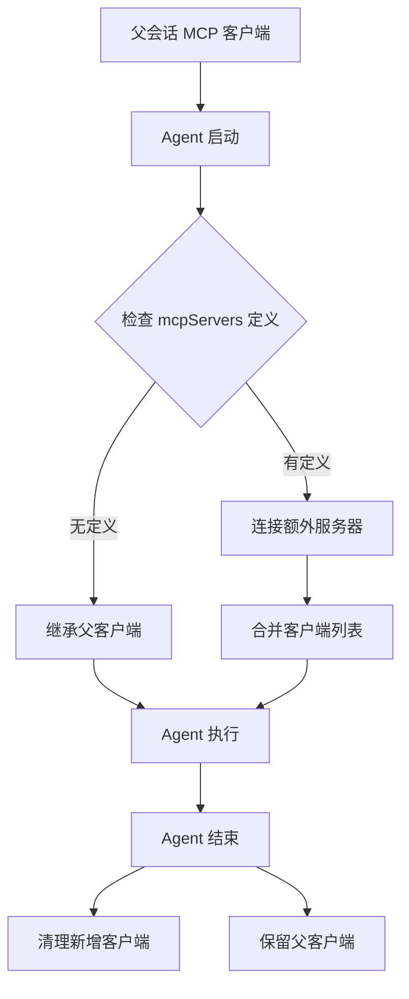
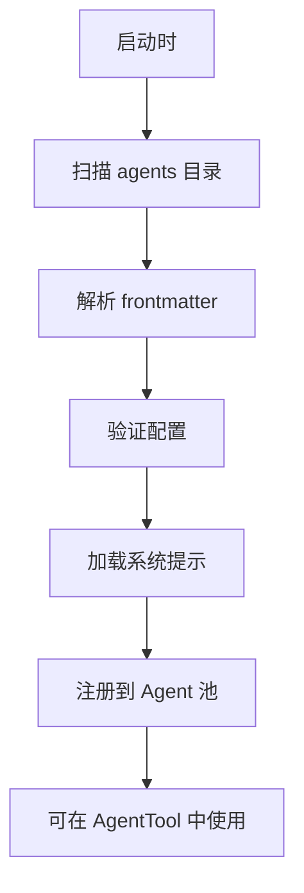

本文档深入解析 Claude Code 的 Agent 工具系统与多智能体协作架构。该系统支持**同步/异步 Agent 执行**、**团队（Swarm）编排**、**进程内/远程 Agent 部署**以及**Agent 间通信**等核心能力，是理解 Claude Code 多智能体协作模式的关键。

## Agent 工具核心架构

**AgentTool** 是多智能体系统的入口点，允许主会话生成子 Agent 来执行独立任务。该工具支持多种执行模式和隔离策略。

### AgentTool 输入参数结构

| 参数 | 类型 | 必填 | 说明 |
|------|------|------|------|
| `description` | string | 是 | 3-5 词的任务简短描述 |
| `prompt` | string | 是 | 分配给 Agent 的具体任务指令 |
| `subagent_type` | string | 否 | 专用 Agent 类型（如 `general-purpose`, `Explore`, `Plan`） |
| `model` | sonnet/opus/haiku | 否 | 模型覆盖，优先级高于 Agent 定义中的 frontmatter |
| `run_in_background` | boolean | 否 | 设为 true 使 Agent 在后台运行 |
| `name` | string | 否 | 生成的 Agent 名称，用于 SendMessage 寻址 |
| `team_name` | string | 否 | 团队名称，用于 Swarm 上下文 |
| `mode` | permissionMode | 否 | 权限模式（如 `plan` 需要计划审批） |
| `isolation` | worktree/remote | 否 | 隔离模式：worktree 创建临时 git 工作树，remote 启动远程 CCR 环境 |
| `cwd` | string | 否 | 工作目录，与 `isolation: worktree` 互斥 |

Sources: [AgentTool.tsx](src/tools/AgentTool/AgentTool.tsx#L58-L95)

### Agent 执行模式



Sources: [AgentTool.tsx](src/tools/AgentTool/AgentTool.tsx#L1-L50) [runAgent.ts](src/tools/AgentTool/runAgent.ts#L1-L100)

## 内置 Agent 类型

系统预置了多个专用 Agent，每个 Agent 有特定的系统提示和工具访问权限。

### 内置 Agent 列表

| Agent 类型 | 用途 | 工具权限 | 来源文件 |
|------------|------|----------|----------|
| `general-purpose` | 通用任务执行、代码搜索、多步骤任务 | `[*]` 通配符 | [generalPurposeAgent.ts](src/tools/AgentTool/built-in/generalPurposeAgent.ts#L1-L35) |
| `Explore` | 探索性研究任务 | 受限工具集 | [exploreAgent.ts](src/tools/AgentTool/built-in/exploreAgent.ts#L1-L1) |
| `Plan` | 规划与分析任务 | 受限工具集 | [planAgent.ts](src/tools/AgentTool/built-in/planAgent.ts#L1-L1) |
| `claude-code-guide` | Claude Code 使用指导 | 受限工具集 | [claudeCodeGuideAgent.ts](src/tools/AgentTool/built-in/claudeCodeGuideAgent.ts#L1-L1) |
| `verification` | 验证与测试（实验性） | 受限工具集 | [verificationAgent.ts](src/tools/AgentTool/built-in/verificationAgent.ts#L1-L1) |

Sources: [builtInAgents.ts](src/tools/AgentTool/builtInAgents.ts#L1-L73)

### Agent 定义结构

```typescript
type AgentDefinition = {
  agentType: string           // Agent 类型标识
  whenToUse: string           // 使用场景描述
  tools: string[]             // 允许的工具列表，支持 '*' 通配符
  disallowedTools?: string[]  // 明确禁止的工具
  source: 'built-in' | 'custom' | 'plugin'
  baseDir: string             // Agent 定义所在目录
  model?: ModelAlias          // 可选的模型指定
  mcpServers?: string[]       // 可选的 MCP 服务器列表
  getSystemPrompt: () => string // 系统提示生成函数
}
```

Sources: [loadAgentsDir.ts](src/tools/AgentTool/loadAgentsDir.ts#L1-L1) [agentToolUtils.ts](src/tools/AgentTool/agentToolUtils.ts#L1-L50)

## 任务管理系统

任务系统是多智能体协作的基础设施，提供任务的**创建**、**查询**、**监控**和**终止**能力。

### Task 工具集

| 工具名称 | 功能 | 输入参数 | 输出 |
|----------|------|----------|------|
| `TaskCreate` | 创建新任务 | `subject`, `description`, `activeForm`, `metadata` | `{ task: { id, subject } }` |
| `TaskGet` | 获取任务详情 | `task_id` | 任务完整状态 |
| `TaskList` | 列出所有任务 | 无 | 任务列表 |
| `TaskOutput` | 获取任务输出 | `task_id`, `block`, `timeout` | 任务输出内容 |
| `TaskStop` | 停止运行中的任务 | `task_id` 或 `shell_id` | 停止确认信息 |
| `TaskUpdate` | 更新任务状态 | `task_id`, `status`, `metadata` | 更新确认 |

Sources: [TaskCreateTool.ts](src/tools/TaskCreateTool/TaskCreateTool.ts#L1-L50) [TaskOutputTool.tsx](src/tools/TaskOutputTool/TaskOutputTool.tsx#L1-L100) [TaskStopTool.ts](src/tools/TaskStopTool/TaskStopTool.ts#L1-L80)

### TaskOutputTool 阻塞模式

`TaskOutputTool` 支持阻塞和非阻塞两种模式：

```typescript
// 阻塞模式：等待任务完成
{
  "task_id": "task-123",
  "block": true,
  "timeout": 30000  // 最大等待 30 秒
}

// 非阻塞模式：立即返回当前状态
{
  "task_id": "task-123",
  "block": false
}
```

Sources: [TaskOutputTool.tsx](src/tools/TaskOutputTool/TaskOutputTool.tsx#L25-L35)

## 团队（Swarm）协作

**Swarm** 是多 Agent 协作的高级形式，支持多个 Agent 在共享上下文中协同工作。

### TeamCreateTool 参数

| 参数 | 类型 | 说明 |
|------|------|------|
| `team_name` | string | 新团队的名称 |
| `description` | string | 团队描述/用途（可选） |
| `agent_type` | string | 团队领导（lead）的类型/角色，如 `researcher`, `test-runner` |

Sources: [TeamCreateTool.ts](src/tools/TeamCreateTool/TeamCreateTool.ts#L28-L45)

### Swarm 后端类型

系统支持多种 Swarm 后端部署方式：



Sources: [spawnMultiAgent.ts](src/tools/shared/spawnMultiAgent.ts#L1-L100) [registry.ts](src/utils/swarm/backends/registry.ts#L1-L1)

### 进程内队友（InProcessTeammate）

进程内队友是一种轻量级的多 Agent 协作模式，队友在**同一进程内**运行，共享任务列表和邮箱系统。

```typescript
type InProcessTeammateTaskState = {
  type: 'in_process_teammate'
  identity: {
    agentId: string       // 如 "researcher@my-team"
    agentName: string     // 如 "researcher"
    teamName: string
    color?: string
    planModeRequired: boolean
    parentSessionId: string
  }
  prompt: string
  model?: string
  permissionMode: PermissionMode
  awaitingPlanApproval: boolean
  messages?: Message[]           // 对话历史（用于缩放视图）
  pendingUserMessages: string[]  // 待传递的用户消息
  isIdle: boolean                // 是否空闲
  shutdownRequested: boolean     // 是否请求关闭
}
```

Sources: [types.ts](src/tasks/InProcessTeammateTask/types.ts#L1-L80)

## Agent 间通信机制

**SendMessageTool** 是 Agent 间通信的核心工具，支持**点对点消息**、**广播**和**结构化消息**。

### 消息类型

| 消息类型 | 用途 | 结构 |
|----------|------|------|
| 普通消息 | 文本通信 | `{ to, summary, message: string }` |
| `shutdown_request` | 请求队友关闭 | `{ type, reason }` |
| `shutdown_response` | 响应关闭请求 | `{ type, request_id, approve, reason }` |
| `plan_approval_response` | 计划审批响应 | `{ type, request_id, approve, feedback }` |

Sources: [SendMessageTool.ts](src/tools/SendMessageTool/SendMessageTool.ts#L35-L60)

### 消息路由

```typescript
// 点对点消息
{
  "to": "researcher",      // 队友名称
  "summary": "研究进展",    // 5-10 词预览
  "message": "请继续搜索..."
}

// 广播消息
{
  "to": "*",               // 广播给所有队友
  "summary": "任务更新",
  "message": "所有任务暂停"
}

// 远程会话（Bridge 模式）
{
  "to": "bridge:<session-id>",
  "summary": "远程协作",
  "message": "请查看此问题"
}
```

Sources: [SendMessageTool.ts](src/tools/SendMessageTool/SendMessageTool.ts#L40-L55)

### 邮箱系统（Mailbox）

队友间的消息通过**邮箱系统**传递，支持异步消息队列：



Sources: [teammateMailbox.ts](src/utils/teammateMailbox.ts#L1-L1) [sendMessageTool.ts](src/tools/SendMessageTool/SendMessageTool.ts#L100-L200)

## 任务类型与状态机

系统定义了多种任务类型，每种类型有独立的状态管理。

### 任务类型层次

```typescript
type TaskState =
  | LocalShellTaskState      // 本地 Shell 任务
  | LocalAgentTaskState      // 本地 Agent 任务
  | RemoteAgentTaskState     // 远程 Agent 任务
  | InProcessTeammateTaskState // 进程内队友
  | LocalWorkflowTaskState   // 本地工作流任务
  | MonitorMcpTaskState      // MCP 监控任务
  | DreamTaskState           // 梦境任务（实验性）
```

Sources: [types.ts](src/tasks/types.ts#L1-L20)

### LocalAgentTask 状态结构

| 字段 | 类型 | 说明 |
|------|------|------|
| `type` | `'local_agent'` | 任务类型标识 |
| `agentId` | string | Agent 唯一标识 |
| `prompt` | string | 任务提示 |
| `selectedAgent` | AgentDefinition | 选中的 Agent 定义 |
| `agentType` | string | Agent 类型 |
| `model` | string | 使用的模型 |
| `abortController` | AbortController | 运行时中止控制器 |
| `progress` | AgentProgress | 进度追踪 |
| `isBackgrounded` | boolean | 是否已后台化 |
| `pendingMessages` | string[] | 待处理消息队列 |
| `retain` | boolean | UI 是否保留此任务 |
| `diskLoaded` | boolean | 是否已从磁盘加载 |

Sources: [LocalAgentTask.tsx](src/tasks/LocalAgentTask/LocalAgentTask.tsx#L50-L90)

### 任务状态流转



Sources: [Task.ts](src/Task.ts#L1-L1) [framework.ts](src/utils/task/framework.ts#L1-L1)

## 协调器模式（Coordinator Mode）

**协调器模式**是一种特殊的多 Agent 架构，主会话作为协调器，仅负责 Agent 管理和消息传递，不直接执行工具。

### 协调器模式工具限制

| 工具类别 | 允许的工具 |
|----------|------------|
| Agent 管理 | `Agent`, `TaskStop`, `SendMessage` |
| 输出工具 | `SyntheticOutput` |
| 内部工具 | `TeamCreate`, `TeamDelete` |

Sources: [coordinatorMode.ts](src/coordinator/coordinatorMode.ts#L1-L50) [tools.ts](src/constants/tools.ts#L80-L95)

### 协调器模式启用

```bash
# 通过环境变量启用
export CLAUDE_CODE_COORDINATOR_MODE=1

# 或通过 feature flag（内部测试）
```

Sources: [coordinatorMode.ts](src/coordinator/coordinatorMode.ts#L25-L35)

### 工作 Agent 工具权限

在协调器模式下，通过 `Agent` 工具生成的工作 Agent 有受限的工具访问权限：

```typescript
const ASYNC_AGENT_ALLOWED_TOOLS = new Set([
  'Read', 'WebSearch', 'TodoWrite', 'Grep', 'WebFetch',
  'Glob', 'Bash', 'Edit', 'Write', 'NotebookEdit',
  'Skill', 'SyntheticOutput', 'ToolSearch',
  'EnterWorktree', 'ExitWorktree'
])
```

Sources: [tools.ts](src/constants/tools.ts#L45-L65)

## 工具权限与过滤

系统根据 Agent 类型和执行模式动态过滤可用工具。

### 工具过滤规则

| Agent 类型 | 禁止的工具 | 说明 |
|------------|------------|------|
| 所有 Agent | `TaskOutput`, `ExitPlanMode`, `EnterPlanMode`, `AskUserQuestion`, `TaskStop` | 防止递归和主线程依赖 |
| 自定义 Agent | 额外禁止 `Agent` 工具 | 防止嵌套生成 |
| 异步 Agent | 仅允许 `ASYNC_AGENT_ALLOWED_TOOLS` | 限制后台 Agent 能力 |
| 进程内队友 | 额外允许任务工具和 `SendMessage` | 支持团队协作 |

Sources: [tools.ts](src/constants/tools.ts#L30-L80) [agentToolUtils.ts](src/tools/AgentTool/agentToolUtils.ts#L30-L70)

### 工具解析流程



Sources: [agentToolUtils.ts](src/tools/AgentTool/agentToolUtils.ts#L60-L150)

## 远程 Agent 执行

**RemoteAgentTask** 支持在远程 CCR（Claude Code Remote）环境中执行 Agent 任务。

### 远程 Agent 类型

| 类型 | 用途 |
|------|------|
| `remote-agent` | 通用远程 Agent |
| `ultraplan` | 超计划任务 |
| `ultrareview` | 超审查任务 |
| `autofix-pr` | PR 自动修复 |
| `background-pr` | 后台 PR 处理 |

Sources: [RemoteAgentTask.tsx](src/tasks/RemoteAgentTask/RemoteAgentTask.tsx#L40-L50)

### 远程 Agent 前置条件检查

```typescript
type RemoteAgentPreconditionResult =
  | { eligible: true }
  | { eligible: false; errors: BackgroundRemoteSessionPrecondition[] }

// 检查项包括：
// - 登录状态（Claude.ai 账户）
// - 远程环境可用性
// - 订阅权限
```

Sources: [RemoteAgentTask.tsx](src/tasks/RemoteAgentTask/RemoteAgentTask.tsx#L80-L120)

### 远程会话轮询机制

远程 Agent 通过**轮询机制**获取执行状态：



Sources: [RemoteAgentTask.tsx](src/tasks/RemoteAgentTask/RemoteAgentTask.tsx#L150-L250)

## 进度追踪与通知

系统提供细粒度的 Agent 进度追踪和通知机制。

### 进度追踪器结构

```typescript
type ProgressTracker = {
  toolUseCount: number        // 工具使用次数
  latestInputTokens: number   // 最新输入 token 数（累积）
  cumulativeOutputTokens: number // 累积输出 token 数
  recentActivities: ToolActivity[] // 最近活动（最多 5 条）
}

type ToolActivity = {
  toolName: string
  input: Record<string, unknown>
  activityDescription?: string  // 人类可读的活动描述
  isSearch?: boolean            // 是否为搜索操作
  isRead?: boolean              // 是否为读取操作
}
```

Sources: [LocalAgentTask.tsx](src/tasks/LocalAgentTask/LocalAgentTask.tsx#L25-L55)

### 进度更新流程



Sources: [LocalAgentTask.tsx](src/tasks/LocalAgentTask/LocalAgentTask.tsx#L55-L100) [sdkProgress.ts](src/utils/task/sdkProgress.ts#L1-L1)

### 后台任务通知

后台 Agent 完成后会触发通知：

```typescript
// 通知内容包含：
{
  taskId: string,
  agentId: string,
  description: string,
  result: string,  // 最终结果摘要
  tokenUsage: { input, output }
}
```

Sources: [LocalAgentTask.tsx](src/tasks/LocalAgentTask/LocalAgentTask.tsx#L200-L300)

## 工作树隔离（Worktree Isolation）

**工作树隔离**为 Agent 提供独立的文件系统环境，避免对主工作区的意外修改。

### 隔离模式对比

| 隔离模式 | 优点 | 缺点 | 适用场景 |
|----------|------|------|----------|
| `worktree` | 完整 git 隔离，可独立提交 | 需要 git 支持，磁盘占用 | 代码修改、实验性更改 |
| `remote` | 完全独立的环境 | 需要远程环境支持 | 大规模测试、危险操作 |
| 无隔离 | 零开销，直接访问 | 可能影响主工作区 | 只读操作、快速查询 |

Sources: [AgentTool.tsx](src/tools/AgentTool/AgentTool.tsx#L70-L90) [worktree.ts](src/utils/worktree.ts#L1-L1)

### 工作树生命周期



Sources: [worktree.ts](src/utils/worktree.ts#L1-L1) [forkSubagent.ts](src/tools/AgentTool/forkSubagent.ts#L1-L1)

## MCP 服务器集成

Agent 可以定义自己专属的 **MCP 服务器**，这些服务器在 Agent 启动时连接，结束时清理。

### Agent MCP 配置

```yaml
# Agent frontmatter 示例
---
agentType: research-assistant
mcpServers:
  - github-api      # 引用已配置的 MCP 服务器
  - name: custom-server
    command: node server.js
    env:
      API_KEY: xxx
---
```

Sources: [runAgent.ts](src/tools/AgentTool/runAgent.ts#L50-L100) [loadAgentsDir.ts](src/tools/AgentTool/loadAgentsDir.ts#L1-L1)

### MCP 客户端继承与隔离



Sources: [runAgent.ts](src/tools/AgentTool/runAgent.ts#L50-L150)

## 自定义 Agent 开发

开发者可以创建**自定义 Agent**，定义专属的系统提示、工具权限和行为模式。

### Agent 定义文件结构

```yaml
# ~/.claude/agents/my-agent.md
---
agentType: my-custom-agent
whenToUse: 描述何时使用此 Agent
tools:
  - Read
  - Grep
  - Bash
disallowedTools:
  - Write
  - Edit
model: sonnet
mcpServers:
  - my-mcp-server
---

# 系统提示内容
你是一个专门用于...的 Agent。
```

Sources: [loadAgentsDir.ts](src/tools/AgentTool/loadAgentsDir.ts#L1-L1) [prompt.ts](src/tools/AgentTool/prompt.ts#L1-L1)

### Agent 加载流程



Sources: [loadAgentsDir.ts](src/tools/AgentTool/loadAgentsDir.ts#L1-L1) [builtInAgents.ts](src/tools/AgentTool/builtInAgents.ts#L1-L30)

## 最佳实践与注意事项

### Agent 使用建议

1. **选择合适的 Agent 类型**：对于通用任务使用 `general-purpose`，对于探索性任务使用 `Explore`
2. **合理使用后台模式**：长时间运行的任务应设置 `run_in_background: true`
3. **使用工作树隔离**：涉及文件修改的任务应使用 `isolation: worktree`
4. **限制工具权限**：自定义 Agent 应明确指定 `tools` 和 `disallowedTools`

### 多 Agent 协作模式

| 场景 | 推荐模式 | 说明 |
|------|----------|------|
| 简单子任务 | 同步 Agent | 等待结果后继续 |
| 并行研究 | 多个后台 Agent + SendMessage | 并行执行，定期同步 |
| 团队分工 | Swarm + InProcessTeammate | 共享任务列表和邮箱 |
| 大规模任务 | 协调器模式 | 主会话仅管理，不执行 |

### 性能考虑

- **内存占用**：每个并发 Agent 约占用 20-125MB RSS，取决于对话历史长度
- **消息限制**：`task.messages` 限制在 500 条以内，超出会截断
- **磁盘输出**：Agent 输出以 JSONL 格式存储在会话目录中

Sources: [types.ts](src/tasks/InProcessTeammateTask/types.ts#L90-L110) [LocalAgentTask.tsx](src/tasks/LocalAgentTask/LocalAgentTask.tsx#L1-L50)

## 相关文档

- [工具系统设计与编排](5-gong-ju-xi-tong-she-ji-yu-bian-pai) — 了解工具系统的整体架构
- [任务管理与并发控制](6-ren-wu-guan-li-yu-bing-fa-kong-zhi) — 深入任务管理机制
- [远程会话与 Bridge 模式](23-yuan-cheng-hui-hua-yu-bridge-mo-shi) — 远程会话和 Bridge 模式详解
- [技能系统与插件架构](20-ji-neng-xi-tong-yu-cha-jian-jia-gou) — 自定义技能和插件开发