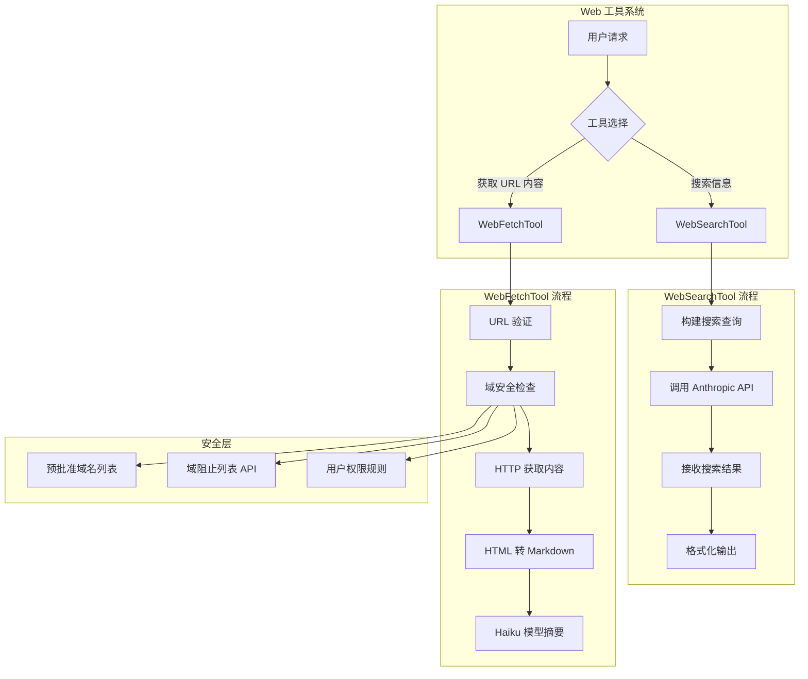
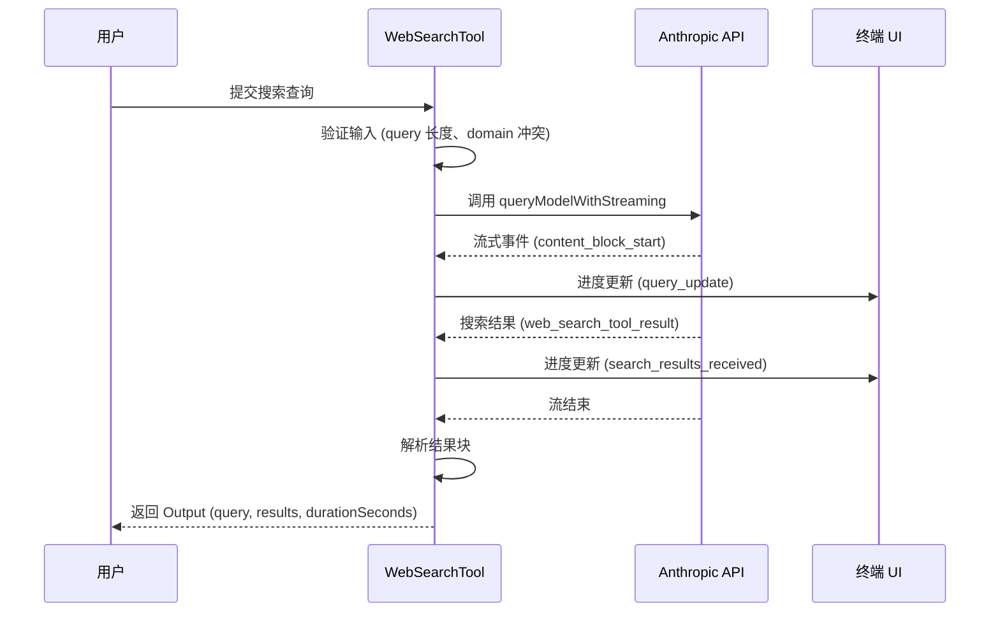
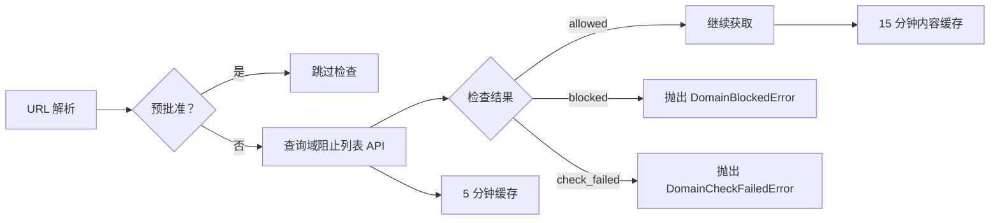

Web 搜索与网络工具模块为 Claude Code 提供了访问互联网内容的能力，包含两个核心工具：**WebSearch** 用于执行网络搜索获取最新信息，**WebFetch** 用于从指定 URL 获取并分析网页内容。这两个工具使 Claude 能够突破训练数据截止时间限制，访问实时信息和外部资源。

## 工具架构概览



Web 工具系统采用分层架构设计，核心工具通过 `buildTool` 工厂函数构建，遵循统一的工具接口规范。两个工具均声明为只读操作（`isReadOnly: true`）且并发安全（`isConcurrencySafe: true`），支持在多个任务中并行执行。

Sources: [src/tools/WebSearchTool/WebSearchTool.ts](src/tools/WebSearchTool/WebSearchTool.ts#L1-L100), [src/tools/WebFetchTool/WebFetchTool.ts](src/tools/WebFetchTool/WebFetchTool.ts#L1-L80)

## WebSearchTool：网络搜索工具

### 核心功能

WebSearchTool 通过 Anthropic SDK 的 `web_search_20250305` 工具类型实现网络搜索能力。该工具接收搜索查询字符串，可选地指定允许或阻止的域名列表，执行搜索后返回结构化的结果集合。

```typescript
const inputSchema = z.strictObject({
  query: z.string().min(2).describe('The search query to use'),
  allowed_domains: z.array(z.string()).optional()
    .describe('Only include search results from these domains'),
  blocked_domains: z.array(z.string()).optional()
    .describe('Never include search results from these domains'),
})
```

工具执行时最多进行 **8 次搜索**（`max_uses: 8`），这是硬编码的上限。搜索结果以 `SearchResult` 类型返回，包含标题和 URL 的映射关系，同时支持文本评论作为补充信息。

### 启用条件

WebSearchTool 的可用性取决于 API 提供商和模型类型，通过 `isEnabled()` 方法进行判断：

| 提供商 | 启用条件 |
|--------|----------|
| `firstParty` | 始终启用 |
| `vertex` | 仅 Claude 4.0+ 系列（opus-4、sonnet-4、haiku-4） |
| `foundry` | 始终启用（内置支持） |
| 其他 | 不启用 |

这种条件判断确保了工具仅在底层 API 支持网络搜索功能时可用，避免了不兼容的调用错误。

### 系统提示与输出要求

WebSearchTool 包含强制性的系统提示，要求模型在响应末尾必须添加 **Sources** 部分，列出所有使用的搜索结果链接：

```markdown
CRITICAL REQUIREMENT - You MUST follow this:
  - After answering the user's question, you MUST include a "Sources:" section
  - List all relevant URLs from the search results as markdown hyperlinks
  - This is MANDATORY - never skip including sources in your response
```

提示中还包含当前月份信息，确保搜索查询使用正确的年份获取最新文档和信息。

Sources: [src/tools/WebSearchTool/WebSearchTool.ts](src/tools/WebSearchTool/WebSearchTool.ts#L25-L45), [src/tools/WebSearchTool/prompt.ts](src/tools/WebSearchTool/prompt.ts#L1-L35)

### 执行流程



执行过程中，工具通过流式事件追踪每个搜索的进度，包括查询更新和结果接收两个阶段。进度信息通过 `onProgress` 回调传递到 UI 层，用户可以看到实时的搜索状态。

结果解析逻辑处理多种内容块类型：`server_tool_use` 标记搜索开始，`web_search_tool_result` 包含搜索结果数组，`text` 块包含模型的文本评论。解析器将这些块重组为结构化的 `Output` 对象。

Sources: [src/tools/WebSearchTool/WebSearchTool.ts](src/tools/WebSearchTool/WebSearchTool.ts#L200-L350)

## WebFetchTool：网页内容获取工具

### 核心功能

WebFetchTool 从指定 URL 获取内容，将其转换为 Markdown 格式，然后使用 Haiku 模型根据用户提供的提示词对内容进行处理和摘要。

```typescript
const inputSchema = z.strictObject({
  url: z.string().url().describe('The URL to fetch content from'),
  prompt: z.string().describe('The prompt to run on the fetched content'),
})
```

输出包含原始内容大小、HTTP 响应码、处理结果和执行时间：

```typescript
const outputSchema = z.object({
  bytes: z.number().describe('Size of the fetched content in bytes'),
  code: z.number().describe('HTTP response code'),
  codeText: z.string().describe('HTTP response code text'),
  result: z.string().describe('Processed result from applying the prompt'),
  durationMs: z.number().describe('Time taken to fetch and process'),
  url: z.string().describe('The URL that was fetched'),
})
```

### URL 验证与安全限制

工具对 URL 执行多层验证：

1. **长度限制**：最大 2000 字符（防止数据泄露）
2. **格式验证**：必须是有效的 URL 格式
3. **认证信息检查**：禁止包含用户名/密码的 URL
4. **主机名验证**：必须是 publicly resolvable 的域名（至少两个部分）

这些限制由 `validateURL()` 函数实现，确保工具不会被滥用于访问内部资源或执行数据外泄。

Sources: [src/tools/WebFetchTool/WebFetchTool.ts](src/tools/WebFetchTool/WebFetchTool.ts#L25-L50), [src/tools/WebFetchTool/utils.ts](src/tools/WebFetchTool/utils.ts#L130-L170)

### 预批准域名机制

出于安全和法律考虑，WebFetchTool 维护了一个预批准域名列表（`PREAPPROVED_HOSTS`），这些域名主要是编程和技术文档相关的网站。

```typescript
export const PREAPPROVED_HOSTS = new Set([
  // Anthropic 相关
  'platform.claude.com',
  'modelcontextprotocol.io',
  
  // 编程语言文档
  'docs.python.org',
  'en.cppreference.com',
  'developer.mozilla.org',
  'go.dev',
  'doc.rust-lang.org',
  
  // 框架文档
  'react.dev',
  'angular.io',
  'vuejs.org',
  'nextjs.org',
  'docs.djangoproject.com',
  'fastapi.tiangolo.com',
  
  // 云平台文档
  'docs.aws.amazon.com',
  'cloud.google.com',
  'kubernetes.io',
  // ... 共 80+ 域名
])
```

预批准域名分为两类：
- **纯域名**：整个域下的所有路径都被允许（如 `react.dev`）
- **路径限定**：仅允许特定路径前缀（如 `github.com/anthropics`）

对于预批准域名，工具会跳过域阻止列表检查，并且在使用 Haiku 模型处理内容时采用更宽松的版权指南。

Sources: [src/tools/WebFetchTool/preapproved.ts](src/tools/WebFetchTool/preapproved.ts#L1-L100)

### 域安全检查流程

对于非预批准域名，工具执行以下检查流程：



域检查通过调用 `https://api.anthropic.com/api/web/domain_info?domain=<domain>` 实现，超时时间为 10 秒。检查结果缓存 5 分钟，避免重复请求。

对于企业环境，用户可以通过设置 `skipWebFetchPreflight` 跳过预检检查，适用于限制出站连接的安全策略。

Sources: [src/tools/WebFetchTool/utils.ts](src/tools/WebFetchTool/utils.ts#L180-L220)

### 内容获取与处理

内容获取使用 axios 库，配置包括：
- **超时**：60 秒获取超时
- **重定向**：最多 10 次，仅允许同域名或添加/移除 www 前缀的重定向
- **内容限制**：最大 10MB
- **User-Agent**：自定义 WebFetch 标识

```typescript
const response = await getWithPermittedRedirects(url, signal, isPermittedRedirect)
```

获取到的内容根据 `Content-Type` 处理：
- **HTML**：使用 Turndown 库转换为 Markdown
- **其他文本**：直接使用原始内容
- **二进制**（PDF 等）：保存到磁盘并生成摘要

转换后的 Markdown 内容如果超过 100,000 字符会被截断，然后通过 Haiku 模型应用用户提示词生成最终结果。

Sources: [src/tools/WebFetchTool/utils.ts](src/tools/WebFetchTool/utils.ts#L250-L350), [src/tools/WebFetchTool/utils.ts](src/tools/WebFetchTool/utils.ts#L450-L531)

### 缓存机制

WebFetchTool 实现双层缓存：

| 缓存类型 | 键 | TTL | 大小限制 |
|----------|-----|-----|----------|
| URL 内容缓存 | 完整 URL | 15 分钟 | 50MB |
| 域检查缓存 | 域名 | 5 分钟 | 128 条目 |

URL 缓存使用 `lru-cache` 库，自动处理过期和驱逐。缓存存储在内存中，键为原始 URL（非升级或重定向后的 URL）。

Sources: [src/tools/WebFetchTool/utils.ts](src/tools/WebFetchTool/utils.ts#L60-L85)

## 权限系统集成

### WebSearchTool 权限

WebSearchTool 的权限检查返回 `passthrough` 行为，表示需要用户明确授权。权限建议添加本地设置规则：

```typescript
async checkPermissions(_input): Promise<PermissionResult> {
  return {
    behavior: 'passthrough',
    message: 'WebSearchTool requires permission.',
    suggestions: [{
      type: 'addRules',
      rules: [{ toolName: WEB_SEARCH_TOOL_NAME }],
      behavior: 'allow',
      destination: 'localSettings',
    }],
  }
}
```

### WebFetchTool 权限

WebFetchTool 的权限检查更加复杂，支持基于域名的规则：

```typescript
async checkPermissions(input, context): Promise<PermissionDecision> {
  // 1. 检查预批准主机
  if (isPreapprovedHost(hostname, pathname)) {
    return { behavior: 'allow', decisionReason: { type: 'other' } }
  }
  
  // 2. 检查拒绝规则
  if (denyRule) return { behavior: 'deny', ... }
  
  // 3. 检查询问规则
  if (askRule) return { behavior: 'ask', ... }
  
  // 4. 检查允许规则
  if (allowRule) return { behavior: 'allow', ... }
  
  // 5. 默认询问
  return { behavior: 'ask', ... }
}
```

权限规则内容格式为 `domain:<hostname>`，用户可以配置特定域名的允许/拒绝/询问策略。

Sources: [src/tools/WebSearchTool/WebSearchTool.ts](src/tools/WebSearchTool/WebSearchTool.ts#L205-L220), [src/tools/WebFetchTool/WebFetchTool.ts](src/tools/WebFetchTool/WebFetchTool.ts#L85-L150)

## UI 展示与进度反馈

### 工具使用消息

两个工具都实现了 `renderToolUseMessage` 函数，在终端中显示当前操作：

**WebSearchTool**：
```
"搜索查询内容"（详细模式下显示 domain 过滤规则）
```

**WebFetchTool**：
```
hostname（简洁模式）
url: "完整 URL", prompt: "提示词"（详细模式）
```

### 进度消息

WebSearchTool 支持两种进度状态：

| 进度类型 | 显示内容 |
|----------|----------|
| `query_update` | `Searching: <查询>` |
| `search_results_received` | `Found N results for "<查询>"` |

WebFetchTool 显示统一的 `Fetching…` 进度状态。

### 结果展示

**WebSearchTool** 结果显示搜索次数和耗时：
```
Did N searches in Xs
```

**WebFetchTool** 结果显示获取的内容大小和 HTTP 状态：
```
Received X KB (200 OK)
```

Sources: [src/tools/WebSearchTool/UI.tsx](src/tools/WebSearchTool/UI.tsx#L1-L80), [src/tools/WebFetchTool/UI.tsx](src/tools/WebFetchTool/UI.tsx#L1-L60)

## 工具可用性与限制

### 工具结果大小限制

两个工具都设置了 `maxResultSizeChars: 100_000`，这是工具结果持久化的阈值。当结果超过此限制时，内容会被保存到磁盘，模型接收包含文件路径的预览。

系统级限制包括：

| 限制类型 | 值 | 说明 |
|----------|-----|------|
| `DEFAULT_MAX_RESULT_SIZE_CHARS` | 50,000 | 默认持久化阈值 |
| `MAX_TOOL_RESULT_TOKENS` | 100,000 | 最大 token 数 |
| `MAX_TOOL_RESULT_BYTES` | 400,000 | 最大字节数 |
| `MAX_TOOL_RESULTS_PER_MESSAGE_CHARS` | 200,000 | 单消息聚合限制 |

Sources: [src/constants/toolLimits.ts](src/constants/toolLimits.ts#L1-L57)

### Agent 工具可用性

在异步 Agent 场景中，WebSearch 和 WebFetch 都在 `ASYNC_AGENT_ALLOWED_TOOLS` 列表中，允许 Agent 独立使用这些工具：

```typescript
export const ASYNC_AGENT_ALLOWED_TOOLS = new Set([
  FILE_READ_TOOL_NAME,
  WEB_SEARCH_TOOL_NAME,  // ✓ 允许
  WEB_FETCH_TOOL_NAME,   // ✓ 允许
  // ...
])
```

但 Agent 无法使用需要主线程状态的工具（如 `TaskOutputTool`、`TaskStopTool`），这确保了并发安全性。

Sources: [src/constants/tools.ts](src/constants/tools.ts#L50-L75)

## 与其他页面的关联

理解 Web 搜索与网络工具后，建议继续阅读：

- **[工具系统设计与编排](5-gong-ju-xi-tong-she-ji-yu-bian-pai)** — 了解工具系统的整体架构和 `buildTool` 工厂模式
- **[权限系统与安全控制](13-quan-xian-xi-tong-yu-an-quan-kong-zhi)** — 深入理解权限检查机制和规则系统
- **[MCP（模型上下文协议）集成](12-mcp-mo-xing-shang-xia-wen-xie-yi-ji-cheng)** — 了解如何通过 MCP 工具扩展网络访问能力
- **[API 服务与 Anthropic SDK 集成](11-api-fu-wu-yu-anthropic-sdk-ji-cheng)** — 理解底层 API 调用和流式处理机制