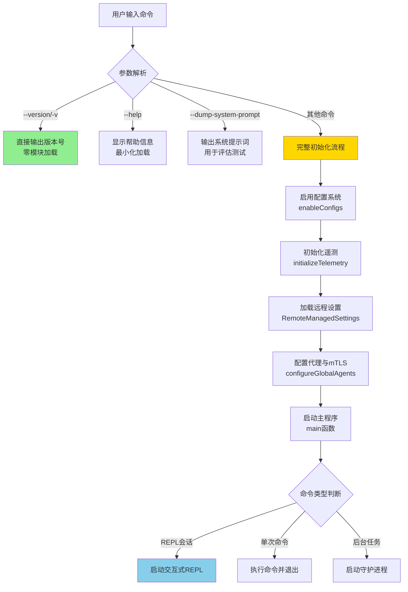
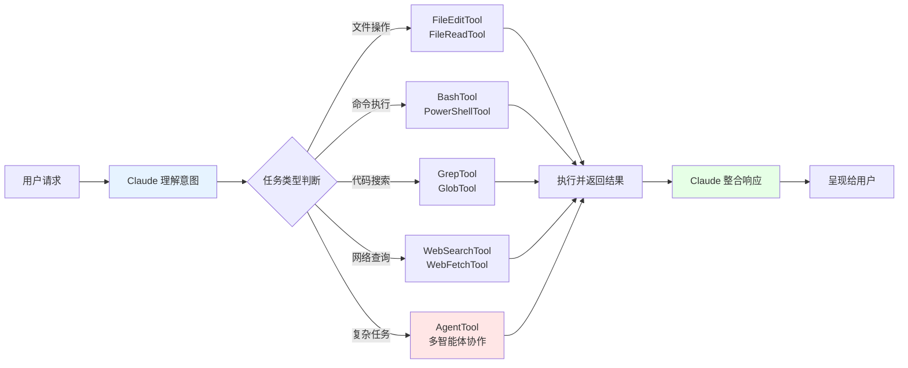

Claude Code 是 Anthropic 推出的命令行 AI 助手工具，它将 Claude 的强大能力直接带到您的终端环境中。本指南将帮助您从零开始，快速掌握 Claude Code 的安装、配置与基本使用，为后续深入探索打下坚实基础。

## 环境要求与系统架构概览

Claude Code 基于 Node.js 构建的 ESM 模块化应用，采用 React + Ink 框架实现终端 UI 交互，核心依赖 @anthropic-ai/sdk 与 Anthropic API 通信。在开始之前，请确保您的开发环境满足以下最低要求：

| 组件 | 最低版本 | 推荐版本 | 用途说明 |
|------|----------|----------|----------|
| Node.js | 18.0.0 | 20.x LTS | 运行时环境，支持 ESM 模块 |
| npm | 9.0.0 | 10.x | 包管理工具 |
| 内存 | 4GB | 8GB+ | 处理大型代码库和复杂会话 |

项目采用 **分层启动架构**，通过快速路径优化确保 --version、--help 等常用操作零模块加载开销，同时将重量级初始化逻辑延迟到实际需要时执行。这种设计使得 Claude Code 在保持功能丰富的同时，依然能够实现毫秒级的快速响应。

Sources: [cli.tsx](src/entrypoints/cli.tsx#L1-L200), [package.json](cc-recovered-main/package.json#L1-L120)

## 安装步骤详解

### 第一步：获取项目源码

由于 Claude Code 2.1.88 的源码是从发布包的 sourcemap 逆向恢复而来，您可以通过以下方式获取项目：

```bash
# 克隆或下载项目到本地
git clone <repository-url>
cd claude-code-recovered
```

### 第二步：安装项目依赖

项目使用标准的 npm 工作流，安装过程会自动处理跨平台原生依赖（如图像处理的 sharp 库）：

```bash
npm install
```

这个命令会根据 `package.json` 安装 70+ 个生产依赖，包括核心框架（React 19、Ink 6）、API 集成（@anthropic-ai/sdk）、工具链（esbuild、chalk）以及可选的平台特定二进制包。

### 第三步：构建可执行产物

项目使用自定义的 esbuild 构建脚本，该脚本会：

1. **转译源代码**：将 TypeScript/TSX 转换为 Node.js 可执行的 ESM 格式
2. **处理 Bun 特定导入**：为 `bun:bundle`、`bun:ffi` 等 Bun 运行时 API 生成兼容 shim
3. **注入构建常量**：将版本号、构建时间等宏定义内联到代码中
4. **生成缺失模块 stub**：为无法从 sourcemap 恢复的私有模块自动生成占位符

执行构建命令：

```bash
npm run build
```

构建完成后，产物将输出到 `dist/` 目录，包括主入口 `dist/cli.js` 以及所有转译后的源码文件。构建脚本通过 MACRO 定义将版本信息注入到代码中，使得 `--version` 命令能够零模块加载直接输出版本号。

Sources: [build.mjs](cc-recovered-main/scripts/build.mjs#L1-L80), [README.zh-CN.md](cc-recovered-main/README.zh-CN.md#L1-L193)

### 第四步：验证安装成功

通过运行以下命令验证 CLI 是否正常工作：

```bash
node dist/cli.js --version
# 输出：2.1.88 (Claude Code)

node dist/cli.js --help
# 显示命令行帮助信息
```

如果您希望将 Claude Code 安装为全局命令行工具，可以执行：

```bash
# 全局安装
npm install -g .

# 或使用符号链接（推荐开发时使用）
npm link

# 之后可直接使用
claude-recovered --version
```

## 基本使用流程与启动机制

Claude Code 的启动流程经过精心优化，遵循"快速路径优先、延迟加载"原则。当您在终端输入命令时，系统会按照以下决策树处理：



**快速路径优化**：`src/entrypoints/cli.tsx` 通过条件编译和动态导入实现快速路径。版本查询不需要任何模块加载，直接读取构建时注入的 `MACRO.VERSION` 常量。帮助命令也仅加载最小必要的模块，避免加载 React、Ink 等重量级依赖。

**完整初始化流程**：对于需要完整功能的命令，系统会依次执行：
- **配置加载**：从 `~/.claude/config.json` 和项目配置文件读取设置
- **环境变量应用**：根据信任级别应用安全的环境变量
- **遥测初始化**：设置 OpenTelemetry 和分析系统
- **网络配置**：设置代理、mTLS、CA 证书等网络层
- **会话准备**：创建工作目录、检测 Git 仓库、初始化权限系统

Sources: [cli.tsx](src/entrypoints/cli.tsx#L44-L100), [init.ts](src/entrypoints/init.ts#L30-L150), [setup.ts](src/setup.ts#L40-L100)

## 项目核心结构解析

Claude Code 的代码库采用清晰的模块化架构，每个目录承担特定的职责。理解这种结构有助于您快速定位代码、扩展功能或调试问题：

```
claude-code/
├── src/
│   ├── entrypoints/          # 应用入口层
│   │   ├── cli.tsx          # CLI 快速路径处理器
│   │   ├── init.ts          # 初始化逻辑（配置、遥测）
│   │   └── sdk/             # SDK 集成入口
│   ├── main.tsx             # 主程序入口（4683行）
│   ├── setup.ts             # 环境设置（权限、工作目录）
│   ├── commands/            # 命令实现（75+ 命令）
│   │   ├── help/            # 帮助系统
│   │   ├── init.ts          # 项目初始化
│   │   ├── login/           # 用户认证
│   │   ├── mcp/             # MCP 协议管理
│   │   └── ...              # 其他命令
│   ├── tools/               # 工具系统（AI 可调用工具）
│   │   ├── FileEditTool/    # 文件编辑
│   │   ├── BashTool/        # Shell 命令执行
│   │   ├── AgentTool/       # 多智能体协作
│   │   └── ...              # 其他工具
│   ├── components/          # React UI 组件
│   │   ├── App.tsx          # 主应用组件
│   │   ├── Messages.tsx     # 消息渲染
│   │   └── HelpV2/          # 帮助界面
│   ├── services/            # 服务层
│   │   ├── api/             # Anthropic API 集成
│   │   ├── mcp/             # MCP 协议实现
│   │   ├── analytics/       # 分析与遥测
│   │   └── settings/        # 设置管理
│   ├── state/               # 状态管理
│   │   ├── AppState.tsx     # 全局应用状态
│   │   └── store.ts         # 状态存储
│   └── utils/               # 工具函数库
│       ├── config.ts        # 配置读取/写入
│       ├── auth.ts          # 认证逻辑
│       └── git/             # Git 操作
├── scripts/
│   └── build.mjs            # 自定义构建脚本
└── package.json             # 项目配置与依赖
```

**分层架构特征**：
- **入口层**（entrypoints/）：处理命令行参数解析和快速路径优化
- **应用层**（main.tsx、setup.ts）：协调各子系统，管理会话生命周期
- **命令层**（commands/）：实现用户可调用的各种指令
- **工具层**（tools/）：定义 AI 可以调用的能力（文件操作、Shell 执行等）
- **服务层**（services/）：封装外部 API 集成、协议实现
- **表现层**（components/）：React 组件渲染终端 UI
- **状态层**（state/）：管理全局状态和会话状态

Sources: [get_dir_structure](.), [main.tsx](src/main.tsx#L1-L100), [commands.ts](src/commands.ts#L1-L100)

## 快速体验：您的第一次对话

### 启动交互式会话

完成安装后，最简单的开始方式是启动交互式 REPL（Read-Eval-Print Loop）：

```bash
node dist/cli.js
```

系统会进入交互式对话模式，您可以：
- 输入自然语言问题，Claude 会理解您的代码库上下文
- 使用 `/help` 查看所有可用命令
- 使用 `/init` 初始化当前项目
- 使用 `/login` 进行身份认证

### 常用命令速览

Claude Code 提供了丰富的命令系统，涵盖项目管理、代码操作、会话控制等多个领域。以下是最常用的命令分类：

| 类别 | 命令示例 | 功能说明 |
|------|----------|----------|
| **项目管理** | `/init` | 初始化 Claude Code 配置和项目设置 |
| | `/doctor` | 诊断项目环境和配置问题 |
| | `/config` | 查看和修改配置项 |
| **代码操作** | `/commit` | AI 辅助 Git 提交 |
| | `/review` | 代码审查和质量分析 |
| | `/diff` | 查看文件差异 |
| **会话管理** | `/resume` | 恢复之前的会话 |
| | `/session` | 管理会话历史 |
| | `/clear` | 清空当前会话 |
| **工具集成** | `/mcp` | 管理 MCP 服务器 |
| | `/skills` | 管理技能和插件 |
| | `/ide` | IDE 集成设置 |
| **信息查询** | `/usage` | 查看 API 使用情况 |
| | `/cost` | 查看成本统计 |
| | `/help` | 显示帮助信息 |

命令系统通过 `src/commands.ts` 统一注册和管理，每个命令都有独立的实现模块。系统支持命令别名、参数解析、权限控制等高级特性。

Sources: [commands.ts](src/commands.ts#L1-L100), [HelpV2.tsx](src/components/HelpV2/HelpV2.tsx#L1-L100)

### 工具系统初探

Claude Code 的核心优势在于其强大的工具系统。当您向 Claude 提出请求时，系统会自动选择合适的工具来完成任务：



例如，当您说"帮我重构这个函数"时，Claude 会：
1. 使用 **FileReadTool** 读取相关文件
2. 使用 **GrepTool** 搜索函数的所有引用
3. 使用 **FileEditTool** 执行重构操作
4. 使用 **BashTool** 运行测试验证变更

所有工具都在 `src/tools/` 目录下实现，遵循统一的接口规范（`Tool.ts`），支持权限控制、超时管理、错误处理等机制。

Sources: [Tool.ts](src/Tool.ts#L1-L50), [tools.ts](src/tools.ts#L1-L100)

## 配置文件与持久化设置

Claude Code 使用多层配置系统，支持全局设置和项目级覆盖：

### 全局配置文件位置

```
~/.claude/
├── config.json           # 全局配置（API 密钥、偏好设置）
├── settings.json         # 用户设置（主题、快捷键）
├── sessions/             # 会话历史记录
├── memory/               # 项目记忆库
└── credentials/          # 认证凭据（OAuth token 等）
```

### 项目级配置

在项目根目录创建 `.claude/config.json` 可以覆盖全局设置，实现项目特定的配置：

```json
{
  "allowedTools": ["FileEditTool", "BashTool"],
  "mcpServers": {
    "my-server": {
      "command": "node",
      "args": ["./mcp-server.js"]
    }
  },
  "model": "claude-sonnet-4-20250514"
}
```

配置系统通过 `src/utils/config.ts` 实现，支持配置合并、热重载、验证等高级功能。系统会在启动时自动检测项目配置并应用相应设置。

Sources: [config.ts](src/utils/config.ts#L1-L100), [setup.ts](src/setup.ts#L40-L100)

## 初始化性能优化机制

Claude Code 的启动性能经过高度优化，采用了多项创新技术：

### 启动性能分析

项目内置启动性能分析器（`src/utils/startupProfiler.ts`），通过 `CLAUDE_CODE_PROFILE_STARTUP=1` 环境变量启用详细分析：

```bash
CLAUDE_CODE_PROFILE_STARTUP=1 node dist/cli.js
```

这会生成包含时间戳和内存快照的性能报告，帮助识别启动瓶颈。

### 并行初始化策略

系统通过以下策略实现快速启动：

1. **MDM 预读取**：在模块加载阶段并行启动 MDM（移动设备管理）配置读取
2. **Keychain 预取**：并行读取 macOS keychain 中的 OAuth 和 API 密钥
3. **延迟加载**：重量级模块（如 OpenTelemetry、protobuf）通过动态导入延迟加载
4. **快速路径优化**：--version、--help 等命令零模块加载

启动性能监控显示，从命令输入到初始化完成通常在 100-300ms 内完成（取决于系统和配置复杂度）。

Sources: [startupProfiler.ts](src/utils/startupProfiler.ts#L1-L100), [cli.tsx](src/entrypoints/cli.tsx#L1-L100)

## 下一步学习路径

现在您已经掌握了 Claude Code 的基本安装和使用，建议按照以下路径深入学习：

### 对于想要理解核心机制的开发者：
- 阅读 [核心概念与架构总览](3-he-xin-gai-nian-yu-jia-gou-zong-lan)，了解系统的整体设计哲学
- 探索 [查询引擎架构与执行机制](4-cha-xun-yin-qing-jia-gou-yu-zhi-xing-ji-zhi)，理解 AI 如何处理您的请求

### 对于想要扩展功能的开发者：
- 学习 [自定义工具开发指南](27-zi-ding-yi-gong-ju-kai-fa-zhi-nan)，为 Claude 添加新能力
- 探索 [MCP 服务器开发](29-mcp-fu-wu-qi-kai-fa)，集成外部工具和数据源

### 对于想要深入集成的开发者：
- 研究 [API 服务与 Anthropic SDK 集成](11-api-fu-wu-yu-anthropic-sdk-ji-cheng)，理解底层通信机制
- 学习 [技能系统与插件架构](20-ji-neng-xi-tong-yu-cha-jian-jia-gou)，构建可复用的能力模块

Claude Code 是一个功能丰富且架构清晰的系统，通过本快速开始指南，您已经具备了探索其深层能力的基础。无论是日常开发辅助，还是构建复杂的自动化工作流，Claude Code 都能成为您的得力助手。