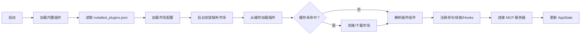

技能系统（Skills）与插件架构（Plugins）是 Claude Code 可扩展性的核心支柱。**技能系统**允许用户定义可复用的 AI 工作流模板，而**插件系统**则提供了更完整的扩展机制，支持命令、技能、Hooks、MCP 服务器等多种组件的打包分发。本文档深入解析这两大系统的架构设计、加载机制与运行时行为。

## 技能系统架构

技能系统采用**多层来源架构**，技能可从四个不同来源加载，每个来源具有不同的优先级和生命周期管理策略。

### 技能来源层级

| 来源类型 | 加载路径 | 优先级 | 生命周期 | 典型用途 |
|---------|---------|--------|---------|---------|
| **内置技能** (bundled) | 编译时嵌入 | 最高 | 随 CLI 版本更新 | 核心功能如 `/remember`、`/verify` |
| **策略设置技能** (policySettings) | 托管配置文件 | 高 | 企业策略控制 | 组织级标准化技能 |
| **用户技能** (userSettings) | `~/.claude/skills/` | 中 | 用户全局可用 | 个人常用工作流 |
| **项目技能** (projectSettings) | `.claude/skills/` | 低 | 项目特定 | 团队协作规范 |
| **插件技能** (plugin) | 插件包内 | 动态 | 随插件启用状态 | 第三方扩展功能 |
| **MCP 技能** (mcp) | MCP 服务器 | 动态 | 随服务器连接 | 外部服务集成 |

技能加载器按优先级合并所有来源的技能，同名技能高优先级覆盖低优先级。[`loadSkillsDir.ts`](src/skills/loadSkillsDir.ts#L1-L100) 实现了跨来源的技能发现与去重逻辑。

### 内置技能注册机制

内置技能通过 `registerBundledSkill()` 函数在启动时注册，定义包含完整的元数据和动态提示生成器：

```typescript
type BundledSkillDefinition = {
  name: string                    // 技能名称
  description: string             // 技能描述
  aliases?: string[]              // 别名列表
  whenToUse?: string              // 使用场景说明
  allowedTools?: string[]         // 允许使用的工具白名单
  model?: string                  // 指定模型
  disableModelInvocation?: boolean // 禁用模型调用
  userInvocable?: boolean         // 用户是否可直接调用
  hooks?: HooksSettings           // Hook 配置
  context?: 'inline' | 'fork'     // 执行上下文
  files?: Record<string, string>  // 参考文件（首次调用时提取到磁盘）
  getPromptForCommand: (args, context) => Promise<ContentBlockParam[]>
}
```

内置技能的核心特征是**惰性文件提取**：当技能定义包含 `files` 字段时，系统会在首次调用时将参考文件提取到 `~/.claude/skills/{skillName}/` 目录，使模型能够通过 Read/Grep 工具按需访问这些文件。[`bundledSkills.ts`](src/skills/bundledSkills.ts#L1-L100) 实现了这一机制，使用 `O_NOFOLLOW | O_EXCL` 标志确保文件写入安全。

### 文件技能与 Frontmatter 解析

文件技能以 Markdown 文件形式存储在 `.claude/skills/` 目录中，通过 YAML frontmatter 定义元数据：

```markdown
---
name: deploy
description: 部署应用到生产环境
allowedTools: Bash, FileRead, FileEdit
argumentHint: <environment>
whenToUse: 当用户需要将应用部署到指定环境时
model: opus
---

部署流程的具体提示内容...
```

`loadSkillsDir.ts` 中的 `parseSkillFrontmatterFields()` 函数负责解析 frontmatter，提取以下核心字段：

- **name/description**: 技能标识与描述
- **allowedTools**: 工具使用白名单
- **argumentHint**: 参数提示
- **whenToUse**: 使用场景（用于技能发现）
- **model**: 模型覆盖
- **hooks**: 钩子配置
- **paths**: 作用域路径限制

技能文件支持参数替换语法（如 `{arg1}`、`{arg2}`），在调用时通过 `substituteArguments()` 函数进行动态替换。[`loadSkillsDir.ts`](src/skills/loadSkillsDir.ts#L200-L400) 实现了完整的 frontmatter 解析与参数处理逻辑。

### 技能执行模型

技能通过 `SkillTool` 工具执行，支持两种执行模式：

**1. 内联模式 (inline)**：技能提示直接注入当前会话上下文，与用户消息合并后发送给模型。适用于简单的工作流增强。

**2. 分叉模式 (fork)**：技能在独立的子代理（sub-agent）中执行，拥有独立的 token 预算和上下文隔离。适用于复杂的多步骤任务。[`SkillTool.ts`](src/tools/SkillTool/SkillTool.ts#L100-L300) 中的 `executeForkedSkill()` 函数实现了分叉执行，包括：

- 创建独立 agentId
- 准备隔离的上下文（`prepareForkedCommandContext()`）
- 调用 `runAgent()` 执行子任务
- 提取并返回结果（`extractResultText()`）

分叉模式支持嵌套调用，通过 `query_depth` 追踪调用层级，防止无限递归。

## 插件系统架构

插件系统是 Claude Code 的**一级扩展机制**，支持将命令、技能、Hooks、MCP 服务器等组件打包分发。插件架构设计遵循**组件化**和**版本隔离**原则。

### 插件组件类型

插件可包含以下组件类型：

| 组件类型 | 目录/配置 | 功能描述 |
|---------|----------|---------|
| **commands** | `commands/` | 自定义斜杠命令（Markdown 文件） |
| **agents** | `agents/` | 自定义 AI 代理配置 |
| **skills** | `skills/` | 技能目录（每个子目录含 SKILL.md） |
| **hooks** | `hooks.json` | 事件钩子配置 |
| **output-styles** | `output-styles/` | 输出样式模板 |
| **mcpServers** | `plugin.json` 配置 | MCP 服务器定义 |
| **lspServers** | `plugin.json` 配置 | LSP 服务器定义 |

插件清单文件 `plugin.json` 定义了组件路径和元数据：

```json
{
  "name": "my-plugin",
  "version": "1.0.0",
  "description": "插件描述",
  "commands": "./commands",
  "skills": "./skills",
  "hooks": "./hooks.json",
  "mcpServers": {
    "github": {
      "command": "github-mcp-server",
      "args": []
    }
  }
}
```

[`schemas.ts`](src/utils/plugins/schemas.ts#L1-L200) 定义了完整的插件清单 Schema，包括路径验证和组件配置校验。

### 内置插件机制

内置插件（Builtin Plugins）是随 CLI 分发的特殊插件类型，通过 `registerBuiltinPlugin()` 注册，具有以下特征：

- 在 `/plugin` UI 中显示在"Built-in"分区
- 用户可通过设置启用/禁用（状态持久化到 `settings.json`）
- 可提供技能、Hooks、MCP 服务器等多种组件
- 插件 ID 格式为 `{name}@builtin`

[`builtinPlugins.ts`](src/plugins/builtinPlugins.ts#L1-L100) 实现了内置插件注册表，`getBuiltinPlugins()` 函数根据用户设置返回启用/禁用状态分类的插件列表。内置插件与内置技能的关键区别在于：内置技能始终可用，而内置插件可由用户切换启用状态。

### 市场插件安装流程

市场插件支持多种安装来源：GitHub 仓库、HTTP(S) URL、npm 包、本地目录。安装流程如下：

```mermaid
flowchart TD
    A[用户发起安装] --> B{解析插件 ID}
    B -->|name@marketplace| C[查询市场配置]
    B -->|bare name| D[搜索所有市场]
    C --> E{来源类型}
    D --> E
    E -->|GitHub| F[git clone 到缓存]
    E -->|URL| G[下载 ZIP 并解压]
    E -->|npm| H[npm pack + 解压]
    E -->|local| I[复制或 symlink]
    F --> J[验证 plugin.json]
    G --> J
    H --> J
    I --> J
    J --> K[写入 installed_plugins.json]
    K --> L[更新 settings.json enabledPlugins]
    L --> M[触发插件刷新]
```

[`pluginOperations.ts`](src/services/plugins/pluginOperations.ts#L1-L300) 实现了核心安装操作，包括：

- `installPluginOp()`: 解析市场条目、克隆/下载、验证、写入元数据
- `uninstallPluginOp()`: 删除安装、清理缓存、检查反向依赖
- `enablePluginOp()` / `disablePluginOp()`: 切换启用状态
- `updatePluginOp()`: 拉取新版本并迁移安装路径

### 版本化缓存系统

插件采用**版本化缓存**结构，确保不同版本的插件可共存：

```
~/.claude/plugins/
├── cache/
│   └── {marketplace}/
│       └── {plugin-name}/
│           └── {version}/    # 版本隔离
│               ├── commands/
│               ├── skills/
│               └── plugin.json
├── marketplaces/             # 市场数据缓存
│   └── {marketplace-name}/
└── installed_plugins.json    # 安装元数据
```

[`pluginLoader.ts`](src/utils/plugins/pluginLoader.ts#L100-L300) 中的 `getVersionedCachePath()` 函数计算缓存路径，格式为 `~/.claude/plugins/cache/{marketplace}/{plugin}/{version}/`。路径中的 marketplace、plugin、version 均经过 sanitization 处理，防止路径遍历攻击。

缓存系统支持**种子目录（seed directories）**机制，允许在启动时预加载插件缓存。`probeSeedCache()` 函数按优先级扫描种子目录，实现企业环境下的插件预分发。

### 插件安装元数据管理

`installed_plugins.json` 文件跟踪全局插件安装状态，采用 V2 格式：

```json
{
  "version": 2,
  "plugins": {
    "my-plugin@official": [
      {
        "scope": "user",
        "installPath": "~/.claude/plugins/cache/official/my-plugin/1.0.0",
        "installedAt": "2024-01-01T00:00:00.000Z",
        "source": "github:anthropics/my-plugin",
        "sha": "abc123"
      }
    ]
  }
}
```

关键设计决策：

- **安装与启用分离**：`installed_plugins.json` 跟踪全局安装状态，`settings.json` 跟踪每仓库的启用状态
- **多作用域支持**：同一插件可在 user/project/local/managed 多个作用域安装
- **版本追踪**：通过 `sha` 字段支持 Git 提交哈希版本锁定

[`installedPluginsManager.ts`](src/utils/plugins/installedPluginsManager.ts#L1-L200) 实现了安装元数据的读写、迁移和缓存管理。

## 市场管理与安全控制

### 市场配置架构

市场配置存储在 `~/.claude/plugins/known_marketplaces.json`，定义所有已知市场来源：

```json
{
  "marketplaces": {
    "claude-code-marketplace": {
      "source": "github:anthropics/claude-code-plugins",
      "autoUpdate": true
    },
    "custom-marketplace": {
      "source": "https://example.com/marketplace.json",
      "autoUpdate": false
    }
  }
}
```

[`marketplaceManager.ts`](src/utils/plugins/marketplaceManager.ts#L1-L300) 实现了市场管理的核心功能：

- `getDeclaredMarketplaces()`: 合并设置和 `--add-dir` 来源的市场声明
- `loadKnownMarketplacesConfig()`: 加载并缓存市场配置
- `getMarketplace()`: 获取特定市场的条目（支持缓存和远程获取）
- `reconcileMarketplaces()`: 对比声明与市场实际内容，触发后台安装

### 官方市场保护机制

系统实现了多层防御机制防止官方市场假冒：

**1. 名称保留**：`ALLOWED_OFFICIAL_MARKETPLACE_NAMES` 定义了保留名称列表（如 `claude-code-marketplace`、`anthropic-marketplace`），第三方市场不得使用。

**2. 来源验证**：`validateOfficialNameSource()` 函数验证保留名称的市场必须来自 `github.com/anthropics/` 组织。

**3. 模式检测**：`BLOCKED_OFFICIAL_NAME_PATTERN` 正则表达式检测包含 "official"、"anthropic"、"claude" 组合的可疑名称。

**4. 非 ASCII 字符阻止**：`NON_ASCII_PATTERN` 检测并阻止包含非 ASCII 字符的市场名称，防止同形异义字攻击（homograph attacks）。

[`schemas.ts`](src/utils/plugins/schemas.ts#L1-L150) 实现了完整的市场名称验证逻辑。

### 策略控制与权限

企业环境可通过策略设置控制插件行为：

- **市场白名单/黑名单**：`isSourceAllowedByPolicy()` 和 `isSourceInBlocklist()` 函数根据策略验证市场来源
- **插件安装限制**：`isPluginBlockedByPolicy()` 检查插件是否被策略阻止
- **仅插件模式**：`isRestrictedToPluginOnly()` 限制某些功能仅可通过插件使用

[`pluginPolicy.ts`](src/utils/plugins/pluginPolicy.ts)（引用自 `pluginOperations.ts`）实现了策略检查逻辑。

## 运行时集成

### 插件加载流程

插件在启动时通过以下流程加载：



[`PluginInstallationManager.ts`](src/services/plugins/PluginInstallationManager.ts#L1-L100) 实现了后台安装逻辑，`performBackgroundPluginInstallations()` 函数在启动时异步执行市场协调，避免阻塞主流程。

### 技能工具集成

`SkillTool` 是技能执行的统一入口，集成所有来源的技能：

- 通过 `getAllCommands()` 合并本地命令、内置技能和 MCP 技能
- 使用 `uniqBy(..., 'name')` 进行去重，高优先级来源覆盖低优先级
- 支持实验性的技能搜索功能（`EXPERIMENTAL_SKILL_SEARCH` 特性标志）

[`SkillTool.ts`](src/tools/SkillTool/SkillTool.ts#L1-L150) 中的 `getAllCommands()` 函数实现了技能聚合逻辑。

### 状态管理与 UI 集成

插件状态通过 `AppState.plugins` 管理，包括：

- `installationStatus`: 市场/插件安装进度（pending/installing/installed/failed）
- `needsRefresh`: 标记是否需要重新加载插件
- `pluginReconnectKey`: 变更时触发 MCP 重新连接

`/plugin` 命令的 UI 组件（`ManagePlugins.tsx`）提供交互式插件管理界面，支持：

- 浏览已安装插件和可用市场
- 启用/禁用/卸载操作
- 查看插件组件详情（命令、技能、MCP 服务器）
- 配置插件选项（通过 `pluginOptionsStorage` 持久化）

[`ManagePlugins.tsx`](src/commands/plugin/ManagePlugins.tsx#L1-L200) 实现了完整的插件管理 UI 逻辑。

## 扩展开发指南

### 创建内置技能

1. 在 `src/skills/bundled/` 创建新文件（如 `myskill.ts`）
2. 导出注册函数调用 `registerBundledSkill()`
3. 在 `src/skills/bundled/index.ts` 中导入并调用注册函数

```typescript
// src/skills/bundled/myskill.ts
import { registerBundledSkill } from '../bundledSkills.js'

export function registerMySkill(): void {
  registerBundledSkill({
    name: 'myskill',
    description: '我的技能描述',
    async getPromptForCommand(args, context) {
      return [{ type: 'text', text: `提示内容：${args}` }]
    },
  })
}
```

### 创建文件技能

1. 在 `~/.claude/skills/` 或 `.claude/skills/` 创建 Markdown 文件
2. 添加 YAML frontmatter 定义元数据
3. 编写提示内容，可使用 `{arg1}` 等参数占位符

### 创建插件

1. 创建插件目录结构（commands/、skills/、hooks.json 等）
2. 添加 `plugin.json` 清单文件
3. 通过市场发布或本地安装

插件开发完整指南参考：[自定义工具开发指南](27-zi-ding-yi-gong-ju-kai-fa-zhi-nan)、[MCP 服务器开发](29-mcp-fu-wu-qi-kai-fa)。

## 下一步阅读

- [工具系统设计与编排](5-gong-ju-xi-tong-she-ji-yu-bian-pai) — 了解 SkillTool 如何与其他工具协同工作
- [MCP（模型上下文协议）集成](12-mcp-mo-xing-shang-xia-wen-xie-yi-ji-cheng) — 深入 MCP 服务器集成机制
- [自定义命令开发指南](28-zi-ding-yi-ming-ling-kai-fa-zhi-nan) — 学习创建自定义命令
- [项目构建与依赖管理](24-xiang-mu-gou-jian-yu-yi-lai-guan-li) — 了解插件开发环境配置