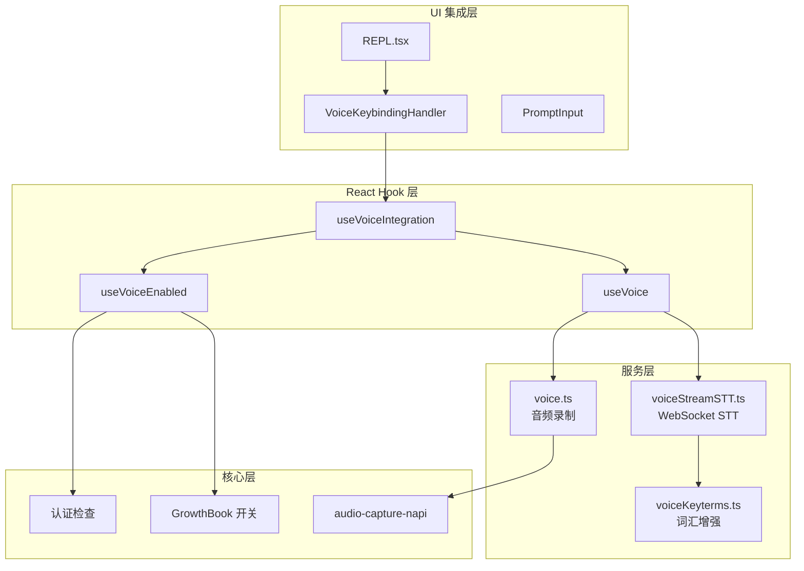
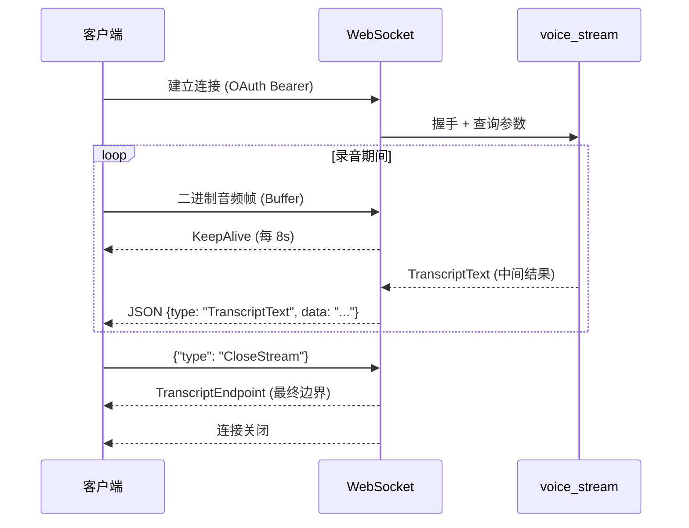
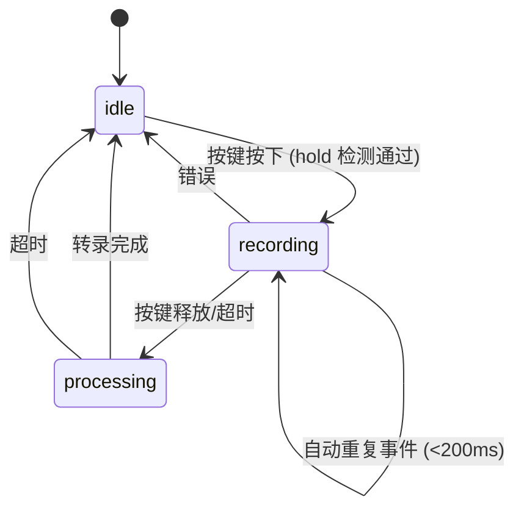
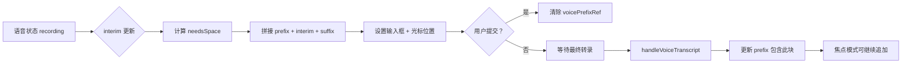

语音模式是 Claude Code 的多模态交互核心功能，支持**按住说话**（hold-to-talk）的语音输入体验。该功能通过 Anthropic 的 `voice_stream` WebSocket 端点实现实时语音转文字（STT），并将转录结果无缝集成到终端输入流程中。

## 架构概览

语音模式的架构采用分层设计，从底层音频捕获到上层 UI 集成形成完整的数据流：



**数据流特征**：
- **音频流**：麦克风 → 原生音频模块 → 16kHz 单声道 PCM → WebSocket 二进制帧
- **转录流**：voice_stream 端点 → JSON TranscriptText → 临时/最终转录 → 输入框
- **状态流**：idle → recording → processing → idle 的状态机转换

Sources: [voice.ts](src/services/voice.ts#L1-L50), [voiceStreamSTT.ts](src/services/voiceStreamSTT.ts#L1-L50), [useVoice.ts](src/hooks/useVoice.ts#L1-L50)

## 语音模式启用机制

语音模式的可用性由三层检查决定，确保功能在正确的环境下激活：

| 检查层级 | 函数/组件 | 检查内容 | 缓存策略 |
|---------|----------|---------|---------|
| 功能开关 | `isVoiceGrowthBookEnabled()` | GrowthBook `VOICE_MODE` 特性标志 + `tengu_amber_quartz_disabled` 紧急关闭开关 | 磁盘缓存，默认开启 |
| 认证检查 | `hasVoiceAuth()` | Anthropic OAuth 令牌存在性（仅支持 claude.ai 账户） | memoized，token 刷新时清除 |
| 用户意图 | `settings.voiceEnabled` | 用户设置中的显式启用标志 | 实时读取 |

**完整启用条件**：
```typescript
// 命令时路径（新鲜读取）
isVoiceModeEnabled() = hasVoiceAuth() && isVoiceGrowthBookEnabled()

// React 渲染路径（memoized 认证）
useVoiceEnabled() = userIntent && authed && isVoiceGrowthBookEnabled()
```

**关键设计决策**：
- **OAuth 必需**：voice_stream 端点仅在 claude.ai 可用，不支持 API Key、Bedrock、Vertex 或 Foundry
- **kill-switch 模式**：GrowthBook 标志支持紧急关闭，默认值设计确保新安装无需等待初始化
- **认证缓存优化**：`getClaudeAIOAuthTokens()` 使用 memoize，冷启动时 macOS keychain 访问约 20-50ms

Sources: [voiceModeEnabled.ts](src/voice/voiceModeEnabled.ts#L1-L55), [useVoiceEnabled.ts](src/hooks/useVoiceEnabled.ts#L1-L26)

## 音频录制服务

音频录制服务负责捕获麦克风输入并提供跨平台兼容性：

### 原生音频模块（首选）

```typescript
// 懒加载 native audio-capture-napi 模块
// macOS: CoreAudio.framework + AudioUnit.framework
// 冷启动 dlopen 阻塞事件循环约 1s，coreaudiod 休眠后唤醒可达 8s
type AudioNapi = typeof import('audio-capture-napi')
```

**延迟加载策略**：首次语音按键时加载，避免启动时冻结。这是必要的权衡——无法使 dlopen 非阻塞，启动冻结比首次按键延迟更糟糕。

### 备用方案（Linux）

| 备用工具 | 检测方式 | 适用场景 |
|---------|---------|---------|
| `arecord` (ALSA) | 探测实际设备打开能力 | WSL2+WSLg、PulseAudio 环境 |
| `SoX rec` | 检查命令存在性 | 传统 Linux 发行版 |
| 包管理器提示 | 检测 brew/apt/dnf/pacman | 提供安装命令建议 |

**arecord 探测机制**：
```typescript
// 150ms 超时探测：进程存活 = 设备打开成功
// 早期退出 = 无 ALSA 声卡或 PulseAudio 不可用
function probeArecord(): Promise<{ ok: boolean; stderr: string }>
```

Sources: [voice.ts](src/services/voice.ts#L15-L60), [voice.ts](src/services/voice.ts#L150-L200)

## voice_stream STT 连接

语音识别通过 Anthropic 的 `voice_stream` WebSocket 端点实现，该端点使用 conversation_engine 支持的模型进行语音转文字。

### 连接参数

```typescript
const params = new URLSearchParams({
  encoding: 'linear16',      // 16-bit PCM
  sample_rate: '16000',      // 16kHz 采样率
  channels: '1',             // 单声道
  endpointing_ms: '300',     // 端点检测阈值
  utterance_end_ms: '1000',  // 话语结束判定
  language: 'en',            // BCP-47 语言代码
  use_conversation_engine: 'true',  // Nova 3 网关
  stt_provider: 'deepgram-nova3',   // Deepgram Nova 3
  keyterms: [...]            // 领域词汇增强
})
```

### 支持的语言

STT 支持 20 种语言，通过 `normalizeLanguageForSTT()` 进行名称到代码的映射：

| 语言 | 代码 | 别名 |
|-----|------|-----|
| English | en | english |
| 日本語 | ja | japanese |
| 中文 | **不支持** | 回退到 en |
| Español | es | spanish, español |
| Français | fr | french, français |
| Deutsch | de | german, deutsch |

**注意**：中文目前不在支持列表中，非支持语言会回退到英语。

### 词汇增强（Keyterms）

`voiceKeyterms.ts` 提供领域特定词汇提示，显著提升编码术语的识别准确率：

```typescript
const GLOBAL_KEYTERMS = [
  'MCP', 'symlink', 'grep', 'regex', 'localhost',
  'codebase', 'TypeScript', 'JSON', 'OAuth',
  'webhook', 'gRPC', 'dotfiles', 'subagent', 'worktree'
]

// 动态添加：项目名、git 分支、最近文件名
async function getVoiceKeyterms(recentFiles?: ReadonlySet<string>)
```

**智能拆分算法**：
```typescript
// camelCase/PascalCase/kebab-case/snake_case → 单词列表
splitIdentifier("voiceKeyterms") → ["voice", "keyterms"]
splitIdentifier("feat/voice-fix") → ["feat", "voice", "fix"]
```

Sources: [voiceStreamSTT.ts](src/services/voiceStreamSTT.ts#L80-L180), [voiceKeyterms.ts](src/services/voiceKeyterms.ts#L1-L50)

### WebSocket 协议

wire protocol 使用 JSON 控制消息和二进制音频帧：



**finalize() 超时机制**：
- `noData` 超时：1500ms，CloseStream 后无 TranscriptText = 静默丢弃
- `safety` 超时：5000ms，最后保障防止 WS 挂起

Sources: [voiceStreamSTT.ts](src/services/voiceStreamSTT.ts#L200-L350)

## 按住说话交互设计

`useVoice.ts` hook 实现按住说话的完整交互逻辑：

### 状态机



### Hold 检测机制

**自动重复检测**：
```typescript
const RELEASE_TIMEOUT_MS = 200  // 自动重复间隔超过此值 = 释放
const REPEAT_FALLBACK_MS = 600  // 首次按键后备超时
const FIRST_PRESS_FALLBACK_MS = 2000  // 修饰键组合后备 (macOS 最长初始延迟)
```

**修饰键组合 vs 裸字符**：
- **Modifier + letter** (如 `meta+k`)：首次按下即激活，无 hold 阈值
- **Bare chars** (如 `space`, `v`)：需要 `HOLD_THRESHOLD = 5` 次快速按键

### 音频级别可视化

```typescript
// 计算 RMS 振幅并归一化到 0-1
export function computeLevel(chunk: Buffer): number {
  const rms = Math.sqrt(sumSq / samples)
  const normalized = Math.min(rms / 2000, 1)
  return Math.sqrt(normalized)  // sqrt 曲线扩展低电平范围
}
```

**可视化条数**：`AUDIO_LEVEL_BARS = 16`

Sources: [useVoice.ts](src/hooks/useVoice.ts#L100-L200), [useVoice.ts](src/hooks/useVoice.ts#L300-L450)

## 输入框集成

`useVoiceIntegration.tsx` 处理语音转录与终端输入框的无缝集成：

### 锚点机制

```typescript
// 录音开始时捕获光标前后的内容
voicePrefixRef.current = input.slice(0, offset)   // 光标前
voiceSuffixRef.current = input.slice(offset)       // 光标后

// 插入临时转录：prefix + [空格] + interim + [空格] + suffix
```

**间隙空格策略**：当后缀非空且不以空格开头时，添加间隙空格，确保波形光标不覆盖首字母。

### 临时转录流



### 提交竞态处理

```typescript
// 防护：如果输入值不是本 hook 最后设置的，用户已提交或编辑
if (inputValueRef.current !== lastSetInputRef.current) return
```

**场景**：用户按下 Enter 提交 → 输入框清空 → WebSocket close 触发最终 TranscriptText → 防护阻止重新填充已清空的输入。

Sources: [useVoiceIntegration.tsx](src/hooks/useVoiceIntegration.tsx#L100-L250), [useVoiceIntegration.tsx](src/hooks/useVoiceIntegration.tsx#L250-L350)

## VoiceKeybindingHandler

`VoiceKeybindingHandler` 组件处理键盘事件到语音激活的映射：

### 绑定类型行为

| 绑定类型 | 示例 | 激活阈值 | 字符流入 | 清理行为 |
|---------|------|---------|---------|---------|
| 修饰键组合 | `meta+k`, `ctrl+x` | 首次按下 | 无流入 | 无需清理 |
| 裸字符 | `space`, `v` | 5 次快速按键 | 前 2 次流入 | 激活时剥离 |

### 键事件匹配

```typescript
function matchesKeyboardEvent(e: KeyboardEvent, target: ParsedKeystroke): boolean {
  // 规范化：'space' → ' ', 'return' → 'enter'
  const key = e.key === 'space' ? ' ' : e.key === 'return' ? 'enter' : e.key.toLowerCase()
  // 修饰键精确匹配：ctrl, shift, alt/meta, super
}
```

**已知限制**：
- `modifier+space` 组合：终端发送 NUL，解析为 `ctrl+backtick`，无法匹配
- 和弦绑定：离散序列，不支持 hold 检测

Sources: [useVoiceIntegration.tsx](src/hooks/useVoiceIntegration.tsx#L350-L500)

## /voice 命令

`/voice` 命令提供语音模式的显式切换和预检检查：

### 启用流程

```mermaid
flowchart TD
    A[/voice 命令] --> B{isVoiceModeEnabled?}
    B -->|否 - 无 OAuth| C[提示 /login]
    B -->|否 - kill-switch| D[无提示]
    B -->|是 | E{当前已启用？}
    E -->|是 | F[禁用语音]
    E -->|否 | G[预检检查]
    
    subgraph 预检检查
        G --> H[录音可用性]
        H --> I[voice_stream 可用]
        I --> J[依赖检查 SoX/cpal]
        J --> K[麦克风权限探测]
    end
    
    K --> L{全部通过？}
    L -->|是 | M[启用并显示快捷键]
    L -->|否 | N[返回错误信息]
```

### 语言提示机制

```typescript
const LANG_HINT_MAX_SHOWS = 2  // 最多显示 2 次语言提示

// 当 STT 语言回退或首次启用时显示
// "Dictation language: en (/config to change)."
```

**全局配置跟踪**：
- `voiceLangHintShownCount`：提示显示次数
- `voiceLangHintLastLanguage`：上次语言，语言变化时重置计数

Sources: [voice.ts](src/commands/voice/voice.ts#L1-L80), [voice.ts](src/commands/voice/voice.ts#L80-L151)

## 错误处理与诊断

### 错误类型矩阵

| 错误场景 | 错误消息 | 解决方案 |
|---------|---------|---------|
| 无 OAuth 令牌 | "Voice mode requires a Claude.ai account" | 运行 `/login` |
| 麦克风拒绝 | "Microphone access is denied" | 系统设置 → 隐私 → 麦克风 |
| 无录音工具 | "No audio recording tool found" | 安装 SoX: `brew install sox` |
| WS 连接失败 | "voice_stream connection failed" | 检查网络/代理设置 |
| 不支持的语言 | 回退到英语 + 提示 | 通过 `/config` 更改语言 |

### 调试日志

```typescript
logForDebugging('[voice_stream] Connecting to wss://...')
logForDebugging('[voice] audio-capture-napi loaded in 1234ms')
logForDebugging('[voice_stream] Nova 3 gate enabled')
```

**环境变量覆盖**：
- `VOICE_STREAM_BASE_URL`：覆盖 WebSocket 端点 URL（用于测试）

Sources: [voice.ts](src/commands/voice/voice.ts#L50-L100), [voiceStreamSTT.ts](src/services/voiceStreamSTT.ts#L100-L150)

## 性能优化

### 懒加载策略

| 模块 | 加载时机 | 冷启动成本 |
|-----|---------|-----------|
| `audio-capture-napi` | 首次语音按键 | ~1s (warm), ~8s (cold coreaudiod) |
| `voiceStreamSTT` | `/voice` 启用时 | WebSocket 握手 ~200ms |
| `useVoice` hook | VOICE_MODE 构建 + 启用 | 模块导入 ~50ms |

### 认证缓存

```typescript
// getClaudeAIOAuthTokens() 使用 memoize
// 首次调用：macOS security 命令 ~60ms
// 后续调用：缓存命中 <1ms
// 清除时机：token 刷新（约每小时一次）
```

### 渲染优化

```typescript
// useVoiceEnabled 分离 memo 范围
// authVersion 仅在 /login 时变化
// GrowthBook 检查保持动态（支持 mid-session kill-switch）
const authed = useMemo(hasVoiceAuth, [authVersion])
return userIntent && authed && isVoiceGrowthBookEnabled()
```

Sources: [voice.ts](src/services/voice.ts#L20-L40), [useVoiceEnabled.ts](src/hooks/useVoiceEnabled.ts#L1-L26)

## 与相关页面关联

完成语音模式的学习后，建议继续阅读：

- **[命令注册与路由机制](7-ming-ling-zhu-ce-yu-lu-you-ji-zhi)** — 了解 `/voice` 命令的注册流程
- **[React + Ink 终端 UI 实现](10-react-ink-zhong-duan-ui-shi-xian)** — 深入理解语音 UI 组件的渲染机制
- **[设置管理与持久化](14-she-zhi-guan-li-yu-chi-jiu-hua)** — 了解 `voiceEnabled` 设置的存储方式
- **[权限系统与安全控制](13-quan-xian-xi-tong-yu-an-quan-kong-zhi)** — 了解麦克风权限的处理机制