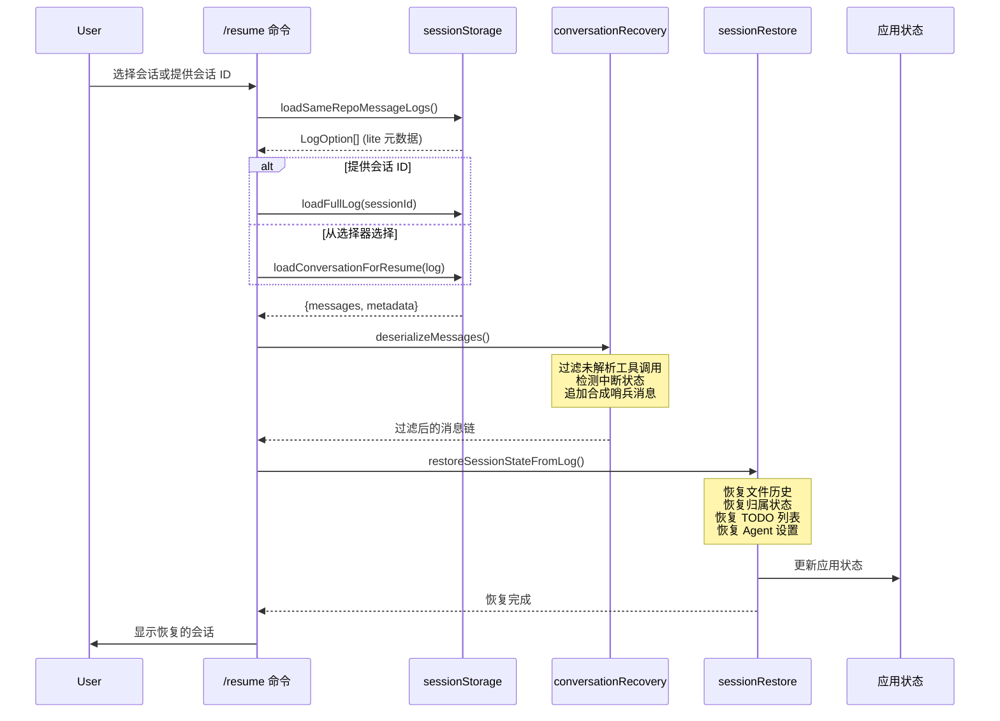

本文档深入解析 Claude Code 的**会话持久化**、**历史记录管理**与**会话恢复机制**。系统采用 JSONL（JSON Lines）格式存储会话转录，支持跨项目会话浏览、中断恢复、以及多工作树（worktree）会话管理。

## 会话存储架构

Claude Code 使用**项目隔离的 JSONL 文件**存储每个会话的完整对话历史。会话文件存储在 `~/.claude/projects/<sanitized_project_path>/<session_id>.jsonl` 目录下。

### 存储目录结构

```
~/.claude/
├── history.jsonl              # 全局命令历史（跨项目）
├── projects/                  # 项目会话存储
│   ├── <sanitized-path-1>/    # 项目目录（路径经 sanitizePath 处理）
│   │   ├── <session-id>.jsonl # 会话转录文件
│   │   └── subagents/         # 子智能体会话
│   └── <sanitized-path-2>/
└── paste-store/               # 大文本粘贴内容存储
```

路径 sanitization 使用 [`sanitizePath`](src/utils/sessionStoragePortable.ts#L287-L302) 函数，将非字母数字字符替换为连字符，并对超过 200 字符的路径追加哈希后缀以保证文件系统兼容性。

Sources: [sessionStoragePortable.ts](src/utils/sessionStoragePortable.ts#L287-L302), [sessionStorage.ts](src/utils/sessionStorage.ts#L103-L105)

### JSONL 消息格式

每个会话文件包含多种消息类型，除标准对话消息外，还包含元数据消息：

| 消息类型 | 用途 | 关键字段 |
|---------|------|---------|
| `user` | 用户输入 | `message.content`, `permissionMode` |
| `assistant` | AI 响应 | `message.content`, `stop_reason` |
| `system` | 系统消息 | 会话边界、模式切换 |
| `attachment` | 附件信息 | 文件、技能调用、工具结果 |
| `summary` | 会话摘要 | `summary` 文本 |
| `custom-title` | 用户自定义标题 | `customTitle` |
| `tag` | 会话标签 | `tag`（用于 `/resume` 搜索） |
| `pr-link` | GitHub PR 链接 | `prNumber`, `prUrl`, `prRepository` |
| `worktree-state` | 工作树状态 | `worktreeSession` |
| `content-replacement` | 内容替换记录 | `replacements`（用于 prompt 缓存稳定） |
| `file-history-snapshot` | 文件历史快照 | `snapshot` |

Sources: [logs.ts](src/types/logs.ts#L1-L80)

### 转录消息链

会话消息通过 `parentUuid` 字段构建**有向链式结构**。每个消息包含：
- `uuid`: 消息唯一标识符
- `parentUuid`: 父消息 ID（形成对话链）
- `sessionId`: 所属会话 ID

系统通过 [`isTranscriptMessage`](src/utils/sessionStorage.ts#L137-L145) 类型守卫识别有效转录消息（`user`、`assistant`、`attachment`、`system`），**排除临时性 progress 消息**以避免链分叉问题。

Sources: [sessionStorage.ts](src/utils/sessionStorage.ts#L137-L165)

## 会话恢复机制

会话恢复是 Claude Code 的核心功能，支持通过 `/resume` 命令、`--resume` 标志或启动时的会话选择器恢复之前的对话。

### 恢复流程图



### 消息反序列化与过滤

[`deserializeMessages`](src/utils/conversationRecovery.ts#L108-L178) 函数执行以下关键操作：

1. **迁移遗留附件类型**：将旧版 `new_file`、`new_directory` 附件类型转换为当前格式
2. **过滤未解析工具调用**：通过 [`filterUnresolvedToolUses`](src/utils/messages.ts) 移除没有对应 `tool_result` 的 `tool_use` 消息
3. **过滤孤立思考消息**：移除因流式传输产生的 orphaned thinking-only 消息
4. **过滤空白助手消息**：移除仅包含空白字符的助手消息
5. **检测中断状态**：通过 [`detectTurnInterruption`](src/utils/conversationRecovery.ts#L254-L310) 判断会话是否在中途被中断
6. **追加合成哨兵**：在最后一个用户消息后添加 `NO_RESPONSE_REQUESTED` 哨兵消息，确保 API 有效性

Sources: [conversationRecovery.ts](src/utils/conversationRecovery.ts#L108-L178)

### 中断检测逻辑

系统通过检查最后一条有效消息类型判断中断状态：

| 最后消息类型 | 中断状态 | 处理行为 |
|------------|---------|---------|
| `assistant` | 无中断 | 视为正常完成 |
| `user` (普通文本) | `interrupted_prompt` | 自动追加"Continue from where you left off." |
| `user` (tool_result) | 检查是否终端工具 | Brief 模式的 `SendUserMessage` 视为完成 |
| `attachment` | `interrupted_turn` | 用户提供了上下文但 AI 未响应 |

Sources: [conversationRecovery.ts](src/utils/conversationRecovery.ts#L254-L310)

### 状态恢复

[`restoreSessionStateFromLog`](src/utils/sessionRestore.ts#L88-L137) 负责恢复以下持久化状态：

```typescript
// 文件历史快照恢复
fileHistoryRestoreStateFromLog(result.fileHistorySnapshots, newState => {
  setAppState(prev => ({ ...prev, fileHistory: newState }))
})

// 代码归属状态恢复（Ant 内部功能）
attributionRestoreStateFromLog(result.attributionSnapshots, newState => {
  setAppState(prev => ({ ...prev, attribution: newState }))
})

// 上下文折叠提交日志恢复
restoreFromEntries(
  result.contextCollapseCommits ?? [],
  result.contextCollapseSnapshot
)

// TODO 列表恢复（从转录中提取最后一个 TodoWrite 工具调用）
const todos = extractTodosFromTranscript(result.messages)
```

Sources: [sessionRestore.ts](src/utils/sessionRestore.ts#L88-L137)

### 工作树恢复

当会话在工作树（worktree）中结束时，[`restoreWorktreeForResume`](src/utils/sessionRestore.ts#L330-L368) 会：

1. 检查是否有新鲜的 worktree 会话（`--worktree` 标志创建）
2. 尝试 `process.chdir` 到记录的工作树路径（TOCTOU 安全检查）
3. 如果目录已删除，清除缓存并标记为已退出
4. 清除内存文件缓存和系统提示部分以刷新状态

Sources: [sessionRestore.ts](src/utils/sessionRestore.ts#L330-L368)

## 历史记录系统

历史记录分为**全局命令历史**和**会话历史**两个层级。

### 全局命令历史

[`src/history.ts`](src/history.ts#L1-L465) 管理跨项目的命令输入历史，存储在 `~/.claude/history.jsonl`。

#### 粘贴内容处理

系统对粘贴内容采用**智能存储策略**：
- **小文本**（≤1024 字符）：内联存储在历史条目中
- **大文本**：计算哈希后存储在 `paste-store/` 目录，历史条目仅保留哈希引用

```typescript
// 粘贴内容存储格式
type StoredPastedContent = {
  id: number
  type: 'text' | 'image'
  content?: string        // 小文本内联存储
  contentHash?: string    // 大文本哈希引用
  mediaType?: string
  filename?: string
}
```

[`expandPastedTextRefs`](src/history.ts#L60-L74) 函数在读取历史时将 `[Pasted text #N]` 占位符替换为实际内容。

Sources: [history.ts](src/history.ts#L24-L74)

#### 历史刷新机制

系统使用**延迟刷新策略**避免频繁磁盘写入：
1. 新条目首先添加到 `pendingEntries` 内存队列
2. [`flushPromptHistory`](src/history.ts#L303-L326) 异步写入磁盘
3. 使用文件锁（[`lock`](src/utils/lockfile.ts)）确保并发安全
4. 失败时最多重试 5 次

Sources: [history.ts](src/history.ts#L279-L352)

### 会话历史浏览

[`/resume`](src/commands/resume/resume.tsx#L1-L275) 命令提供交互式会话选择器：

#### 搜索策略

1. **UUID 精确匹配**：直接验证并查找会话 ID
2. **自定义标题匹配**：通过 [`searchSessionsByCustomTitle`](src/utils/sessionStorage.ts) 搜索
3. **模糊标题搜索**：在 `firstPrompt` 字段中进行子串匹配

#### 跨项目恢复检测

[`checkCrossProjectResume`](src/utils/crossProjectResume.ts) 检测会话是否来自不同项目目录：
- **同仓库工作树**：直接恢复
- **不同项目**：显示恢复命令并复制到剪贴板

```bash
# 跨项目恢复命令示例
cd /path/to/original/project && claude --resume <session-id>
```

Sources: [resume.tsx](src/commands/resume/resume.tsx#L132-L165)

### 渐进式日志加载

为优化大型会话列表的性能，系统实现**渐进式加载**：

```typescript
// 仅读取文件头尾 64KB 提取元数据
async function readLiteMetadata(filePath, fileSize, buf) {
  const { head, tail } = await readHeadAndTail(filePath, fileSize, buf)
  // 从 head 提取：isSidechain, projectPath, firstPrompt
  // 从 tail 提取：customTitle, tag, prLink, gitBranch
}
```

[`loadSameRepoMessageLogsProgressive`](src/utils/sessionStorage.ts#L4083-L4106) 返回：
- `logs`: 已丰富的前 N 条记录（默认 50 条）
- `allStatLogs`: 完整统计列表（仅文件元数据）
- `nextIndex`: 渐进加载的下一个索引

Sources: [sessionStorage.ts](src/utils/sessionStorage.ts#L4526-L4600)

## 远程会话历史

对于远程会话（Bridge 模式），[`src/assistant/sessionHistory.ts`](src/assistant/sessionHistory.ts#L1-L88) 提供基于 API 的历史获取。

### API 分页机制

```typescript
// 获取最新一页（最新 limit 条事件）
fetchLatestEvents(ctx, limit = 100)

// 获取更早的页面（基于 before_id 游标）
fetchOlderEvents(ctx, beforeId, limit = 100)
```

响应格式：
```typescript
type HistoryPage = {
  events: SDKMessage[]      // 按时间顺序排列
  firstId: string | null    // 本页最早事件 ID（用于下一页游标）
  hasMore: boolean          // 是否有更早的事件
}
```

Sources: [sessionHistory.ts](src/assistant/sessionHistory.ts#L12-L88)

## 会话元数据管理

### 轻量级元数据提取

[`readLiteMetadata`](src/utils/sessionStorage.ts#L4638-L4702) 通过读取文件头尾 64KB 快速提取元数据，避免完整解析大型 JSONL 文件：

| 元数据 | 提取位置 | 提取方法 |
|-------|---------|---------|
| `firstPrompt` | head/tail | 优先从 tail 的 `lastPrompt` 字段，回退到 head 扫描 |
| `customTitle` | tail | `extractLastJsonStringField`（最后出现优先） |
| `tag` | tail | 同上 |
| `prNumber/prUrl` | tail | 数字和字符串双重解析 |
| `gitBranch` | tail/head | 最后出现优先 |
| `isSidechain` | head | 布尔字段存在性检查 |

Sources: [sessionStorage.ts](src/utils/sessionStorage.ts#L4638-L4702)

### Agent 元数据

子智能体（subagent）的元数据存储在独立的 `.meta.json` 侧车文件中：

```typescript
// Agent 元数据
type AgentMetadata = {
  agentType: string           // Agent 类型标识
  worktreePath?: string       // 工作树隔离路径
  description?: string        // 原始任务描述
}

// 远程 Agent 元数据
type RemoteAgentMetadata = {
  taskId: string
  remoteTaskType: string
  sessionId: string           // CCR 会话 ID（用于获取实时状态）
  title: string
  command: string
  spawnedAt: number
  isLongRunning?: boolean
}
```

[`listRemoteAgentMetadata`](src/utils/sessionStorage.ts#L275-L303) 扫描 `remote-agents/` 目录恢复所有远程 Agent 任务。

Sources: [sessionStorage.ts](src/utils/sessionStorage.ts#L195-L303)

## 关键工具函数

### 会话文件路径

```typescript
// 当前会话的转录路径
getTranscriptPath() // → ~/.claude/projects/<project>/<session-id>.jsonl

// 指定会话的转录路径
getTranscriptPathForSession(sessionId)

// 子智能体会话路径
getAgentTranscriptPath(agentId) // → <session-dir>/subagents/<subdir>/agent-<id>.jsonl
```

Sources: [sessionStorage.ts](src/utils/sessionStorage.ts#L205-L230)

### 会话加载

| 函数 | 用途 | 返回类型 |
|-----|------|---------|
| `loadSameRepoMessageLogs` | 加载同仓库所有工作树的会话 | `Promise<LogOption[]>` |
| `loadAllProjectsMessageLogs` | 加载所有项目的会话 | `Promise<LogOption[]>` |
| `loadFullLog` | 完整加载单个会话（含消息） | `Promise<LogOption>` |
| `loadConversationForResume` | 为恢复加载会话（含状态） | `Promise<ResumeLoadResult>` |
| `getLastSessionLog` | 直接查找指定会话 ID | `Promise<LogOption \| null>` |

Sources: [sessionStorage.ts](src/utils/sessionStorage.ts#L4083-L4280)

### 会话搜索

```typescript
// 按自定义标题搜索
searchSessionsByCustomTitle(query, { exact: boolean })

// 智能体会话搜索
agenticSessionSearch(query, filters)
```

Sources: [sessionStorage.ts](src/utils/sessionStorage.ts#L4890-L4950)

## 最佳实践与注意事项

### 会话文件大小限制

系统对大型会话文件实施保护：
- **最大转录读取**：50MB（[`MAX_TRANSCRIPT_READ_BYTES`](src/utils/sessionStorage.ts#L213)）
- **墓碑重写限制**：50MB（防止 OOM）

Sources: [sessionStorage.ts](src/utils/sessionStorage.ts#L213-L215)

### 并发会话处理

多会话并发时的历史记录隔离：
- [`getHistory`](src/history.ts#L93-L120) 优先返回当前会话条目
- 其他会话条目在后续生成，避免历史交错

Sources: [history.ts](src/history.ts#L93-L120)

### 路径规范化

系统使用 [`canonicalizePath`](src/utils/sessionStoragePortable.ts#L324-L332) 处理符号链接和路径大小写差异：
- macOS: `/tmp` → `/private/tmp`（通过 `realpath`）
- Windows: 驱动器字母大小写归一化
- Unicode NFC 规范化确保路径一致性

Sources: [sessionStoragePortable.ts](src/utils/sessionStoragePortable.ts#L324-L332)

## 相关页面

- [任务管理与并发控制](6-ren-wu-guan-li-yu-bing-fa-kong-zhi) — 了解子智能体会话的并发管理
- [远程会话与 Bridge 模式](23-yuan-cheng-hui-hua-yu-bridge-mo-shi) — 远程会话的历史同步机制
- [设置管理与持久化](14-she-zhi-guan-li-yu-chi-jiu-hua) — 会话相关的配置选项
- [应用状态管理架构](9-ying-yong-zhuang-tai-guan-li-jia-gou) — 恢复后的状态更新流程