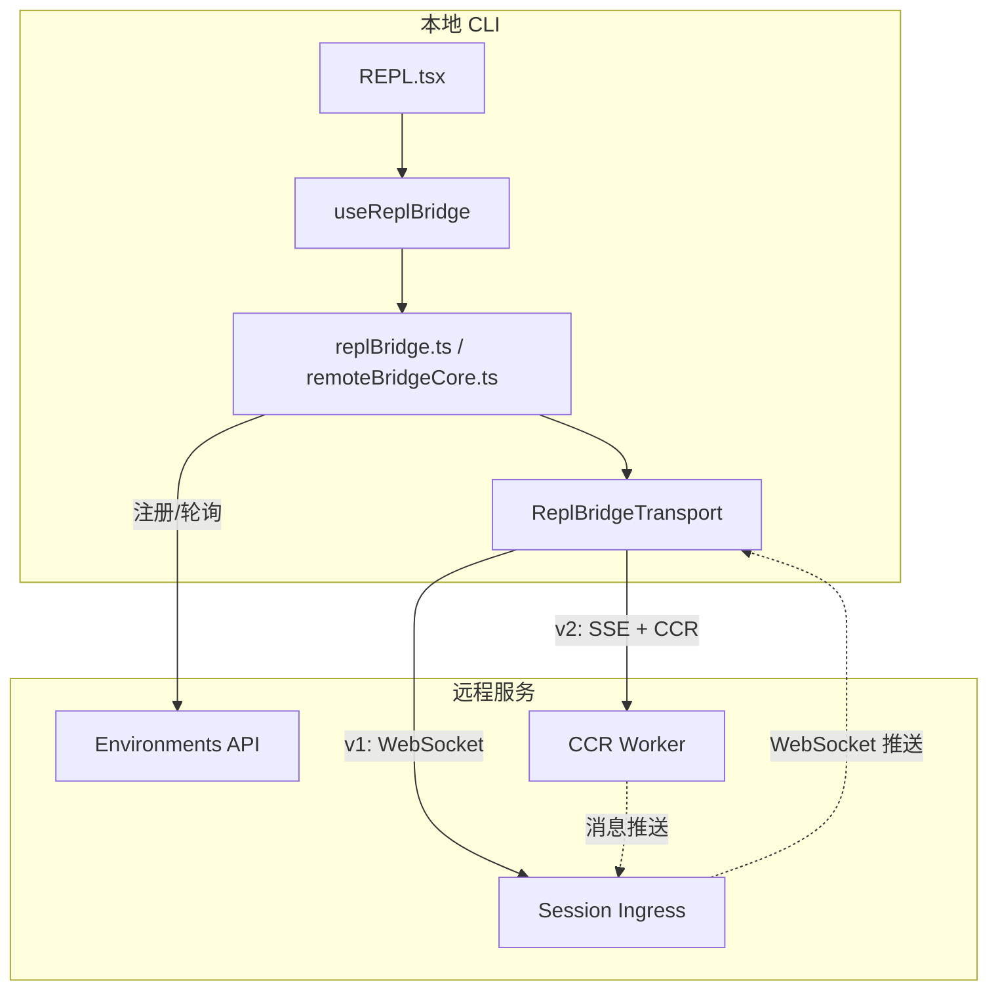
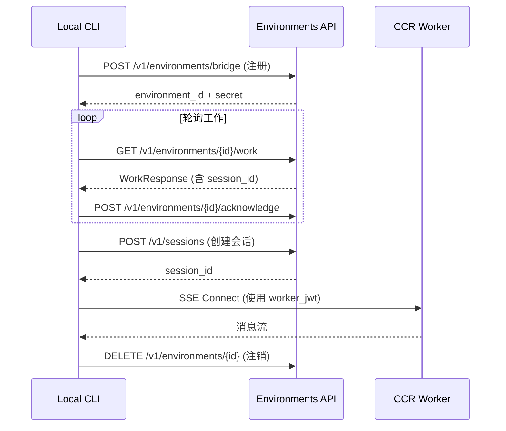
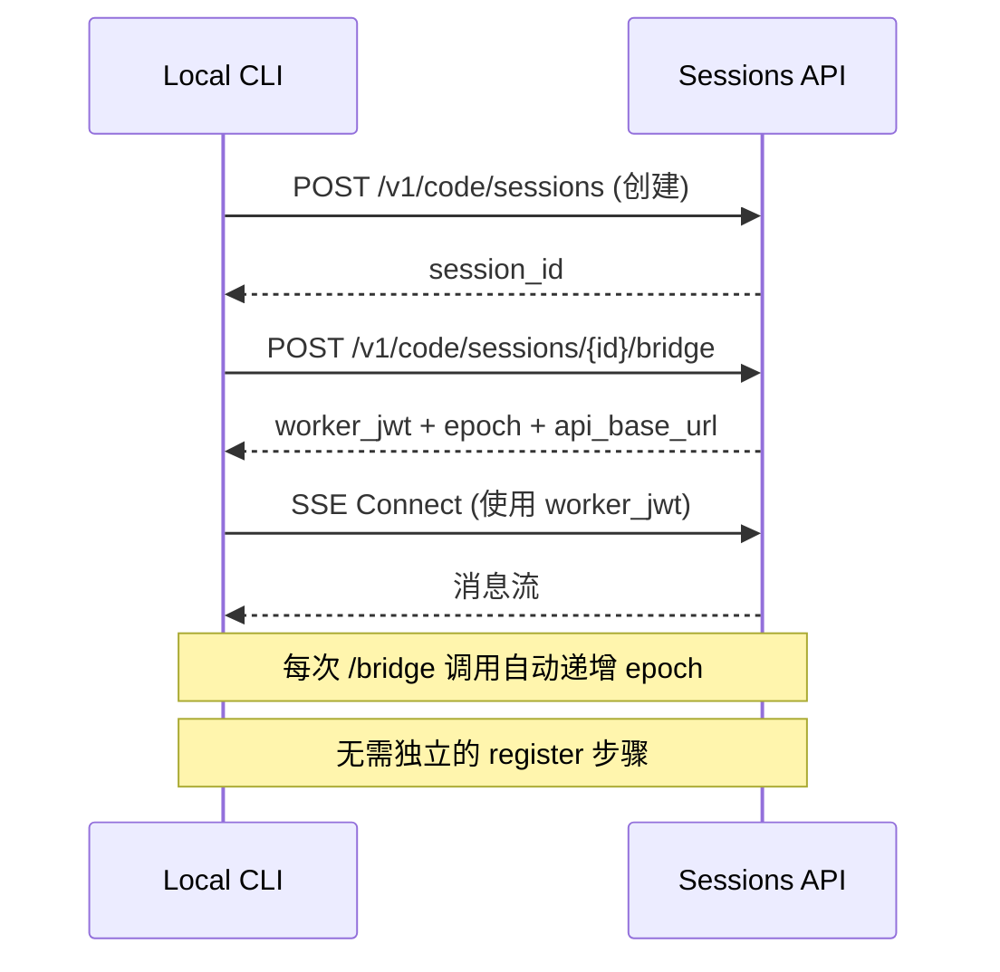
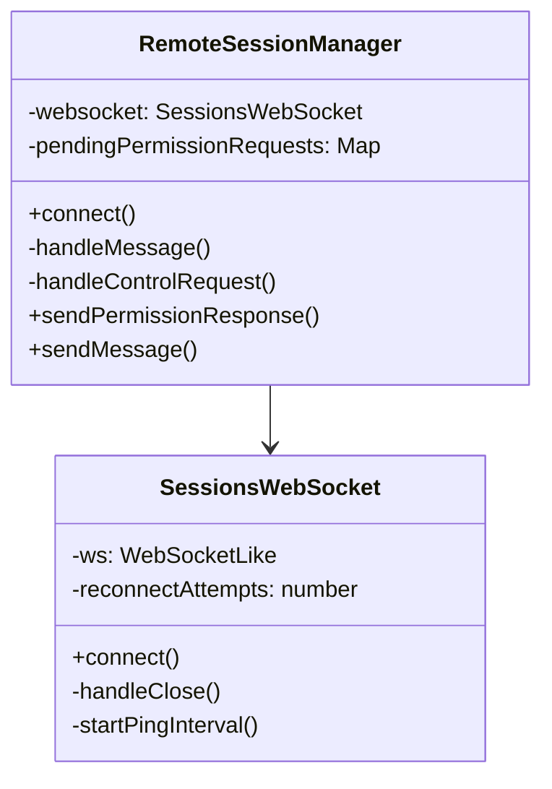
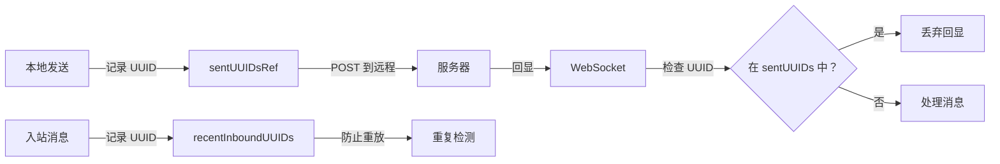
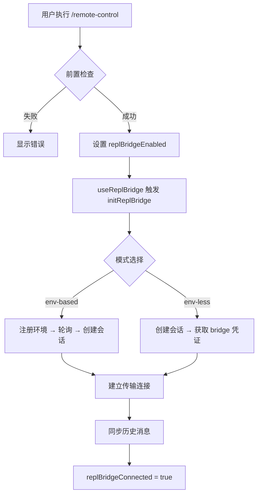
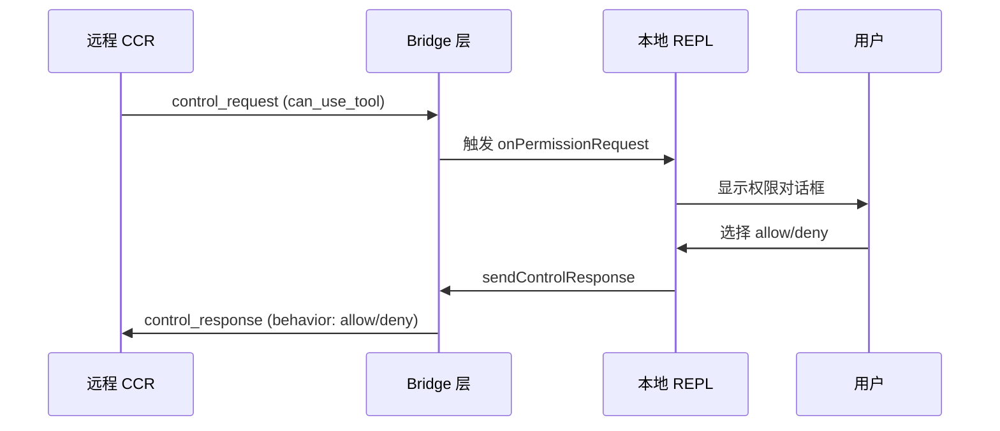

远程会话与 Bridge 模式是 Claude Code 实现本地 CLI 与云端 claude.ai 双向同步的核心机制。该模式允许用户在本地终端与 Web 界面之间无缝切换，实现会话状态的实时同步和跨设备协作。

## 架构总览

Bridge 模式采用分层架构设计，核心目标是建立本地 REPL 与远程 CCR（Claude Code Remote）会话之间的双向通信通道。



**核心设计原则**：

| 原则 | 说明 |
|------|------|
| **传输抽象** | 统一的 `ReplBridgeTransport` 接口屏蔽 v1/v2 协议差异 |
| **环境隔离** | 支持 env-based（完整环境生命周期）和 env-less（直接会话连接）两种模式 |
| **消息去重** | 使用 `BoundedUUIDSet` 防止消息回环和重复投递 |
| **弹性恢复** | 内置指数退避重连机制，支持断点续传 |

Sources: [src/bridge/replBridge.ts](src/bridge/replBridge.ts#L1-L100), [src/bridge/remoteBridgeCore.ts](src/bridge/remoteBridgeCore.ts#L1-L50), [src/bridge/replBridgeTransport.ts](src/bridge/replBridgeTransport.ts#L1-L80)

## Bridge 模式类型

系统支持两种 Bridge 实现模式，通过 GrowthBook 功能标志 `tengu_bridge_repl_v2` 控制切换。

### 环境基础模式（Env-based）

传统模式，通过 Environments API 进行工作调度。完整的环境生命周期包括注册、轮询、确认、停止和注销。



**关键特征**：
- 需要 `environment_id` 和 `environment_secret`
- 通过轮询获取工作项（pollForWork）
- 支持多会话并发（maxSessions 配置）
- 需要心跳维持租约（heartbeatWork）

Sources: [src/bridge/bridgeApi.ts](src/bridge/bridgeApi.ts#L100-L200), [src/bridge/types.ts](src/bridge/types.ts#L50-L100)

### 无环境模式（Env-less）

简化模式，直接通过 OAuth 连接会话 Ingress 层，跳过 Environments API 调度层。



**关键特征**：
- 无需 `environment_id`，直接使用 `session_id`
- `/bridge` 端点同时完成注册和凭证获取
- 每次调用自动递增 worker epoch
- 简化了认证流程，直接使用 OAuth 令牌

Sources: [src/bridge/remoteBridgeCore.ts](src/bridge/remoteBridgeCore.ts#L1-L100), [src/bridge/envLessBridgeConfig.ts](src/bridge/envLessBridgeConfig.ts#L1-L50)

## 传输层协议

Bridge 支持两种传输协议，通过 `ReplBridgeTransport` 接口统一抽象。

### v1 传输：HybridTransport

基于 WebSocket 的双向通信，使用 Session Ingress HTTP POST 进行写入。

| 操作 | 实现 |
|------|------|
| 读取 | WebSocket 订阅 `/v1/sessions/ws/{id}/subscribe` |
| 写入 | HTTP POST 到 Session Ingress |
| 认证 | OAuth Bearer Token |
| 序列号 | 不使用 SSE 序列号 |

```typescript
// v1 传输创建
const hybrid = new HybridTransport(sessionUrl, headers)
const transport = createV1ReplTransport(hybrid)
```

### v2 传输：SSE + CCRClient

基于 SSE（Server-Sent Events）的单向读取流，配合 CCRClient 进行写入。

| 操作 | 实现 |
|------|------|
| 读取 | SSE 流 `/worker/events/stream` |
| 写入 | CCRClient POST `/worker/events/{id}` |
| 认证 | worker_jwt（JWT，含 session_id claim） |
| 序列号 | SSE Last-Event-ID 支持断点续传 |

```typescript
// v2 传输创建
const transport = await createV2ReplTransport({
  sessionUrl,
  ingressToken: workerJwt,
  sessionId,
  epoch,  // worker epoch，每次 /bridge 调用递增
  initialSequenceNum,  // 从上次的 seq-num 继续
})
```

**关键差异**：

| 特性 | v1 | v2 |
|------|----|----|
| 认证方式 | OAuth Token | worker_jwt |
| 读取协议 | WebSocket | SSE |
| 写入协议 | HTTP POST | CCRClient |
| 断点续传 | 服务端游标 | SSE Last-Event-ID |
| 心跳 | 手动实现 | CCRClient 自动 |

Sources: [src/bridge/replBridgeTransport.ts](src/bridge/replBridgeTransport.ts#L50-L150), [src/remote/SessionsWebSocket.ts](src/remote/SessionsWebSocket.ts#L50-L150)

## 核心组件详解

### RemoteSessionManager

负责管理远程 CCR 会话的生命周期，协调 WebSocket 订阅和 HTTP 通信。



**核心职责**：
- WebSocket 连接管理和自动重连
- 权限请求/响应流转
- 消息类型路由（SDK 消息 vs 控制消息）
- 会话状态监控

Sources: [src/remote/RemoteSessionManager.ts](src/remote/RemoteSessionManager.ts#L50-L150)

### ReplBridgeHandle

桥接会话的句柄，提供消息读写和生命周期管理接口。

```typescript
type ReplBridgeHandle = {
  bridgeSessionId: string
  environmentId: string
  sessionIngressUrl: string
  writeMessages(messages: Message[]): void
  writeSdkMessages(messages: SDKMessage[]): void
  sendControlRequest(request: SDKControlRequest): void
  sendControlResponse(response: SDKControlResponse): void
  sendResult(): void
  teardown(): Promise<void>
}
```

**消息流向**：
1. **出站**：本地 Message → toSDKMessages → writeMessages → Transport → 远程
2. **入站**：Transport → handleIngressMessage → onInboundMessage → 本地队列

Sources: [src/bridge/replBridge.ts](src/bridge/replBridge.ts#L50-L100)

### 消息去重机制

使用 `BoundedUUIDSet` 防止消息回环和重复投递。



**设计要点**：
- 使用有界环形缓冲区（默认 50 条）
- 同一 UUID 可能多次回显（服务器广播 + Worker 回显）
- 不采用 delete-on-first-match 策略

Sources: [src/bridge/bridgeMessaging.ts](src/bridge/bridgeMessaging.ts#L100-L150), [src/hooks/useRemoteSession.ts](src/hooks/useRemoteSession.ts#L100-L150)

## 会话生命周期

### 连接建立流程



### 断开与恢复

**主动断开**：
- 用户执行 `/remote-control` 切换开关
- 调用 `teardown()` 清理资源
- 非永久模式会清除 `bridge-pointer.json`

**异常恢复**：
- WebSocket 断开触发指数退避重连
- 401 错误触发令牌刷新
- 环境丢失触发 `doReconnect` 流程

Sources: [src/commands/bridge/bridge.tsx](src/commands/bridge/bridge.tsx#L1-L100), [src/hooks/useReplBridge.tsx](src/hooks/useReplBridge.tsx#L50-L150)

## 权限控制流

Bridge 模式下的权限请求通过控制消息（Control Message）在本地和远程之间传递。



**权限模式**：
- `auto`：自动模式，低风险提示自动通过
- `bypassPermissions`：绕过权限检查（需满足条件）
- `default`：标准权限检查流程

Sources: [src/bridge/bridgePermissionCallbacks.ts](src/bridge/bridgePermissionCallbacks.ts#L1-L50), [src/remote/remotePermissionBridge.ts](src/remote/remotePermissionBridge.ts#L1-L50)

## 配置与调试

### 关键配置项

| 配置 | 说明 | 默认值 |
|------|------|--------|
| `spawnMode` | 会话生成模式（single-session/worktree/same-dir） | single-session |
| `maxSessions` | 最大并发会话数 | 32 |
| `sessionTimeoutMs` | 会话超时时间 | 24 小时 |
| `pollIntervalConfig` | 轮询间隔配置（GrowthBook 控制） | 动态 |

### 调试命令

仅限内部测试使用：

```bash
# 注入故障测试恢复逻辑
/bridge-kick close 1002      # 触发 ws_closed
/bridge-kick poll 404        # 触发 poll 404 错误
/bridge-kick status          # 查看桥接状态

# 查看调试日志
tail -f debug.log | grep '\[bridge:repl\]'
```

Sources: [src/commands/bridge-kick.ts](src/commands/bridge-kick.ts#L1-L100), [src/bridge/bridgeDebug.ts](src/bridge/bridgeDebug.ts#L1-L50)

## 相关页面

- [命令注册与路由机制](7-ming-ling-zhu-ce-yu-lu-you-ji-zhi) — `/remote-control` 命令实现
- [应用状态管理架构](9-ying-yong-zhuang-tai-guan-li-jia-gou) — `replBridgeEnabled` 状态管理
- [会话恢复与历史记录](22-hui-hua-hui-fu-yu-li-shi-ji-lu) — 会话持久化与恢复
- [API 服务与 Anthropic SDK 集成](11-api-fu-wu-yu-anthropic-sdk-ji-cheng) — 底层 API 通信