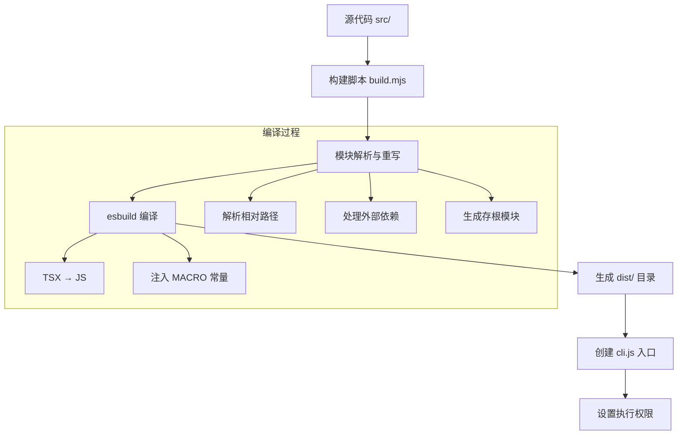
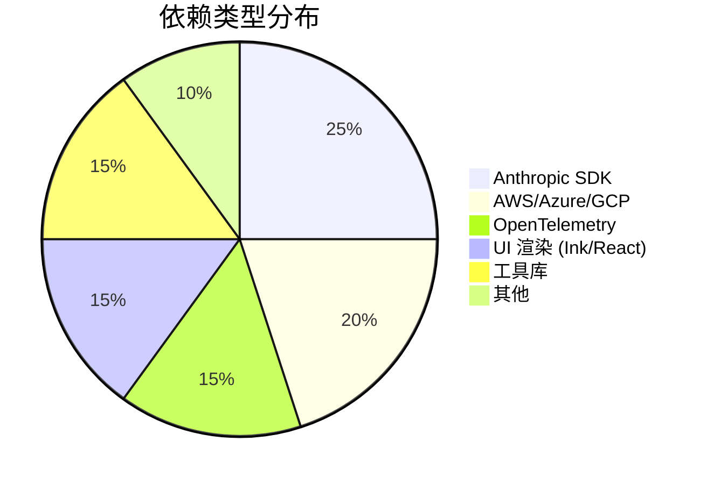
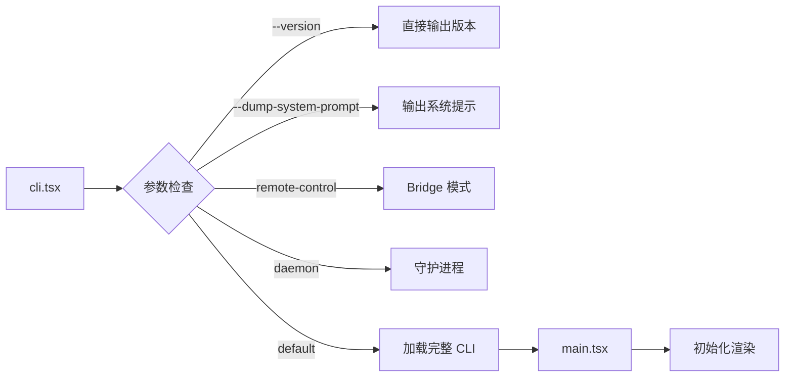

本文档介绍 Claude Code 项目的构建系统、依赖管理策略以及开发环境配置。理解这些内容对于参与项目开发、调试问题或进行自定义扩展至关重要。

## 项目结构概览

Claude Code 采用 **Monorepo 风格** 的多目录结构，包含源代码、恢复版本和发布包三个主要部分：

```
raw_code/
├── cc-recovered-main/      # 恢复的源代码（可重建版本）
│   ├── src/               # TypeScript 源代码
│   ├── scripts/           # 构建脚本
│   └── package.json       # 开发依赖配置
├── claude-code-main/      # 原始源代码副本
├── package/               # 发布包（预构建）
│   ├── cli.js            # 预构建的 CLI 入口
│   └── package.json      # 发布配置
└── src/                   # 独立源代码目录
```

**关键设计原则**：
- **开发环境** 使用 `cc-recovered-main` 目录，包含完整依赖和构建工具
- **生产环境** 使用 `package` 目录，包含预构建的压缩代码
- **源代码分析** 可直接查看 `src` 目录

Sources: [cc-recovered-main/package.json](cc-recovered-main/package.json#L1-L15)

## 构建系统架构

项目使用 **esbuild** 作为核心构建工具，通过自定义的 ESM 构建脚本实现 TypeScript 到 JavaScript 的转换。

### 构建流程



构建脚本 [`build.mjs`](cc-recovered-main/scripts/build.mjs#L1-L30) 执行以下核心操作：

1. **清理输出目录** - 删除旧的 `dist/` 目录
2. **遍历源代码** - 扫描 `src/` 和 `vendor/` 目录
3. **模块重写** - 解析并转换导入路径
4. **esbuild 编译** - 使用 `tsx` 和 `ts` loader 转换代码
5. **生成存根** - 为缺失的外部模块创建占位符
6. **创建入口** - 生成可执行的 `cli.js` 文件

Sources: [cc-recovered-main/scripts/build.mjs](cc-recovered-main/scripts/build.mjs#L30-L90)

### 构建配置详解

构建脚本中定义的关键配置：

| 配置项 | 值 | 说明 |
|--------|-----|------|
| `target` | `node18` | 目标 Node.js 版本 |
| `format` | `esm` | 输出模块格式 |
| `platform` | `node` | 运行平台 |
| `jsx` | `automatic` | React JSX 转换模式 |
| `charset` | `utf8` | 字符编码 |

**MACRO 常量注入**：构建时通过 `define` 选项注入版本信息、包 URL、反馈渠道等常量，这些常量在运行时可通过 `MACRO.VERSION` 等方式访问。

```javascript
// build.mjs 中定义的 MACRO
const macroDefinition = JSON.stringify({
  VERSION: '2.1.88',
  PACKAGE_URL: '@anthropic-ai/claude-code',
  README_URL: 'https://code.claude.com/docs/en/overview',
  FEEDBACK_CHANNEL: 'https://github.com/anthropics/claude-code/issues',
  BUILD_TIME: '2026-03-30T21:59:52Z'
});
```

Sources: [cc-recovered-main/scripts/build.mjs](cc-recovered-main/scripts/build.mjs#L14-L24)

## 依赖管理策略

项目采用 **分层依赖管理** 策略，区分开发依赖和生产依赖。

### 核心依赖分类



**主要依赖类别**：

| 类别 | 代表包 | 用途 |
|------|--------|------|
| **AI SDK** | `@anthropic-ai/sdk`, `@anthropic-ai/bedrock-sdk` | 与 Anthropic API 通信 |
| **云服务** | `@aws-sdk/*`, `@azure/identity`, `google-auth-library` | 多云平台认证 |
| **可观测性** | `@opentelemetry/*` | 日志、指标、追踪 |
| **终端 UI** | `ink`, `react`, `chalk` | 终端界面渲染 |
| **工具库** | `zod`, `lodash-es`, `execa` | 数据验证、工具函数 |

Sources: [cc-recovered-main/package.json](cc-recovered-main/package.json#L35-L95)

### 发布包依赖策略

生产发布包 (`package/package.json`) 采用 **零依赖** 策略：

```json
{
  "name": "@anthropic-ai/claude-code",
  "dependencies": {},
  "optionalDependencies": {
    "@img/sharp-darwin-arm64": "^0.34.2",
    // ... 各平台 sharp 二进制
  }
}
```

**设计理念**：
- 所有依赖在构建时打包进 `cli.js`
- 仅保留平台特定的可选依赖（如图片处理库）
- 确保安装简单、启动快速

Sources: [package/package.json](package/package.json#L1-L34)

## 入口点与执行流程

### CLI 入口结构

项目的执行入口位于 [`src/entrypoints/cli.tsx`](src/entrypoints/cli.tsx#L1-L50)，采用 **快速路径优先** 的设计模式：



**关键特性**：
- `--version` 路径零模块加载，实现快速响应
- 特殊模式（Bridge、Daemon）独立加载，减少主 CLI 开销
- 使用 `feature()` 函数进行构建时死代码消除

Sources: [src/entrypoints/cli.tsx](src/entrypoints/cli.tsx#L30-L60)

### 特性开关系统

项目使用 **Bun Bundle 特性开关** 机制：

```typescript
import { feature } from 'bun:bundle';

// 构建时根据环境变量决定是否包含代码
if (feature('BRIDGE_MODE')) {
  // Bridge 相关代码
}
```

**支持的特性**：
- `BRIDGE_MODE` - 远程桥接模式
- `DAEMON` - 守护进程模式
- `COORDINATOR_MODE` - 协调器模式
- `KAIROS` - 助手模式
- `ABLATION_BASELINE` - 实验基线

Sources: [src/entrypoints/cli.tsx](src/entrypoints/cli.tsx#L1-L25)

## 开发环境配置

### 系统要求

| 组件 | 最低版本 | 推荐版本 |
|------|----------|----------|
| Node.js | 18.0.0 | 20.x LTS |
| npm | 9.x | 10.x |
| 操作系统 | Linux/macOS/Windows | Linux/macOS |

Sources: [cc-recovered-main/package.json](cc-recovered-main/package.json#L8-L10)

### 安装与构建步骤

```bash
# 1. 进入开发目录
cd cc-recovered-main

# 2. 安装依赖
npm install

# 3. 构建项目
npm run build

# 4. 启动开发
npm start
```

**可用脚本**：

| 脚本 | 命令 | 说明 |
|------|------|------|
| `build` | `node ./scripts/build.mjs` | 编译 TypeScript 到 dist/ |
| `clean` | 删除 dist 目录 | 清理构建产物 |
| `start` | `node ./dist/cli.js` | 启动编译后的 CLI |

Sources: [cc-recovered-main/package.json](cc-recovered-main/package.json#L15-L22)

### 目录组织规范

源代码采用 **功能模块化** 组织方式：

| 目录 | 职责 | 示例文件 |
|------|------|----------|
| `entrypoints/` | 程序入口 | `cli.tsx`, `mcp.ts` |
| `commands/` | CLI 命令实现 | `help/`, `version.ts` |
| `tools/` | 工具定义 | `BashTool/`, `FileEditTool/` |
| `services/` | 后台服务 | `analytics/`, `mcp/` |
| `utils/` | 通用工具函数 | `git.ts`, `auth.ts` |
| `components/` | React 组件 | `App.tsx`, `Message.tsx` |
| `hooks/` | React Hooks | `useSettings.ts`, `useTasksV2.ts` |

Sources: [get_dir_structure](cc-recovered-main/src#L1-L100)

## 构建产物说明

构建完成后生成的 `dist/` 目录包含：

```
dist/
├── cli.js              # 可执行入口（chmod 755）
├── src/                # 编译后的 JS 文件
│   ├── entrypoints/
│   ├── commands/
│   ├── tools/
│   └── ...
└── __generated__/      # 自动生成的存根模块
    ├── bun-bundle.js   # 特性开关实现
    ├── bun-ffi.js      # FFI 兼容层
    └── externals/      # 外部依赖存根
```

**重要说明**：
- `cli.js` 被设置为可执行文件（权限 0o755）
- `__generated__/` 目录包含构建时生成的兼容性代码
- 所有 `.ts/.tsx` 文件转换为 `.js` 文件

Sources: [cc-recovered-main/scripts/build.mjs](cc-recovered-main/scripts/build.mjs#L215-L230)

## 下一步学习路径

完成本章节后，建议按以下顺序继续学习：

1. **[核心概念与架构总览](3-he-xin-gai-nian-yu-jia-gou-zong-lan)** - 了解整体架构设计
2. **[查询引擎架构与执行机制](4-cha-xun-yin-qing-jia-gou-yu-zhi-xing-ji-zhi)** - 深入核心引擎
3. **[调试技巧与诊断工具](25-diao-shi-ji-qiao-yu-zhen-duan-gong-ju)** - 学习开发调试方法

如需进行自定义开发，可参考：
- **[自定义工具开发指南](27-zi-ding-yi-gong-ju-kai-fa-zhi-nan)**
- **[自定义命令开发指南](28-zi-ding-yi-ming-ling-kai-fa-zhi-nan)**