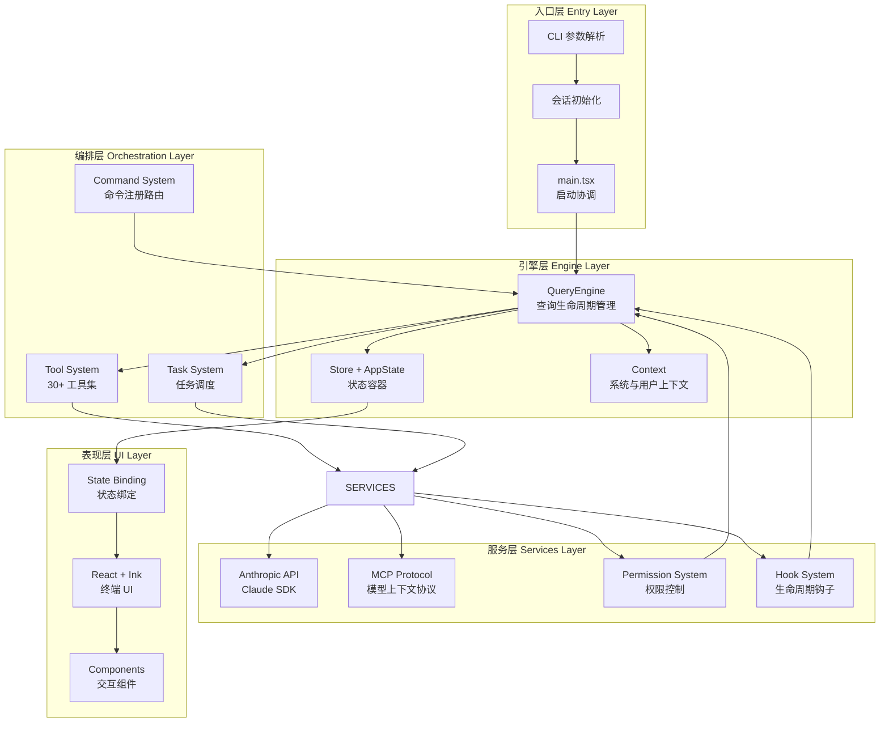
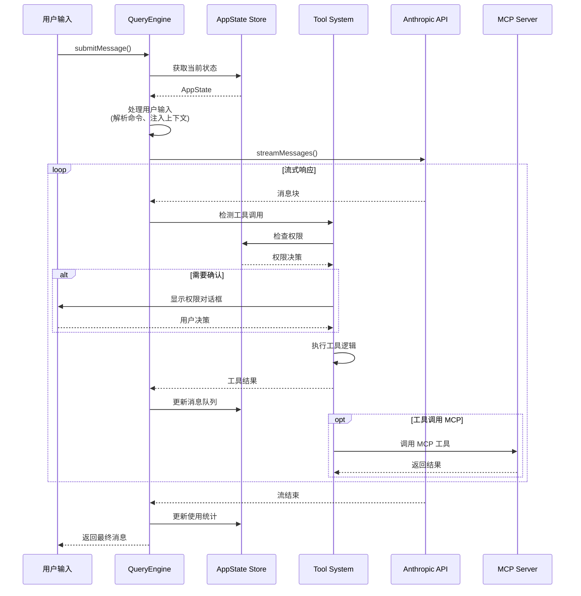

Claude Code 是一个基于 React + Ink 构建的终端 AI 编程助手，采用模块化架构设计，将查询引擎、工具系统、命令系统、状态管理和服务集成等核心组件解耦为独立的可扩展单元。整体架构遵循**单一职责原则**，通过依赖注入和事件驱动机制实现组件间协作，为开发者提供高可维护性和可扩展性。

## 架构全景图

系统核心由五个层次构成：**入口层**（CLI 参数解析与会话初始化）、**引擎层**（查询执行与状态管理）、**编排层**（工具调用与任务调度）、**服务层**（API 集成、MCP 协议、权限控制）以及**表现层**（React + Ink 终端 UI）。这种分层设计确保了关注点分离，每一层都可以独立演进和测试。

## 三大核心抽象

### QueryEngine：查询生命周期管理器

**QueryEngine** 是系统的核心编排引擎，负责管理完整的对话生命周期。每个 QueryEngine 实例对应一个会话，通过 `submitMessage()` 方法启动新的对话轮次，并在多轮对话间保持消息历史、文件缓存、使用统计等状态。引擎采用**惰性加载策略**，仅在需要时才加载 React/Ink 等重量级依赖，优化启动性能。

QueryEngine 的核心职责包括：管理消息队列与对话上下文、执行工具调用与权限检查、处理 API 重试与错误恢复、跟踪 token 使用与成本统计、执行预/后处理钩子（如 session_start、pre_compact 等）。通过 `maxTurns`、`maxBudgetUsd` 等配置参数，支持精细化的资源控制和预算管理。

Sources: [QueryEngine.ts](src/QueryEngine.ts#L1-L200)

### Task：异步任务抽象

**Task** 系统提供了统一的异步任务抽象，支持多种任务类型：本地 Shell 命令（`local_bash`）、本地 Agent（`local_agent`）、远程 Agent（`remote_agent`）、队友协作（`in_process_teammate`）、工作流（`local_workflow`）、MCP 监控（`monitor_mcp`）以及后台思考（`dream`）。每种任务类型都有独立的状态机（`pending` → `running` → `completed/failed/killed`）和持久化输出机制。

任务系统通过 `TaskContext` 提供统一的上下文访问接口（`getAppState`、`setAppState`、`abortController`），支持任务间的状态共享和取消传播。任务 ID 采用前缀命名规则（如 `b` 表示 bash、`a` 表示 agent），结合 36 进制随机字符串生成，确保全局唯一性和安全性。

Sources: [Task.ts](src/Task.ts#L1-L126)

### Tool：可扩展工具系统

**Tool** 系统采用插件化设计，定义了统一的工具接口：`name`（工具名称）、`inputSchema`（Zod 输入验证）、`validate`（前置验证）、`isEnabled`（启用检查）、`run`（执行逻辑）、`render`（UI 渲染）、`kill`（取消操作）。每个工具都是独立模块，通过 `ToolUseContext` 访问会话状态、权限上下文、文件缓存等共享资源。

系统内置 30+ 工具，涵盖文件操作、Shell 执行、Agent 调用、Web 搜索、Git 操作、任务管理等核心功能。通过 `getAllBaseTools()` 函数聚合所有工具，并根据特性开关（feature flags）动态启用/禁用特定工具。工具间支持组合调用，如 `AgentTool` 可调用其他工具实现复杂任务编排。

Sources: [Tool.ts](src/Tool.ts#L1-L200), [tools.ts](src/tools.ts#L1-L200)

## 状态管理架构

### Store：不可变状态容器

系统采用**函数式不可变状态管理**模式，通过 `createStore` 创建状态容器。Store 提供三个核心 API：`getState()` 获取当前状态、`setState(updater)` 通过函数式更新状态、`subscribe(listener)` 订阅状态变化。状态更新采用浅比较优化，只有当新旧状态不同时才触发订阅回调。

这种设计避免了 Redux 的样板代码，同时保持了状态变更的可预测性和可追溯性。通过 `onChange` 回调，可以在状态变化时执行副作用（如持久化存储、日志记录），实现声明式副作用管理。

Sources: [store.ts](src/state/store.ts#L1-L35)

### AppState：应用状态定义

**AppState** 定义了应用的完整状态树，包含：`settings`（用户设置）、`mainLoopModel`（当前模型）、`tasks`（任务注册表）、`mcp`（MCP 连接状态）、`plugins`（插件系统）、`toolPermissionContext`（权限上下文）、`replBridge*`（远程会话状态）等 50+ 字段。所有字段都通过 `DeepImmutable` 类型包装，确保外部代码无法直接修改状态。

状态字段分为三类：**配置型状态**（如 settings、mainLoopModel）影响系统行为；**运行时状态**（如 tasks、mcp.clients）跟踪当前执行；**UI 状态**（如 expandedView、footerSelection）控制界面交互。通过 `onChangeAppState` 函数，可以将状态变化映射到副作用（如 MCP 重连、插件重载）。

Sources: [AppStateStore.ts](src/state/AppStateStore.ts#L1-L200)

## 命令系统架构

### 命令注册与路由

命令系统采用**声明式注册**模式，在 `commands.ts` 中集中导入所有命令模块。每个命令定义为 `Command` 类型，包含 `name`（命令名称）、`description`（描述）、`type`（命令类型）、`source`（来源标识）等字段。命令类型包括：`prompt`（生成提示词）、`action`（执行操作）、`dialog`（显示对话框）、`link`（外部链接）等。

命令通过**懒加载**优化启动性能，如 `insights` 命令（113KB、3200 行）通过动态导入延迟加载。通过 `getCommands()` 函数聚合内置命令、技能命令、插件命令，并根据执行环境（本地/远程）过滤可用命令。命令路由通过 `/command-name` 语法识别，由 `processUserInput` 函数解析并分发。

Sources: [commands.ts](src/commands.ts#L1-L200)

### 上下文注入机制

系统在每轮对话开始时注入两类上下文：**系统上下文**（`getSystemContext`）包含 Git 状态、当前日期等环境信息；**用户上下文**（`getUserContext`）包含 CLAUDE.md 文件内容、项目配置等用户定义信息。上下文通过 `memoize` 缓存，避免重复计算，并通过缓存键机制（如 `cacheBreaker`）支持强制刷新。

上下文注入遵循**最小权限原则**：在 `--bare` 模式下跳过自动发现（如 CLAUDE.md 扫描），但保留显式指定的目录（`--add-dir`）。通过环境变量 `CLAUDE_CODE_DISABLE_CLAUDE_MDS` 可完全禁用 CLAUDE.md 注入，适用于安全敏感环境。

Sources: [context.ts](src/context.ts#L1-L190)

## 服务集成层

### Anthropic API 集成

服务层通过 `services/api/claude.ts` 封装 Anthropic Messages API，提供：`streamMessages`（流式对话）、`accumulateUsage`（使用统计）、`updateUsage`（成本跟踪）等核心功能。API 客户端支持**自动重试**（通过 `categorizeRetryableAPIError` 识别可重试错误）、**OAuth 刷新**（通过 `ensureKeychainPrefetchCompleted` 预加载密钥链凭证）、**速率限制处理**（通过 `claudeAiLimits.ts` 实现配额检查）。

API 调用通过 `AbortController` 支持取消操作，通过 `maxBudgetUsd` 参数支持预算限制。响应消息通过 `Message` 类型统一表示，支持文本、图片、工具调用、思考块等多种内容类型。

Sources: [services/api 目录结构](src/services)

### MCP（模型上下文协议）集成

**MCP** 是 Anthropic 定义的模型上下文协议，用于连接外部工具和数据源。Claude Code 通过 `services/mcp/client.ts` 实现 MCP 客户端，支持：服务器发现（`getMcpToolsCommandsAndResources`）、工具调用（`MCPTool`）、资源访问（`ReadMcpResourceTool`）、权限控制（`channelPermissions`）等功能。

MCP 服务器配置通过 `.claude/mcp_config.json` 管理，支持三种类型：标准输入输出（stdio）、HTTP/SSE、内置服务器。系统通过 `MCPConnectionManager` 管理连接生命周期，自动处理重连、错误恢复、资源清理等场景。通过 `--mcp-debug` 标志可启用详细日志，便于调试。

Sources: [services/mcp 目录结构](src/services/mcp)

### 权限系统

权限系统采用**三层架构**：**规则层**（`ToolPermissionRulesBySource`）定义允许/拒绝/询问规则；**上下文层**（`ToolPermissionContext`）包含当前权限模式、工作目录、规则集合；**执行层**（`useCanUseTool`）在工具调用前检查权限并触发用户确认。

权限模式包括：`default`（默认确认）、`acceptEdits`（自动接受文件编辑）、`plan`（计划模式，只读）、`auto`（自动模式，受限制的自动执行）。通过 `alwaysAllowRules`、`alwaysDenyRules`、`alwaysAskRules` 可为每个工具配置细粒度权限策略。权限规则支持路径模式匹配（如 `src/**`）、参数约束（如 `read-only commands`）。

Sources: [types/permissions.ts](src/types/permissions.ts), [services/tools 目录](src/services/tools)

## Bridge 远程会话机制

### 架构设计

**Bridge** 是 Claude Code 的远程会话系统，支持将本地终端会话同步到 claude.ai 网页端。核心组件包括：`ReplBridge`（会话管理）、`BridgeApiClient`（HTTP 客户端）、`HybridTransport`（传输层，支持 WebSocket 和轮询）、`FlushGate`（消息批处理）、`CapacityWake`（唤醒信号）。

Bridge 支持**双向通信**：本地会话通过 `writeMessages` 发送消息到云端；云端通过 `handleIngressMessage` 接收用户指令（如 `/remote-control`）。会话状态通过 `replBridgeEnabled`、`replBridgeConnected`、`replBridgeSessionActive` 等字段在 AppState 中跟踪。

Sources: [bridge/replBridge.ts](src/bridge/replBridge.ts#L1-L150)

### 工作流程

1. **初始化阶段**：通过 `initReplBridge` 创建 Bridge 环境，向云端注册 `environmentId`，建立 `sessionIngressUrl`
2. **连接阶段**：启动 WebSocket 连接，监听云端消息；若连接失败则降级为轮询模式
3. **消息同步**：本地消息通过 `writeMessages` 批量发送；云端消息通过 `handleIngressMessage` 处理
4. **断线重连**：通过指数退避策略自动重连；超过最大重试次数则标记为 `failed` 状态
5. **清理阶段**：通过 `teardown` 关闭连接，归档会话（`archiveSession`），清理资源

Bridge 支持**离线队列**：在断线期间，消息缓存在本地，重连后自动同步。通过 `FlushGate` 实现消息批处理，减少网络开销。

Sources: [bridge 目录结构](src/bridge)

## 核心架构对比

| 架构层次 | 核心职责 | 关键模块 | 状态管理 | 扩展方式 |
|---------|---------|---------|---------|---------|
| **入口层** | 参数解析、会话初始化 | `main.tsx`, `cli.tsx` | 命令行参数 → AppState | 新增 CLI 参数 |
| **引擎层** | 查询生命周期管理 | `QueryEngine`, `query.ts` | 消息队列、使用统计 | 扩展 QueryEngineConfig |
| **编排层** | 工具调用、任务调度 | `Tool`, `Task`, `commands.ts` | TaskState、工具状态 | 注册新工具/命令 |
| **服务层** | API 集成、协议实现 | `services/api`, `services/mcp` | 连接状态、权限上下文 | 实现 MCP 服务器 |
| **表现层** | 终端 UI 渲染 | `components/`, `ink/` | AppState → React 状态 | 新增 React 组件 |

## 数据流与执行模型

## 关键设计模式

### 1. 依赖注入模式

系统通过**构造函数注入**传递依赖，如 `QueryEngine` 接收 `QueryEngineConfig` 对象，包含 `tools`、`commands`、`mcpClients`、`canUseTool` 等依赖。这种设计支持单元测试时注入模拟对象，也允许不同运行环境（REPL、SDK、Daemon）提供不同实现。

### 2. 观察者模式

通过 `Store.subscribe` 实现状态变化订阅，组件可以响应式地更新 UI。例如 `onChangeAppState` 函数将状态变化映射到副作用（如 MCP 重连），实现声明式副作用管理。React 组件通过 `useAppState` Hook 订阅特定状态字段，避免不必要的重渲染。

### 3. 策略模式

工具系统采用策略模式，每个工具实现统一接口（`run`、`render`、`kill`），但内部实现各异。例如 `BashTool` 执行 Shell 命令，`FileEditTool` 编辑文件，`AgentTool` 启动子 Agent。工具选择通过工具名称动态匹配，支持运行时扩展。

### 4. 工厂模式

任务创建通过工厂函数 `createTaskStateBase` 生成标准任务状态，通过 `generateTaskId` 生成唯一 ID。不同任务类型通过类型区分，共享基础状态字段（如 `status`、`startTime`、`outputFile`），但可扩展特定字段（如 `LocalShellSpawnInput.command`）。

## 扩展性与定制化

### 插件系统

Claude Code 支持**插件化扩展**，通过 `plugins/` 目录管理内置插件，通过 `loadAllPluginsCacheOnly` 加载外部插件。插件可以注册新命令（`commands`）、新工具（`tools`）、新技能（`skills`），并通过 `PluginError` 机制报告加载错误。插件生命周期通过 `PluginInstallationManager` 管理。

Sources: [plugins 目录结构](src/plugins), [services/plugins 目录](src/services/plugins)

### 技能系统

技能是**可复用的提示词模板**，存储在 `skills/` 目录。每个技能定义包含 `name`、`description`、`prompt`、`tools` 等字段。通过 `SkillTool` 可动态加载技能，通过 `skills/loadSkillsDir.ts` 可从目录加载自定义技能。技能支持参数化提示词（通过 `{{param}}` 语法），实现高度定制化的任务模板。

Sources: [skills 目录结构](src/skills)

### Hook 系统

Hook 系统允许在关键生命周期节点注入自定义逻辑，支持：`session_start`（会话开始）、`pre_tool_use`（工具调用前）、`post_tool_use`（工具调用后）、`pre_compact`（压缩前）、`post_compact`（压缩后）等钩子。Hook 通过 `schemas/hooks.ts` 定义 Schema，通过 `utils/hooks/` 目录实现钩子注册和执行。

Sources: [schemas/hooks.ts](src/schemas/hooks.ts), [utils/hooks 目录](src/utils/hooks)

## 阅读建议

根据您的关注点，建议按以下顺序深入探索：

**核心引擎与执行流程**：
- [查询引擎架构与执行机制](4-cha-xun-yin-qing-jia-gou-yu-zhi-xing-ji-zhi) - 深入理解 QueryEngine 的查询编排逻辑
- [工具系统设计与编排](5-gong-ju-xi-tong-she-ji-yu-bian-pai) - 掌握工具注册、调用、权限检查机制
- [任务管理与并发控制](6-ren-wu-guan-li-yu-bing-fa-kong-zhi) - 学习异步任务调度与状态机管理

**命令系统**：
- [命令注册与路由机制](7-ming-ling-zhu-ce-yu-lu-you-ji-zhi) - 了解命令声明、解析、分发流程
- [常用命令实现解析](8-chang-yong-ming-ling-shi-xian-jie-xi) - 学习典型命令的实现模式

**状态管理与数据流**：
- [应用状态管理架构](9-ying-yong-zhuang-tai-guan-li-jia-gou) - 理解不可变状态管理和副作用处理
- [React + Ink 终端 UI 实现](10-react-ink-zhong-duan-ui-shi-xian) - 掌握终端 UI 组件化开发

**服务层集成**：
- [API 服务与 Anthropic SDK 集成](11-api-fu-wu-yu-anthropic-sdk-ji-cheng) - 学习 API 调用、重试、成本跟踪
- [MCP（模型上下文协议）集成](12-mcp-mo-xing-shang-xia-wen-xie-yi-ji-cheng) - 掌握 MCP 客户端开发
- [权限系统与安全控制](13-quan-xian-xi-tong-yu-an-quan-kong-zhi) - 理解三层权限架构
- [设置管理与持久化](14-she-zhi-guan-li-yu-chi-jiu-hua) - 学习配置管理和迁移机制

**工具实现详解**：
- [文件操作工具集](15-wen-jian-cao-zuo-gong-ju-ji) - 掌握文件读写、编辑、搜索工具
- [Shell 与 Bash 工具](16-shell-yu-bash-gong-ju) - 学习 Shell 命令执行和安全控制
- [Agent 工具与多智能体协作](17-agent-gong-ju-yu-duo-zhi-neng-ti-xie-zuo) - 理解子 Agent 创建和任务分发
- [Web 搜索与网络工具](18-web-sou-suo-yu-wang-luo-gong-ju) - 掌握 Web 搜索和内容获取
- [Git 版本控制工具](19-git-ban-ben-kong-zhi-gong-ju) - 学习 Git 操作集成

**高级功能**：
- [技能系统与插件架构](20-ji-neng-xi-tong-yu-cha-jian-jia-gou) - 扩展系统功能
- [语音模式与多模态交互](21-yu-yin-mo-shi-yu-duo-mo-tai-jiao-hu) - 实现语音交互
- [会话恢复与历史记录](22-hui-hua-hui-fu-yu-li-shi-ji-lu) - 管理会话持久化
- [远程会话与 Bridge 模式](23-yuan-cheng-hui-hua-yu-bridge-mo-shi) - 实现云端同步

**开发与调试**：
- [项目构建与依赖管理](24-xiang-mu-gou-jian-yu-yi-lai-guan-li) - 了解构建流程和打包优化
- [调试技巧与诊断工具](25-diao-shi-ji-qiao-yu-zhen-duan-gong-ju) - 掌握日志、追踪、性能分析
- [性能优化与内存管理](26-xing-neng-you-hua-yu-nei-cun-guan-li) - 学习性能调优技巧

**扩展与定制**：
- [自定义工具开发指南](27-zi-ding-yi-gong-ju-kai-fa-zhi-nan) - 开发自定义工具
- [自定义命令开发指南](28-zi-ding-yi-ming-ling-kai-fa-zhi-nan) - 开发自定义命令
- [MCP 服务器开发](29-mcp-fu-wu-qi-kai-fa) - 实现自定义 MCP 服务器