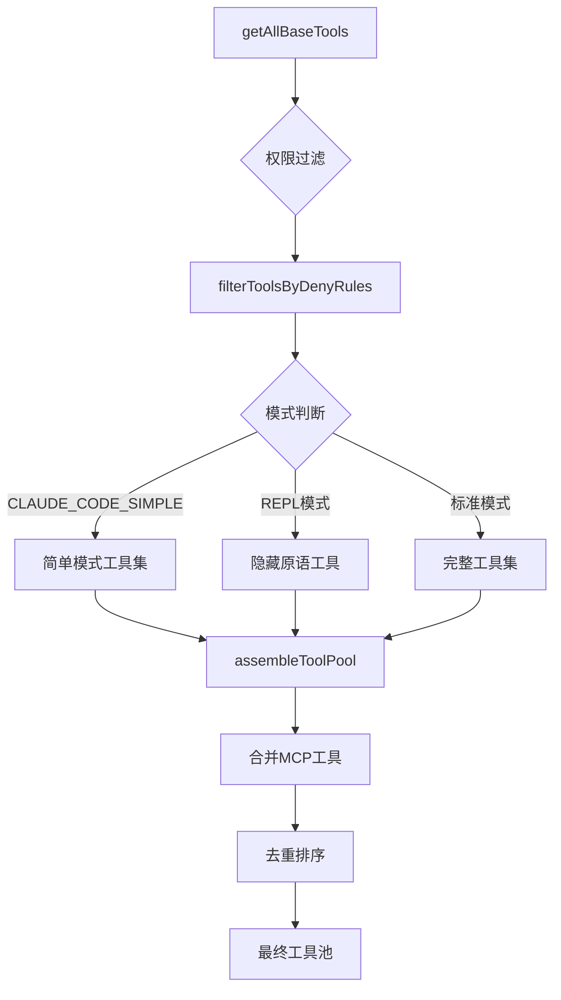
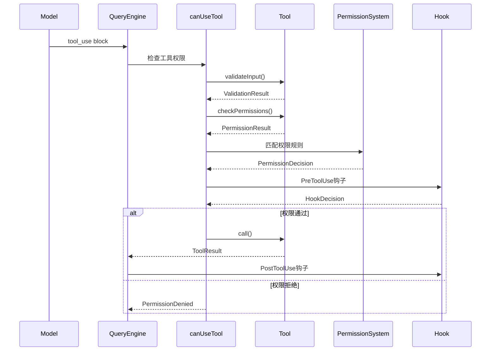

Claude Code 的工具系统采用高度模块化、类型安全的设计架构，将 AI 能力与实际执行逻辑分离，通过统一的接口编排文件操作、Shell 命令、Web 搜索等核心功能。该系统不仅支持内置工具的灵活组合，还能动态集成 MCP（模型上下文协议）外部工具，并通过权限检查、Hook 钩子、工具搜索延迟加载等机制实现精细化的安全控制与性能优化。

## 核心架构：Tool 接口与类型系统

工具系统的基石是 `Tool` 泛型接口，定义了所有工具必须实现的核心契约。每个工具都包含名称、输入/输出 Schema、执行方法、权限检查、UI 渲染等一系列标准化成员。TypeScript 类型系统确保工具定义的完整性，通过 `buildTool` 工厂函数提供默认实现，降低开发门槛。

```typescript
export type Tool<
  Input extends AnyObject = AnyObject,
  Output = unknown,
  P extends ToolProgressData = ToolProgressData,
> = {
  readonly name: string
  aliases?: string[]
  searchHint?: string
  inputSchema: Input
  inputJSONSchema?: ToolInputJSONSchema
  outputSchema?: z.ZodType<unknown>
  
  call(
    args: z.infer<Input>,
    context: ToolUseContext,
    canUseTool: CanUseToolFn,
    parentMessage: AssistantMessage,
    onProgress?: ToolCallProgress<P>,
  ): Promise<ToolResult<Output>>
  
  checkPermissions(
    input: z.infer<Input>,
    context: ToolUseContext,
  ): Promise<PermissionResult>
  
  description(input: z.infer<Input>, options): Promise<string>
  prompt(options): Promise<string>
  isEnabled(): boolean
  isConcurrencySafe(input: z.infer<Input>): boolean
  isReadOnly(input: z.infer<Input>): boolean
  isDestructive?(input: z.infer<Input>): boolean
  
  renderToolUseMessage(input: Partial<z.infer<Input>>, options): React.ReactNode
  renderToolResultMessage?(content: Output, ...): React.ReactNode
  mapToolResultToToolResultBlockParam(content: Output, toolUseID: string): ToolResultBlockParam
  
  maxResultSizeChars: number
}
```

`ToolUseContext` 参数携带完整的运行时上下文，包括工具列表、MCP 客户端、文件状态缓存、应用状态管理器、中止控制器等。工具可通过此上下文访问全局资源、更新 UI 状态、发送通知、处理文件历史等。`ToolResult` 返回工具执行结果及可能的后续消息，支持上下文修改以适应特殊场景。

Sources: [Tool.ts](src/Tool.ts#L362-L400), [Tool.ts](src/Tool.ts#L500-L503), [Tool.ts](src/Tool.ts#L321-L336)

## 工具注册与发现机制

`tools.ts` 模块作为工具注册中心，通过 `getAllBaseTools()` 函数汇总所有内置工具，并根据环境变量和功能开关进行条件性加载。工具列表包括 `AgentTool`、`BashTool`、`FileEditTool`、`WebSearchTool` 等核心工具，以及通过 `feature()` 特性开关控制的实验性工具。

```typescript
export function getAllBaseTools(): Tools {
  return [
    AgentTool,
    TaskOutputTool,
    BashTool,
    ...(hasEmbeddedSearchTools() ? [] : [GlobTool, GrepTool]),
    ExitPlanModeV2Tool,
    FileReadTool,
    FileEditTool,
    FileWriteTool,
    NotebookEditTool,
    WebFetchTool,
    TodoWriteTool,
    WebSearchTool,
    ...(isToolSearchEnabledOptimistic() ? [ToolSearchTool] : []),
  ]
}
```

`getTools()` 函数在此基础上应用权限过滤和模式适配。`CLAUDE_CODE_SIMPLE` 模式下仅暴露 Bash、Read、Edit 三个基础工具；REPL 模式下隐藏 `REPL_ONLY_TOOLS` 集合中的原语工具，通过虚拟机上下文访问。`assembleToolPool()` 则合并内置工具与 MCP 工具，通过名称去重并按字母排序以优化提示缓存稳定性。



Sources: [tools.ts](src/tools.ts#L193-L251), [tools.ts](src/tools.ts#L271-L327), [tools.ts](src/tools.ts#L345-L367)

## 工具实现模式：FileReadTool 示例

以 `FileReadTool` 为例，工具实现遵循清晰的职责分离原则。核心 `call()` 方法处理文件读取逻辑，包括设备文件黑名单检查、macOS 截图路径兼容、图片/PDF 处理、Notebook 文件解析等。`checkPermissions()` 委托给 `checkReadPermissionForTool()` 函数，检查文件系统权限规则。`renderToolUseMessage()` 和 `renderToolResultMessage()` 负责终端 UI 渲染。

```typescript
export const FileReadTool = buildTool({
  name: FILE_READ_TOOL_NAME,
  inputSchema: lazySchema(() => z.object({
    file_path: z.string().describe('The absolute path to the file to read'),
    offset: z.number().optional(),
    limit: z.number().optional(),
  })),
  
  async call(args, context, canUseTool, parentMessage, onProgress) {
    const { file_path, offset, limit } = args
    // 设备文件黑名单检查
    if (isBlockedDevicePath(file_path)) {
      throw new Error(`Cannot read from device file: ${file_path}`)
    }
    // macOS 截图路径兼容
    const resolvedPath = await resolveMacOSScreenshotPath(file_path)
    // 文件读取与格式处理...
    return { data: content }
  },
  
  async checkPermissions(input, context) {
    return checkReadPermissionForTool(input.file_path, context)
  },
  
  isReadOnly: () => true,
  maxResultSizeChars: Infinity, // 避免循环持久化
})
```

工具通过 `lazySchema()` 延迟构建 Zod Schema，避免启动时全量初始化。`isSearchOrReadCommand()` 方法标识该工具为读取操作，触发 UI 折叠显示以简化长输出。`maxResultSizeChars: Infinity` 防止工具结果持久化造成的循环依赖（Read → 持久化文件 → 再次 Read）。

Sources: [FileReadTool.ts](src/tools/FileReadTool/FileReadTool.ts#L1-L95), [FileReadTool.ts](src/tools/FileReadTool/FileReadTool.ts#L117-L128)

## 工具执行流程与权限检查

工具调用通过 `canUseTool()` 函数触发权限检查流程，该函数协调 `validateInput()`、`checkPermissions()`、权限规则匹配、Hook 钩子执行等多重验证。权限系统维护 `alwaysAllowRules`、`alwaysDenyRules`、`alwaysAskRules` 三类规则，按来源（用户设置、CLI 参数、命令行、会话）分组。



权限决策流程首先检查 `alwaysDenyRules`，若匹配则直接拒绝；其次检查 `alwaysAllowRules`，若匹配则跳过用户确认；最后检查 `alwaysAskRules` 或默认弹出权限请求对话框。BashTool 和 PowerShellTool 通过 `bashPermissions.ts` 和 `powershellPermissions.ts` 实现复杂的命令语义分析，识别危险操作、写操作、读操作等。

Sources: [permissions.ts](src/utils/permissions/permissions.ts#L122-L132), [permissions.ts](src/utils/permissions/permissions.ts#L137-L200)

## 工具搜索与延迟加载机制

当工具数量庞大时，系统启用 **ToolSearch** 延迟加载机制以节省提示 token。被标记为 `shouldDefer: true` 或所有 MCP 工具默认延迟加载，仅在模型调用 `ToolSearchTool` 时才动态加载其 Schema。`isToolSearchEnabledOptimistic()` 函数根据 `ENABLE_TOOL_SEARCH` 环境变量和 token 阈值自动判断是否启用该机制。

```typescript
export type ToolSearchMode = 'tst' | 'tst-auto' | 'standard'

export function getToolSearchMode(): ToolSearchMode {
  const value = process.env.ENABLE_TOOL_SEARCH
  const autoPercent = value ? parseAutoPercentage(value) : null
  if (autoPercent === 0) return 'tst'  // 始终延迟
  if (autoPercent === 100) return 'standard'  // 从不延迟
  if (isAutoToolSearchMode(value)) return 'tst-auto'  // 自动阈值
  if (isEnvTruthy(value)) return 'tst'
  if (isEnvDefinedFalsy(value)) return 'standard'
  return 'tst'  // 默认延迟MCP工具
}
```

`ToolSearchTool` 通过关键词搜索匹配延迟工具名称和描述，支持 `select:<tool_name>` 精确选择和模糊关键词搜索。搜索算法优先精确名称匹配，然后遍历工具描述进行关键词评分。结果返回工具名称列表，API 根据 `defer_loading` 标记动态注入完整 Schema。

```typescript
async function searchToolsWithKeywords(
  query: string,
  deferredTools: Tools,
  tools: Tools,
  maxResults: number,
): Promise<string[]> {
  const queryLower = query.toLowerCase().trim()
  // 快速路径：精确名称匹配
  const exactMatch = deferredTools.find(t => 
    t.name.toLowerCase() === queryLower
  )
  if (exactMatch) return [exactMatch.name]
  
  // 关键词搜索：解析工具名称、匹配描述、评分排序
  const results: Array<{ tool: Tool; score: number }> = []
  for (const tool of deferredTools) {
    const { parts, full } = parseToolName(tool.name)
    const description = await getToolDescriptionMemoized(tool.name, tools)
    // 计算关键词匹配分数...
  }
  return results.sort((a, b) => b.score - a.score)
    .slice(0, maxResults)
    .map(r => r.tool.name)
}
```

Sources: [toolSearch.ts](src/utils/toolSearch.ts#L161-L198), [ToolSearchTool.ts](src/tools/ToolSearchTool/ToolSearchTool.ts#L186-L200), [ToolSearchTool.ts](src/tools/ToolSearchTool/ToolSearchTool.ts#L132-L161)

## MCP 工具集成架构

MCP（Model Context Protocol）工具通过 `MCPTool` 模板动态创建，每个 MCP 服务器连接暴露的工具都实例化一个独立的 Tool 对象。`MCPServerConnection` 类型维护服务器状态、工具列表、资源列表和客户端实例。MCP 工具的 `name` 通常为 `mcp__<server>__<tool>` 格式，`mcpInfo` 字段存储原始服务器名和工具名。

```typescript
export const MCPTool = buildTool({
  isMcp: true,
  name: 'mcp',  // 被mcpClient.ts覆盖
  maxResultSizeChars: 100_000,
  
  async call() {
    // 被mcpClient.ts覆盖为实际MCP调用
    return { data: '' }
  },
  
  async checkPermissions(): Promise<PermissionResult> {
    return {
      behavior: 'passthrough',
      message: 'MCPTool requires permission.',
    }
  },
})
```

MCP 服务器配置支持多种传输协议：`stdio`（命令行进程）、`sse`（Server-Sent Events）、`http`、`ws`（WebSocket）、`sdk`（内嵌 SDK）和 `claudeai-proxy`（Claude.ai 代理）。OAuth 配置通过 `McpOAuthConfigSchema` 定义，支持 `clientId`、`callbackPort`、`authServerMetadataUrl` 等字段。XAA（Cross-App Access）通过布尔标志启用，共享全局 IdP 连接。

Sources: [MCPTool.ts](src/tools/MCPTool/MCPTool.ts#L27-L77), [types.ts](src/services/mcp/types.ts#L23-L56), [types.ts](src/services/mcp/types.ts#L124-L135)

## Hook 钩子系统集成

工具系统通过 Hook 钩子实现扩展性，支持在工具调用前后注入自定义逻辑。`PreToolUse` 钩子在工具执行前触发，可修改输入参数、添加上下文、阻止执行或修改权限决策。`PostToolUse` 钩子在工具成功执行后触发，可修改输出结果、添加额外上下文。`PostToolUseFailure` 钩子在工具执行失败后触发，用于错误处理。

```typescript
export const syncHookResponseSchema = lazySchema(() =>
  z.object({
    continue: z.boolean().optional(),
    suppressOutput: z.boolean().optional(),
    stopReason: z.string().optional(),
    decision: z.enum(['approve', 'block']).optional(),
    reason: z.string().optional(),
    hookSpecificOutput: z.union([
      z.object({
        hookEventName: z.literal('PreToolUse'),
        permissionDecision: permissionBehaviorSchema().optional(),
        updatedInput: z.record(z.string(), z.unknown()).optional(),
        additionalContext: z.string().optional(),
      }),
      z.object({
        hookEventName: z.literal('PostToolUse'),
        additionalContext: z.string().optional(),
        updatedMCPToolOutput: z.unknown().optional(),
      }),
    ]).optional(),
  })
)
```

Hook 输出通过 JSON Schema 严格验证，支持同步和异步两种模式。异步模式通过 `{ async: true, asyncTimeout: 5000 }` 标记，允许 Hook 在后台执行而不阻塞工具调用。`additionalContext` 字段向模型提供额外信息，`updatedInput` 字段修改工具输入参数，`updatedMCPToolOutput` 字段修改 MCP 工具输出结果。

Sources: [hooks.ts](src/types/hooks.ts#L50-L165), [hooks.ts](src/types/hooks.ts#L73-L107)

## 工具分类与特征标记

工具系统通过一系列布尔方法标识工具特征，用于权限检查、UI 优化和并发控制。`isReadOnly()` 标识只读工具（如 Read、Grep），`isDestructive()` 标识破坏性工具（如 Write、Bash 删除命令）。`isConcurrencySafe()` 标识可并发执行的工具，默认返回 `false` 以保守方式避免竞态条件。

| 方法 | 用途 | 示例工具 |
|------|------|----------|
| `isReadOnly()` | 只读操作，无副作用 | FileReadTool, GrepTool, GlobTool |
| `isDestructive()` | 破坏性操作，需额外确认 | FileWriteTool, BashTool (rm/mv) |
| `isConcurrencySafe()` | 可并发执行 | WebSearchTool, WebFetchTool |
| `isSearchOrReadCommand()` | UI 折叠显示 | BashTool (grep/find/cat), FileReadTool |
| `isOpenWorld()` | 访问外部世界 | WebSearchTool, WebFetchTool, BashTool |
| `requiresUserInteraction()` | 需要用户交互 | AskUserQuestionTool |

`interruptBehavior()` 方法定义用户提交新消息时的中断行为：`'cancel'` 取消工具执行并丢弃结果，`'block'` 保持工具运行并等待新消息。默认为 `'block'`，长时间运行的 Bash 命令可设置为 `'cancel'` 以提升响应性。

Sources: [Tool.ts](src/Tool.ts#L402-L416), [Tool.ts](src/Tool.ts#L429-L433), [Tool.ts](src/Tool.ts#L405-L406)

## buildTool 工厂函数与默认实现

`buildTool()` 工厂函数简化工具定义，为常用方法提供安全默认值。默认实现遵循"失败封闭"原则：`isConcurrencySafe()` 默认 `false`（保守假设不安全），`isReadOnly()` 默认 `false`（保守假设有写操作），`checkPermissions()` 默认返回 `{ behavior: 'allow' }`（委托给通用权限系统），`toAutoClassifierInput()` 默认返回空字符串（跳过自动模式分类器）。

```typescript
const TOOL_DEFAULTS = {
  isEnabled: () => true,
  isConcurrencySafe: (_input?: unknown) => false,
  isReadOnly: (_input?: unknown) => false,
  isDestructive: (_input?: unknown) => false,
  checkPermissions: (input, _ctx) =>
    Promise.resolve({ behavior: 'allow', updatedInput: input }),
  toAutoClassifierInput: (_input?: unknown) => '',
  userFacingName: (_input?: unknown) => '',
}

export function buildTool<D extends AnyToolDef>(def: D): BuiltTool<D> {
  return {
    ...TOOL_DEFAULTS,
    userFacingName: () => def.name,
    ...def,
  }
}
```

`ToolDef` 类型表示部分工具定义，允许省略默认方法。`BuiltTool<D>` 类型通过类型级展开确保返回类型完整性：若 `D` 提供某方法，则使用 `D` 的类型；否则使用默认类型。这种设计既保证类型安全，又避免重复实现。

Sources: [Tool.ts](src/Tool.ts#L757-L792), [Tool.ts](src/Tool.ts#L707-L726)

## QueryEngine 中的工具编排

`QueryEngine` 类作为会话生命周期管理器，协调工具调用、消息处理、状态更新等核心流程。`submitMessage()` 方法处理用户提交，遍历 API 流式响应中的 `tool_use` 块，调用 `canUseTool()` 检查权限，执行工具调用，收集结果，触发 PostToolUse 钩子，将工具结果添加到消息历史。

```typescript
export class QueryEngine {
  private config: QueryEngineConfig
  private mutableMessages: Message[]
  private abortController: AbortController
  private permissionDenials: SDKPermissionDenial[]
  private totalUsage: NonNullableUsage
  private readFileState: FileStateCache
  private discoveredSkillNames = new Set<string>()
  
  constructor(config: QueryEngineConfig) {
    this.config = config
    this.mutableMessages = config.initialMessages || []
    this.abortController = config.abortController || createAbortController()
    this.readFileState = cloneFileStateCache(config.readFileCache)
  }
  
  async *submitMessage(userMessage: Message): AsyncGenerator<SDKMessage> {
    // 处理用户输入，调用API，流式处理响应
    for await (const event of query(/* ... */)) {
      if (event.type === 'tool_use') {
        const tool = findToolByName(this.config.tools, event.tool_name)
        const result = await tool.call(event.input, context, canUseTool, ...)
        yield { type: 'tool_result', tool_use_id: event.tool_use_id, content: result.data }
      }
    }
  }
}
```

`ToolUseContext` 在 QueryEngine 初始化时构建，包含完整的运行时环境：`options.tools` 工具列表、`abortController` 中止控制器、`readFileState` 文件状态缓存、`getAppState()/setAppState()` 状态访问器、`messages` 消息历史等。工具通过此上下文访问全局资源，无需直接依赖单例或全局变量。

Sources: [QueryEngine.ts](src/QueryEngine.ts#L130-L173), [QueryEngine.ts](src/QueryEngine.ts#L184-L199), [Tool.ts](src/Tool.ts#L158-L300)

## 进阶主题：工具结果持久化与大文件处理

工具结果可能非常庞大（如 Bash 命令输出 GB 级日志），系统通过 `maxResultSizeChars` 限制内存占用。当结果超过阈值时，自动持久化到临时文件，工具返回文件路径预览而非完整内容。`buildLargeToolResultMessage()` 函数处理持久化逻辑，生成带文件路径的预览消息。

```typescript
// BashTool 示例：大输出持久化
if (output.length > tool.maxResultSizeChars) {
  const outputPath = getToolResultPath(toolUseID)
  await ensureToolResultsDir()
  await writeTextContent(outputPath, output)
  return buildLargeToolResultMessage(output, outputPath, PREVIEW_SIZE_BYTES)
}
```

`FileReadTool` 设置 `maxResultSizeChars: Infinity` 以避免循环持久化问题：如果读取的文件被持久化，则下次读取该文件会触发 Read 工具，形成无限递归。通过 `offset` 和 `limit` 参数，FileReadTool 自行控制读取范围，无需外部持久化机制。

Sources: [Tool.ts](src/Tool.ts#L458-L466), [BashTool.tsx](src/tools/BashTool/BashTool.tsx#L38-L41)

## 总结

Claude Code 的工具系统通过 **统一接口**、**类型安全**、**权限检查**、**Hook 钩子**、**延迟加载** 等机制，实现了高度模块化与可扩展性。`buildTool` 工厂函数降低开发门槛，`ToolSearch` 机制优化大规模工具集的性能，MCP 集成无缝扩展外部能力。开发者可通过实现 `Tool` 接口定义自定义工具，利用 `checkPermissions()` 精细控制权限，通过 `renderToolUseMessage()` 定制 UI 展示，接入 Hook 系统实现横切关注点（如审计日志、输入验证）。该架构既满足当前 40+ 内置工具的高效管理，也为未来扩展奠定了坚实基础。