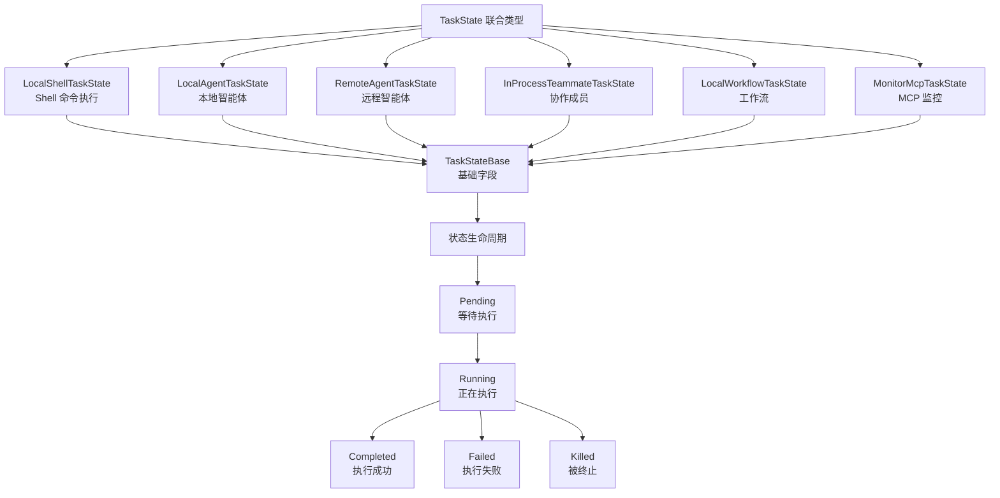
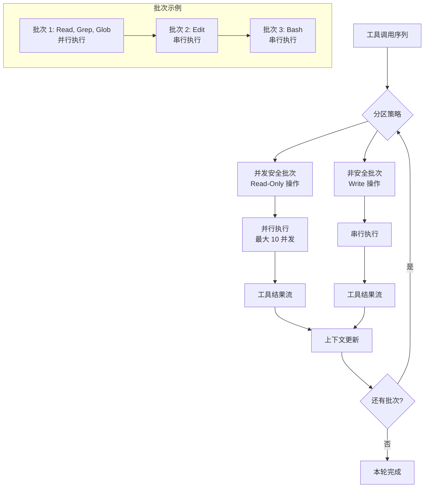
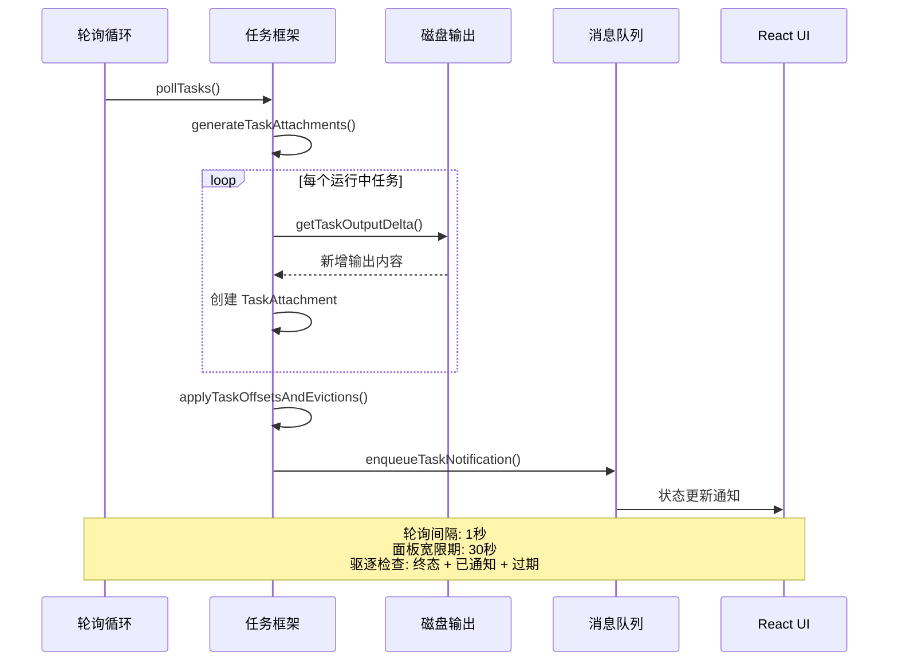

Claude Code 的任务管理系统是其并发能力的核心基础设施，采用分层架构设计，支持从简单的 Shell 命令执行到复杂的多智能体协作等多种并发场景。该系统通过统一的任务抽象层、精细的状态管理以及智能的并发控制策略，实现了高效率的资源利用和可靠的任务生命周期管理。系统的并发模型基于"并发安全分区"理念，能够自动识别哪些操作可以并行执行（如文件读取、搜索），哪些必须串行执行（如文件写入、状态修改），从而在保证正确性的前提下最大化并发性能。整个架构遵循响应式设计原则，通过信号机制和 React Context 实现跨组件的状态同步，确保 UI 始终反映最新的任务执行状态。

Sources: [Task.ts](src/Task.ts#L1-L100), [tasks.ts](src/tasks.ts#L1-L40), [tasks/types.ts](src/tasks/types.ts#L1-L47)

## 任务抽象与类型系统

任务系统的核心是一个精心设计的类型层次结构，每种任务类型对应特定的执行场景和生命周期管理策略。`TaskType` 定义了六种任务类型：`local_bash`（本地 Shell 命令）、`local_agent`（本地智能体）、`remote_agent`（远程智能体）、`in_process_teammate`（进程内协作成员）、`local_workflow`（本地工作流）以及 `monitor_mcp`（MCP 监控任务）。每种类型都有其特定的状态扩展，例如 `LocalShellTaskState` 包含命令字符串和完成状态，而 `LocalAgentTaskState` 则增加了进度跟踪、消息队列和后台化标志等字段。这种类型系统通过 TypeScript 的联合类型和类型守卫函数实现了类型安全的任务状态访问，确保了编译时就能捕获类型错误，避免了运行时的类型混乱。

任务状态机的设计遵循严格的转换规则：`pending`（等待执行）只能转换到 `running`（正在执行），而 `running` 状态可以转换到三种终态之一——`completed`（成功完成）、`failed`（执行失败）或 `killed`（被终止）。终态状态通过 `isTerminalTaskStatus()` 函数识别，该函数用于防止向已死任务注入消息、清理完成任务的内存占用等关键场景。每个任务都有唯一的 ID，通过 `generateTaskId()` 函数生成，该 ID 包含类型前缀（如 `b` 代表 bash 任务，`a` 代表 agent 任务）和 8 字节随机数，使用小写字母和数字组成的 36 字符表，确保了足够的组合空间以抵御暴力攻击。任务的输出文件路径通过 `getTaskOutputPath()` 函数计算，所有任务输出存储在项目临时目录的会话特定子目录中，防止了并发会话之间的文件冲突。

Sources: [Task.ts](src/Task.ts#L1-L126), [tasks/types.ts](src/tasks/types.ts#L1-L47), [utils/task/diskOutput.ts](src/utils/task/diskOutput.ts#L1-L100)

## 任务注册与生命周期管理

任务的生命周期从注册开始，通过 `registerTask()` 函数将任务状态注入到全局 AppState 中。该函数实现了智能的合并策略：当任务已存在时（例如恢复代理的重新注册场景），会保留 UI 持有的状态字段如 `retain`（保留标志）、`messages`（消息历史）、`diskLoaded`（磁盘加载标志）等，确保用户的查看状态不会因为任务重建而丢失。注册过程同时会向 SDK 事件队列发送 `task_started` 事件，包含任务 ID、工具使用 ID、描述、类型等元数据，使得外部监听器能够实时跟踪任务的创建。这种事件驱动的设计贯穿整个任务系统，使得任务的创建、状态变更、完成等关键节点都能被观察和记录。

任务状态更新通过 `updateTaskState()` 函数实现原子化操作，该函数接收任务 ID、setState 函数和更新器函数作为参数。更新器函数采用泛型设计，允许特定任务类型进行类型安全的更新。更新过程包含引用相等性检查优化：如果更新器返回相同的对象引用（表示提前返回的无操作），则跳过状态传播，避免不必要的重新渲染。这种优化在高频更新场景（如进度追踪）中尤为重要，能显著减少 React 组件的渲染开销。每个任务的输出采用增量追踪策略，`outputOffset` 字段记录上次读取的位置，`generateTaskAttachments()` 函数通过 `getTaskOutputDelta()` 计算新增的输出内容，避免了重复传输已处理的数据，提高了系统效率。

Sources: [utils/task/framework.ts](src/utils/task/framework.ts#L1-L200), [utils/task/diskOutput.ts](src/utils/task/diskOutput.ts#L1-L100)

## 并发控制与任务编排

Claude Code 的并发控制核心机制是"并发安全分区"策略，该策略在工具编排层（`toolOrchestration.ts`）实现。系统通过 `isConcurrencySafe()` 方法将工具调用分为两类：并发安全的只读操作（如文件读取、搜索、glob 匹配）和不安全的写操作（如文件编辑、命令执行）。`partitionToolCalls()` 函数将连续的工具调用分组为批次（Batch），每个批次要么是单个非安全工具，要么是多个连续的安全工具。对于安全工具批次，系统使用 `runToolsConcurrently()` 并行执行，最大并发数由环境变量 `CLAUDE_CODE_MAX_TOOL_USE_CONCURRENCY` 控制（默认为 10）；对于非安全工具批次，则使用 `runToolsSerially()` 串行执行，确保状态修改的原子性和顺序性。

上下文管理在并发执行中扮演关键角色。每个工具执行可能修改 `ToolUseContext`（例如文件状态缓存、权限上下文），而并发执行的工具需要协调这些修改。系统通过延迟上下文修改应用策略解决此问题：在并发执行期间，工具返回的 `contextModifier` 函数被收集到队列中，而不是立即应用。当并发批次执行完成后，系统按照工具 ID 的顺序依次应用所有修改器，确保上下文更新的确定性和一致性。这种设计避免了并发修改导致的竞态条件，同时保持了并行执行的性能优势。串行执行的工具则立即应用上下文修改，因为不存在并发冲突。整个流程通过异步生成器实现，允许调用方以流式方式消费工具结果，无需等待所有工具完成。

Sources: [services/tools/toolOrchestration.ts](src/services/tools/toolOrchestration.ts#L1-L150)

## 后台任务与状态分离

后台任务机制允许长时间运行的操作在后台执行，同时用户可以继续与主会话交互。任务的后台化通过 `backgroundTask()` 函数实现，该函数将 ShellCommand 从前台模式切换到后台模式，并更新任务状态的 `isBackgrounded` 标志为 true。后台化后，任务的输出继续通过 TaskOutput 流式接收，但不会阻塞 UI 线程。用户可以通过 `backgroundAll()` 函数（快捷键 Ctrl+B）将所有前台任务一键后台化，该函数遍历当前所有任务，识别可后台化的任务（未标记为已后台化的 bash 或 agent 任务），并逐个调用 `backgroundTask()` 进行转换。

任务输出采用磁盘持久化策略，通过 `DiskTaskOutput` 类管理。该类使用队列化的写入机制，将每个输出块作为独立条目加入队列，由单一的 drain 循环顺序处理。这种设计避免了链式 Promise 的内存保留问题——传统方式中，每个 `.then()` 闭包都会捕获其数据，直到整个链完成才能释放；而队列模式允许每个块在写入完成后立即被垃圾回收。输出文件设置了 5GB 的硬上限，通过 `MAX_TASK_OUTPUT_BYTES` 常量定义，防止失控任务耗尽磁盘空间。文件打开时使用 `O_NOFOLLOW` 标志防止符号链接攻击，该标志在 Unix 系统上阻止跟随符号链接打开文件，避免了沙箱内的恶意代码通过创建符号链接访问宿主机敏感文件的风险。

Sources: [tasks/LocalShellTask/LocalShellTask.tsx](src/tasks/LocalShellTask/LocalShellTask.tsx#L255-L350), [utils/task/diskOutput.ts](src/utils/task/diskOutput.ts#L1-L100)

## 状态管理架构

AppState 作为全局状态容器，采用 React Context + Store 模式实现。`AppStateProvider` 组件创建一个 `AppStateStore` 实例，该实例包含当前的 AppState 和 `setState` 方法。Store 通过 React 的 `useSyncExternalStore` 钩子提供订阅机制，允许组件订阅特定的状态切片（slice），只有当该切片的值发生变化时才触发重新渲染。`useAppState()` 钩子封装了这一机制，接收一个选择器函数作为参数，例如 `useAppState(s => s.tasks)` 只订阅任务字典的变化。这种细粒度的订阅机制避免了粗粒度订阅导致的过度渲染问题，特别是在高频状态更新场景下能显著提升性能。状态更新通过不可变模式进行，每次更新都返回新的状态对象，确保了 React 的变更检测机制能够正确工作。

任务状态存储在 `AppState.tasks` 字段中，这是一个以任务 ID 为键、任务状态为值的字典。与任务相关的其他状态字段包括 `foregroundedTaskId`（标记哪个任务正在前台显示其消息）、`viewingAgentTaskId`（标记正在查看哪个协作成员的任务记录）以及 `remoteBackgroundTaskCount`（远程会话中的后台任务计数）。任务面板的可见性通过 `evictAfter` 时间戳控制，该字段在任务进入终态时被设置为当前时间加上 `PANEL_GRACE_MS`（30秒），给予用户足够的时间查看任务结果。`retain` 标志用于防止任务被过早驱逐，当用户进入协作成员视图时，该任务的 `retain` 被设置为 true，阻止驱逐逻辑生效，直到用户退出视图。

Sources: [state/AppState.tsx](src/state/AppState.tsx#L1-L150), [state/AppStateStore.ts](src/state/AppStateStore.ts#L1-L400)

## 任务轮询与通知机制

任务轮询是后台任务的监控核心，通过 `pollTasks()` 函数定期检查所有运行中任务的状态和输出增量。轮询间隔由 `POLL_INTERVAL_MS` 常量定义（默认 1 秒），该频率在响应性和性能之间取得了平衡。轮询过程首先调用 `generateTaskAttachments()` 生成任务附件，该函数遍历所有任务，对于运行中的任务计算输出增量，对于已通知的终态任务则标记为可驱逐。附件生成后，通过 `applyTaskOffsetsAndEvictions()` 应用增量更新和驱逐操作。驱逐逻辑包含多重检查：首先验证任务仍处于终态且已通知，然后检查 `retain` 标志和 `evictAfter` 时间戳，只有所有条件都满足时才从 AppState 中移除任务。这种防御性的驱逐策略确保了正在被查看或刚完成的任务不会被意外清理。

任务通知通过统一的 `enqueuePendingNotification()` 函数发送到消息队列，该函数将任务状态变化格式化为 XML 消息，包含任务 ID、类型、输出文件路径、状态和摘要等信息。消息队列采用优先级机制，支持 `now`（立即处理）、`next`（下一轮处理）和 `later`（稍后处理）三个优先级，确保紧急通知能够快速到达。通知系统还包含一个特殊的"停滞看门狗"机制，用于检测长时间无输出的 Shell 命令。看门狗每隔 5 秒检查一次输出文件大小，如果超过 45 秒没有增长，则读取文件末尾判断是否包含交互式提示符（如 `(y/n)`、`[Y/n]`、`Press any key` 等模式）。如果检测到交互式提示，系统会发送通知提醒用户命令可能在等待输入，建议终止任务并使用管道输入或非交互式标志重新运行。

Sources: [utils/task/framework.ts](src/utils/task/framework.ts#L200-L309), [tasks/LocalShellTask/LocalShellTask.tsx](src/tasks/LocalShellTask/LocalShellTask.tsx#L1-L150), [utils/messageQueueManager.ts](src/utils/messageQueueManager.ts#L1-L100)

## 智能体并发与协作

智能体的并发执行遵循"单消息多工具调用"模式，该模式允许模型在一个响应中包含多个 Agent 工具调用，系统自动将这些调用识别为可并行执行的批次。Agent 工具通过 `isConcurrencySafe()` 方法声明自己是否可以并发执行——同步智能体（等待结果的智能体）返回 false，异步智能体（后台智能体）返回 true。对于异步智能体，系统在创建后立即返回，不阻塞主线程，智能体在后台独立运行并通过任务通知机制报告进度和结果。同步智能体则阻塞当前回合，直到智能体完成或被用户中断。这种设计允许模型根据任务特性灵活选择执行策略：对于独立的子任务（如并行研究多个问题），使用异步智能体最大化性能；对于依赖结果的任务（如基于分析结果执行操作），使用同步智能体保证顺序。

智能体任务的进度追踪通过 `ProgressTracker` 类实现，该类记录工具使用计数、输入输出令牌统计和最近的活动列表。`updateProgressFromMessage()` 函数从助手消息中提取使用统计和工具调用信息，维护输入令牌的最新值（API 中的输入令牌是累积的）和输出令牌的累积值（输出令牌每回合独立）。最近活动列表限制为 5 个条目，保留最新的工具调用及其分类信息（是否为搜索或读取操作），用于 UI 中的进度指示器。进度更新通过 SDK 事件 `task_progress` 发送给外部监听器，包含工具使用次数、令牌计数、最近活动和摘要等信息。这些实时进度信息使得用户能够了解长时间运行的智能体的执行状态，增强了系统的透明度和用户体验。

Sources: [tasks/LocalAgentTask/LocalAgentTask.tsx](src/tasks/LocalAgentTask/LocalAgentTask.tsx#L1-L150), [tools/AgentTool/agentToolUtils.ts](src/tools/AgentTool/agentToolUtils.ts#L1-L150)

## 任务持久化与会话恢复

任务系统的持久化设计支持会话恢复和跨进程协作。每个任务的输出文件存储在会话特定的目录中，路径格式为 `<projectTempDir>/<sessionId>/tasks/<taskId>.output`。会话 ID 在首次调用 `getTaskOutputDir()` 时捕获并缓存，避免了会话恢复或 `/clear` 命令导致的 ID 变化问题。任务元数据和消息历史通过会话存储机制持久化，支持从磁盘重新加载。`LocalAgentTaskState` 包含 `diskLoaded` 标志，表示是否已从磁盘引导加载了 JSONL 格式的侧链记录。加载后的消息通过 UUID 合并机制与内存中的消息集成，避免了重复和冲突。

任务恢复通过 `resumeAgentBackground()` 函数实现，该函数重新创建任务状态并恢复执行。恢复过程保留了用户查看状态（`retain`、`messages`、`diskLoaded`），确保恢复后的任务能无缝衔接之前的上下文。任务清理通过 `registerCleanup()` 注册，确保在会话结束或异常退出时能够正确终止后台进程。清理函数在任务状态中保存为 `unregisterCleanup` 字段，可以在需要时主动调用。这种注册式清理机制比传统的 `try-finally` 模式更可靠，因为它能在异步上下文和跨组件场景中正确工作。清理注册表支持优先级和依赖关系，确保资源释放的顺序正确性。

Sources: [utils/task/diskOutput.ts](src/utils/task/diskOutput.ts#L1-L100), [tasks/LocalAgentTask/LocalAgentTask.tsx](src/tasks/LocalAgentTask/LocalAgentTask.tsx#L1-L150)

## 总结与最佳实践

Claude Code 的任务管理系统展现了现代异步应用架构的最佳实践：分层抽象、类型安全、并发优化和持久化恢复。系统通过精细的并发控制策略实现了性能与正确性的平衡，通过统一的任务抽象支持了多样化的执行场景，通过响应式状态管理确保了 UI 的一致性。对于开发者而言，理解这一系统的核心概念对于调试复杂问题、扩展系统能力以及优化应用性能至关重要。建议继续探索 [工具系统设计与编排](5-gong-ju-xi-tong-she-ji-yu-bian-pai) 以深入理解工具与任务的协作机制，或查看 [应用状态管理架构](9-ying-yong-zhuang-tai-guan-li-jia-gou) 了解全局状态管理的完整图景。