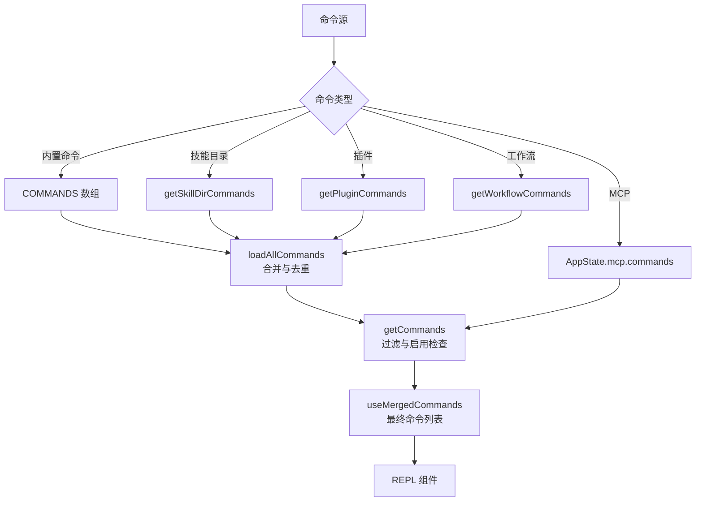
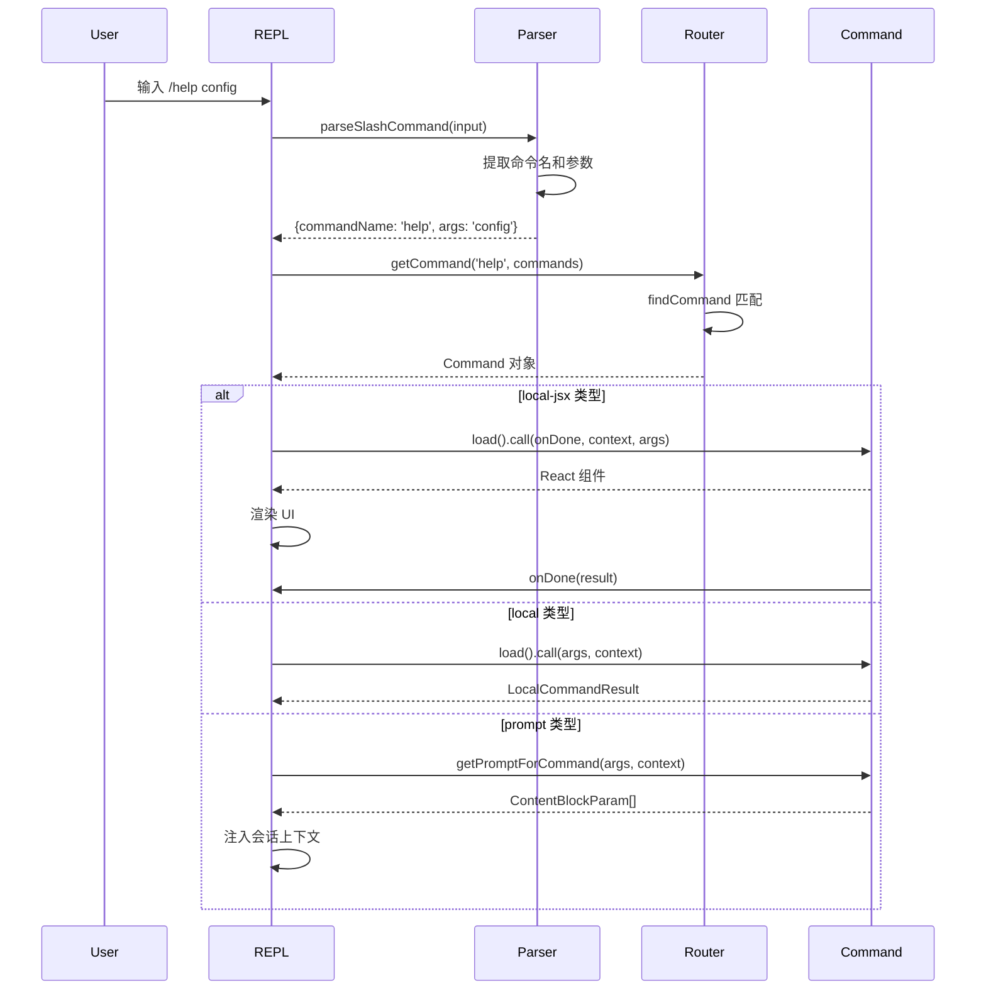

命令系统是 Claude Code 的核心基础设施之一，它将用户输入的斜杠命令（如 `/help`、`/compact`）转换为可执行的操作。该系统采用**分层注册架构**，支持三种命令类型（prompt、local、local-jsx），通过统一的注册表和路由机制实现灵活的命令发现与执行。

## 命令类型与数据结构

Claude Code 的命令系统定义了三种核心命令类型，每种类型服务于不同的执行场景和输出需求。

Sources: [types/command.ts](src/types/command.ts#L1-L217)

### Prompt 类型命令

**Prompt 类型命令**是最常用的命令形式，它将命令内容作为提示词注入到会话上下文中，由 AI 模型处理并生成响应。这类命令适用于需要 AI 理解和执行复杂任务的场景。

```typescript
type PromptCommand = {
  type: 'prompt'
  progressMessage: string           // 执行过程中显示的进度消息
  contentLength: number             // 内容长度，用于令牌估算
  argNames?: string[]               // 参数名称列表
  allowedTools?: string[]           // 命令允许使用的工具
  model?: string                    // 指定模型
  source: SettingSource | 'builtin' | 'mcp' | 'plugin' | 'bundled'
  getPromptForCommand(args: string, context: ToolUseContext): Promise<ContentBlockParam[]>
}
```

Sources: [types/command.ts](src/types/command.ts#L25-L57)

Prompt 命令的典型示例是 `/init` 命令，它通过精心设计的提示词引导 AI 分析代码库并生成 `CLAUDE.md` 文件。该命令支持参数传递、工具权限控制，并能根据上下文动态生成提示内容。

Sources: [commands/init.ts](src/commands/init.ts#L1-L257)

### Local 类型命令

**Local 类型命令**在本地执行 JavaScript/TypeScript 代码，直接返回文本结果，不涉及 AI 模型调用。这类命令适用于需要快速执行本地操作的脚本化任务。

```typescript
type LocalCommand = {
  type: 'local'
  supportsNonInteractive: boolean   // 是否支持非交互模式
  load: () => Promise<LocalCommandModule>
}

type LocalCommandCall = (
  args: string,
  context: LocalJSXCommandContext,
) => Promise<LocalCommandResult>

type LocalCommandResult =
  | { type: 'text'; value: string }
  | { type: 'compact'; compactionResult: CompactionResult }
  | { type: 'skip' }
```

Sources: [types/command.ts](src/types/command.ts#L16-L78)

`/compact` 命令是 Local 类型的典型代表，它通过加载 `compact.js` 模块执行会话压缩逻辑，返回压缩结果并更新会话历史，整个过程中无需 AI 模型介入。

Sources: [commands/compact/index.ts](src/commands/compact/index.ts#L1-L16)

### Local-JSX 类型命令

**Local-JSX 类型命令**是最灵活的命令形式，它返回 React 组件（JSX），通过 Ink 框架在终端中渲染交互式 UI 界面。这类命令适用于需要用户交互的复杂操作流程。

```typescript
type LocalJSXCommand = {
  type: 'local-jsx'
  load: () => Promise<LocalJSXCommandModule>
}

type LocalJSXCommandCall = (
  onDone: LocalJSXCommandOnDone,
  context: ToolUseContext & LocalJSXCommandContext,
  args: string,
) => Promise<React.ReactNode>
```

Sources: [types/command.ts](src/types/command.ts#L144-L152)

`/help` 命令展示了 Local-JSX 类型的典型用法：加载 React 组件 `<HelpV2>`，渲染交互式帮助界面，用户浏览完成后通过 `onDone` 回调通知系统命令执行结束。

Sources: [commands/help/index.ts](src/commands/help/index.ts#L1-L11), [commands/help/help.tsx](src/commands/help/help.tsx#L1-L10)

### 命令基础属性

所有命令类型共享一组基础属性，定义命令的元数据和行为特征。

```typescript
type CommandBase = {
  name: string                       // 命令名称
  aliases?: string[]                 // 命令别名
  description: string                // 命令描述
  argumentHint?: string              // 参数提示文本
  whenToUse?: string                 // 使用场景说明
  version?: string                   // 命令版本
  isEnabled?: () => boolean          // 是否启用
  isHidden?: boolean                 // 是否在帮助中隐藏
  isSensitive?: boolean              // 参数是否敏感（如密码）
  immediate?: boolean                // 是否立即执行（跳过队列）
  userInvocable?: boolean            // 用户是否可直接调用
  disableModelInvocation?: boolean   // 是否禁止模型调用
  availability?: CommandAvailability[] // 可用性约束
  loadedFrom?: 'skills' | 'plugin' | 'bundled' | 'mcp' | 'commands_DEPRECATED'
}
```

Sources: [types/command.ts](src/types/command.ts#L175-L200)

**可用性约束**（`availability`）属性控制命令的访问权限，支持 `claude-ai`（OAuth 订阅用户）和 `console`（直接 API 用户）两种类型。系统在命令过滤时通过 `meetsAvailabilityRequirement` 函数验证用户身份，确保命令仅对授权用户可见。

Sources: [commands.ts](src/commands.ts#L417-L443)

## 命令注册架构

Claude Code 采用**多层注册表架构**，命令来源包括内置命令、技能目录、插件、工作流等，所有命令通过统一的注册机制合并并去重。

### 命令注册流程



Sources: [commands.ts](src/commands.ts#L449-L517)

### 内置命令注册

内置命令在 `src/commands.ts` 中通过数组静态注册，使用 `memoize` 函数延迟初始化以避免配置读取时机问题。

```typescript
const COMMANDS = memoize((): Command[] => [
  addDir,
  advisor,
  agents,
  branch,
  // ... 更多内置命令
])

export async function getCommands(cwd: string): Promise<Command[]> {
  const allCommands = await loadAllCommands(cwd)
  
  const baseCommands = allCommands.filter(
    _ => meetsAvailabilityRequirement(_) && isCommandEnabled(_),
  )
  
  // 添加动态技能并去重
  return [...baseCommands, ...uniqueDynamicSkills]
}
```

Sources: [commands.ts](src/commands.ts#L258-L346), [commands.ts](src/commands.ts#L476-L517)

### 技能目录加载

技能目录从项目根目录的 `.claude/skills/` 和用户配置目录的 `skills/` 加载，每个技能由 `SKILL.md` 文件定义。

```typescript
async function getSkillDirCommands(cwd: string): Promise<Command[]> {
  const projectDirs = getProjectDirsUpToHome(cwd)
  const skillsPaths = projectDirs
    .map(dir => join(dir, '.claude', 'skills'))
    .filter(isSettingSourceEnabled)
  
  const skills: SkillWithPath[] = []
  for (const skillsPath of skillsPaths) {
    const files = await loadMarkdownFilesForSubdir(skillsPath)
    for (const file of files) {
      const skill = await parseSkillMarkdown(file, skillsPath)
      if (skill) skills.push({ skill, filePath: file.path })
    }
  }
  
  return deduplicateSkills(skills).map(s => s.skill)
}
```

Sources: [skills/loadSkillsDir.ts](src/skills/loadSkillsDir.ts#L1-L150)

技能文件使用 YAML frontmatter 定义元数据，支持参数替换、工具权限、钩子配置等高级特性。

```yaml
---
name: verify
description: Run tests and linting
allowedTools: ['Bash', 'Read']
args: ['test_pattern']
hooks:
  PostToolUse: 'npm run format ${file}'
---

Run tests matching $test_pattern and verify code quality.
```

Sources: [skills/loadSkillsDir.ts](src/skills/loadSkillsDir.ts#L132-L150)

### 插件命令集成

插件通过 `getPluginCommands` 和 `getPluginSkills` 加载命令，支持 MCP（模型上下文协议）提供的动态命令。

```typescript
const loadAllCommands = memoize(async (cwd: string): Promise<Command[]> => {
  const [
    { skillDirCommands, pluginSkills, bundledSkills, builtinPluginSkills },
    pluginCommands,
    workflowCommands,
  ] = await Promise.all([
    getSkills(cwd),
    getPluginCommands(),
    getWorkflowCommands(cwd),
  ])

  return [
    ...bundledSkills,        // 内置技能
    ...builtinPluginSkills,  // 内置插件技能
    ...skillDirCommands,     // 项目技能
    ...workflowCommands,     // 工作流命令
    ...pluginCommands,       // 插件命令
    ...pluginSkills,         // 插件技能
    ...COMMANDS(),           // 内置命令
  ]
})
```

Sources: [commands.ts](src/commands.ts#L449-L469)

### 命令去重与优先级

命令系统通过 `uniqBy` 函数按 `name` 属性去重，**后加载的命令优先级更高**，允许用户通过自定义技能覆盖内置命令。

```typescript
export function useMergedCommands(
  initialCommands: Command[],
  mcpCommands: Command[],
): Command[] {
  return useMemo(() => {
    if (mcpCommands.length > 0) {
      return uniqBy([...initialCommands, ...mcpCommands], 'name')
    }
    return initialCommands
  }, [initialCommands, mcpCommands])
}
```

Sources: [hooks/useMergedCommands.ts](src/hooks/useMergedCommands.ts#L1-L16)

## 命令路由机制

命令路由机制负责将用户输入的斜杠命令解析、匹配并分发给对应的处理器执行。

### 命令解析流程



Sources: [utils/slashCommandParsing.ts](src/utils/slashCommandParsing.ts#L1-L61), [utils/processUserInput/processSlashCommand.tsx](src/utils/processUserInput/processSlashCommand.tsx#L309-L524)

### 命令解析器

命令解析器 `parseSlashCommand` 负责从输入字符串中提取命令名称和参数，支持 MCP 命令的特殊标记。

```typescript
export function parseSlashCommand(input: string): ParsedSlashCommand | null {
  const trimmedInput = input.trim()
  
  if (!trimmedInput.startsWith('/')) {
    return null
  }
  
  const withoutSlash = trimmedInput.slice(1)
  const words = withoutSlash.split(' ')
  
  let commandName = words[0]
  let isMcp = false
  let argsStartIndex = 1
  
  // 检查 MCP 命令标记
  if (words.length > 1 && words[1] === '(MCP)') {
    commandName = commandName + ' (MCP)'
    isMcp = true
    argsStartIndex = 2
  }
  
  const args = words.slice(argsStartIndex).join(' ')
  
  return { commandName, args, isMcp }
}
```

Sources: [utils/slashCommandParsing.ts](src/utils/slashCommandParsing.ts#L25-L60)

### 命令查找与匹配

命令查找通过 `findCommand` 函数实现，支持命令名称、别名和用户可见名称三种匹配方式。

```typescript
export function findCommand(
  commandName: string,
  commands: Command[],
): Command | undefined {
  return commands.find(
    _ =>
      _.name === commandName ||
      getCommandName(_) === commandName ||
      _.aliases?.includes(commandName),
  )
}

export function getCommandName(cmd: CommandBase): string {
  return cmd.userFacingName?.() ?? cmd.name
}
```

Sources: [commands.ts](src/commands.ts#L688-L719), [types/command.ts](src/types/command.ts#L209-L211)

### 命令执行分发器

命令执行通过 `getMessagesForSlashCommand` 函数分发到对应的处理器，根据命令类型调用不同的执行逻辑。

```typescript
async function getMessagesForSlashCommand(
  commandName: string,
  args: string,
  context: ProcessUserInputContext,
  // ...
): Promise<SlashCommandResult> {
  const command = getCommand(commandName, context.options.commands)
  
  switch (command.type) {
    case 'local-jsx':
      // 返回 Promise，等待 UI 关闭回调
      return new Promise(resolve => {
        const onDone = (result?, options?) => {
          resolve({
            messages: [...],
            shouldQuery: options?.shouldQuery ?? false,
          })
        }
        
        command.load().then(mod => mod.call(onDone, context, args))
          .then(jsx => {
            if (jsx) setToolJSX({ jsx, shouldHidePromptInput: true })
          })
      })
    
    case 'local':
      // 同步执行并返回结果
      const mod = await command.load()
      const result = await mod.call(args, context)
      return {
        messages: [userMessage, resultMessage],
        shouldQuery: false,
      }
    
    case 'prompt':
      // 生成提示内容并注入上下文
      const prompts = await command.getPromptForCommand(args, context)
      return {
        messages: [userMessage, ...prompts],
        shouldQuery: true,
        allowedTools: command.allowedTools,
      }
  }
}
```

Sources: [utils/processUserInput/processSlashCommand.tsx](src/utils/processUserInput/processSlashCommand.tsx#L525-L777)

### 立即执行模式

某些命令需要立即执行而不排队等待，通过 `immediate: true` 属性标记。这类命令在 REPL 的 `onSubmit` 处理器中优先执行。

```typescript
const shouldTreatAsImmediate = 
  queryGuard.isActive && (matchingCommand?.immediate || options?.fromKeybinding)

if (matchingCommand && shouldTreatAsImmediate && matchingCommand.type === 'local-jsx') {
  // 清空输入并立即执行
  setInputValue('')
  
  const context = getToolUseContext(messagesRef.current, [], createAbortController())
  const mod = await matchingCommand.load()
  const jsx = await mod.call(onDone, context, commandArgs)
  
  if (jsx) {
    setToolJSX({ jsx, shouldHidePromptInput: false })
  }
  
  return // 提前返回，跳过队列
}
```

Sources: [screens/REPL.tsx](src/screens/REPL.tsx#L3184-L3281)

## 命令执行上下文

命令执行时接收完整的上下文对象，包含会话状态、工具权限、UI 控制器等关键资源。

### 上下文结构

```typescript
type LocalJSXCommandContext = ToolUseContext & {
  canUseTool?: CanUseToolFn              // 工具权限检查函数
  setMessages: (updater) => void         // 更新消息列表
  options: {
    dynamicMcpConfig?: Record<string, ScopedMcpServerConfig>
    ideInstallationStatus: IDEExtensionInstallationStatus | null
    theme: ThemeName
  }
  onChangeAPIKey: () => void             // API 密钥变更回调
  onChangeDynamicMcpConfig?: (config) => void
  onInstallIDEExtension?: (ide: IdeType) => void
  resume?: (sessionId, log, entrypoint) => Promise<void>
}
```

Sources: [types/command.ts](src/types/command.ts#L80-L98)

### onDone 回调机制

Local-JSX 命令通过 `onDone` 回调通知系统命令执行完成，支持返回结果文本和控制选项。

```typescript
type LocalJSXCommandOnDone = (
  result?: string,
  options?: {
    display?: 'skip' | 'system' | 'user'  // 显示方式
    shouldQuery?: boolean                  // 是否触发模型查询
    metaMessages?: string[]                // 元消息（模型可见但用户隐藏）
    nextInput?: string                     // 下一个输入
    submitNextInput?: boolean              // 是否自动提交下一个输入
  },
) => void
```

Sources: [types/command.ts](src/types/command.ts#L117-L126)

**显示方式**控制命令结果的呈现形式：
- **skip**：跳过消息显示，命令静默执行
- **system**：系统消息形式显示，不占用用户消息槽位
- **user**：用户消息形式显示（默认）

Sources: [utils/processUserInput/processSlashCommand.tsx](src/utils/processUserInput/processSlashCommand.tsx#L564-L607)

## Fork 模式执行

Prompt 类型命令支持 **Fork 模式**，通过 `context: 'fork'` 属性启用。Fork 模式将命令作为子代理执行，拥有独立的上下文和令牌预算。

### Fork 执行流程

```typescript
async function executeForkedSlashCommand(
  command: CommandBase & PromptCommand,
  args: string,
  context: ProcessUserInputContext,
): Promise<SlashCommandResult> {
  const { skillContent, modifiedGetAppState, baseAgent, promptMessages } = 
    await prepareForkedCommandContext(command, args, context)
  
  const agentDefinition = command.effort !== undefined 
    ? { ...baseAgent, effort: command.effort }
    : baseAgent
  
  // 后台执行子代理
  if (feature('KAIROS') && (await context.getAppState()).kairosEnabled) {
    const bgAbortController = createAbortController()
    
    void (async () => {
      // 等待 MCP 服务器就绪
      await waitForMCPSettlement()
      
      // 运行子代理
      for await (const message of runAgent({
        agentDefinition,
        promptMessages,
        toolUseContext: context,
        canUseTool,
        isAsync: true,
      })) {
        agentMessages.push(message)
      }
      
      // 将结果重新注入队列
      enqueuePendingNotification({
        value: `<scheduled-task-result>${resultText}</scheduled-task-result>`,
        mode: 'prompt',
        priority: 'later',
        isMeta: true,
      })
    })()
    
    return { messages: [], shouldQuery: false }
  }
  
  // 同步执行并返回结果
  for await (const message of runAgent({ /* ... */ })) {
    agentMessages.push(message)
  }
  
  return {
    messages: [userMessage, resultMessage],
    shouldQuery: false,
  }
}
```

Sources: [utils/processUserInput/processSlashCommand.tsx](src/utils/processUserInput/processSlashCommand.tsx#L62-L295)

Fork 模式适用于长时间运行的任务（如定时任务、批量处理），避免阻塞主会话输入队列。子代理执行结果通过 `enqueuePendingNotification` 以元消息形式重新注入主会话。

Sources: [utils/processUserInput/processSlashCommand.tsx](src/utils/processUserInput/processSlashCommand.tsx#L126-L133)

## 命令缓存与清理

命令系统使用多层缓存机制提升性能，支持动态刷新和清理。

### 缓存层次

```typescript
// 命令加载缓存
const loadAllCommands = memoize(async (cwd: string): Promise<Command[]> => {
  // ... 加载所有命令源
})

// 技能工具命令缓存
export const getSkillToolCommands = memoize(async (cwd: string) => {
  // ... 过滤模型可调用的技能命令
})

// 技能索引缓存（用于技能搜索）
const getSkillIndex = memoize(async (cwd: string) => {
  // ... 构建技能搜索索引
})
```

Sources: [commands.ts](src/commands.ts#L449-L469), [commands.ts](src/commands.ts#L563-L581)

### 缓存清理

当动态技能添加或插件重载时，需要清理命令缓存以重新加载命令列表。

```typescript
export function clearCommandMemoizationCaches(): void {
  loadAllCommands.cache?.clear?.()
  getSkillToolCommands.cache?.clear?.()
  getSlashCommandToolSkills.cache?.clear?.()
  clearSkillIndexCache?.()
}

export function clearCommandsCache(): void {
  clearCommandMemoizationCaches()
  clearPluginCommandCache()
  clearPluginSkillsCache()
  clearSkillCaches()
}
```

Sources: [commands.ts](src/commands.ts#L523-L539)

## 命令安全与权限

命令系统实施多层安全控制，包括可用性约束、用户调用权限和模型调用权限。

### 可用性约束验证

```typescript
export function meetsAvailabilityRequirement(cmd: Command): boolean {
  if (!cmd.availability) return true
  
  for (const a of cmd.availability) {
    switch (a) {
      case 'claude-ai':
        if (isClaudeAISubscriber()) return true
        break
      case 'console':
        if (!isClaudeAISubscriber() && 
            !isUsing3PServices() && 
            isFirstPartyAnthropicBaseUrl()) {
          return true
        }
        break
    }
  }
  return false
}
```

Sources: [commands.ts](src/commands.ts#L417-L443)

### 用户调用权限

`userInvocable` 属性控制用户是否可以直接通过斜杠命令调用技能。设置为 `false` 的技能只能由 AI 模型通过 SkillTool 间接调用。

```typescript
if (command.userInvocable === false) {
  return {
    messages: [
      createUserMessage({ content: `/${commandName}` }),
      createUserMessage({
        content: `This skill can only be invoked by Claude, not directly by users.`
      })
    ],
    shouldQuery: false,
  }
}
```

Sources: [utils/processUserInput/processSlashCommand.tsx](src/utils/processUserInput/processSlashCommand.tsx#L535-L548)

### 模型调用权限

`disableModelInvocation` 属性防止 AI 模型自动调用敏感命令，如部署、删除等破坏性操作。

```typescript
export const getSkillToolCommands = memoize(async (cwd: string) => {
  const allCommands = await getCommands(cwd)
  return allCommands.filter(cmd =>
    cmd.type === 'prompt' &&
    !cmd.disableModelInvocation &&  // 排除模型不可调用的命令
    // ...
  )
})
```

Sources: [commands.ts](src/commands.ts#L563-L581)

## 远程模式命令过滤

在远程模式（`--remote`）下，系统限制可用命令集合，仅保留不影响本地环境的命令。

```typescript
export const REMOTE_SAFE_COMMANDS: Set<Command> = new Set([
  session,    // 显示远程会话信息
  exit,       // 退出 TUI
  clear,      // 清屏
  help,       // 帮助
  theme,      // 主题切换
  color,      // 代理颜色
  vim,        // Vim 模式
  cost,       // 会话成本
  usage,      // 使用信息
  copy,       // 复制消息
  // ...
])

export function filterCommandsForRemoteMode(commands: Command[]): Command[] {
  return commands.filter(cmd => REMOTE_SAFE_COMMANDS.has(cmd))
}
```

Sources: [commands.ts](src/commands.ts#L619-L686)

## 扩展阅读

- **[常用命令实现解析](8-chang-yong-ming-ling-shi-xian-jie-xi)**：深入了解 `/init`、`/compact`、`/doctor` 等核心命令的实现细节
- **[技能系统与插件架构](20-ji-neng-xi-tong-yu-cha-jian-jia-gou)**：探索如何通过技能和插件扩展命令系统
- **[自定义命令开发指南](28-zi-ding-yi-ming-ling-kai-fa-zhi-nan)**：学习如何开发自定义命令
- **[MCP（模型上下文协议）集成](12-mcp-mo-xing-shang-xia-wen-xie-yi-ji-cheng)**：了解 MCP 如何动态提供命令