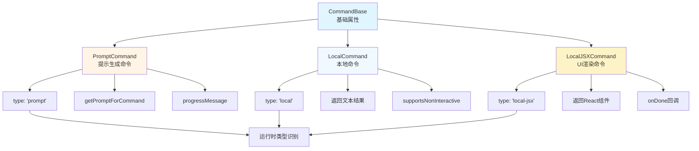
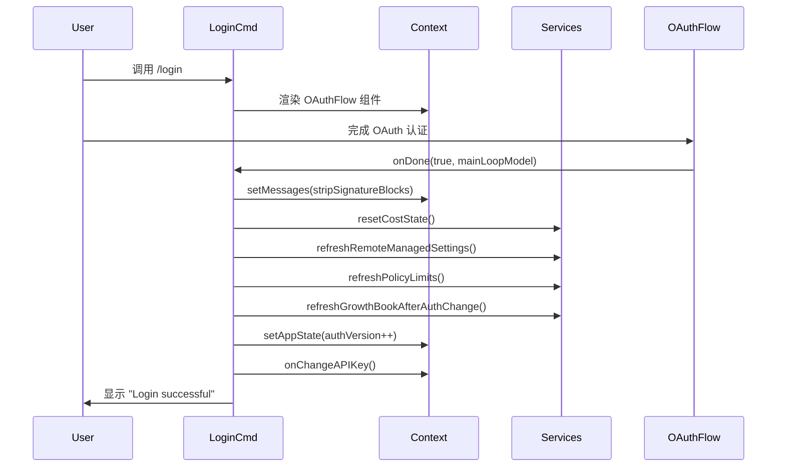
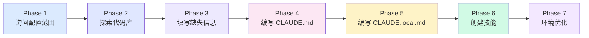
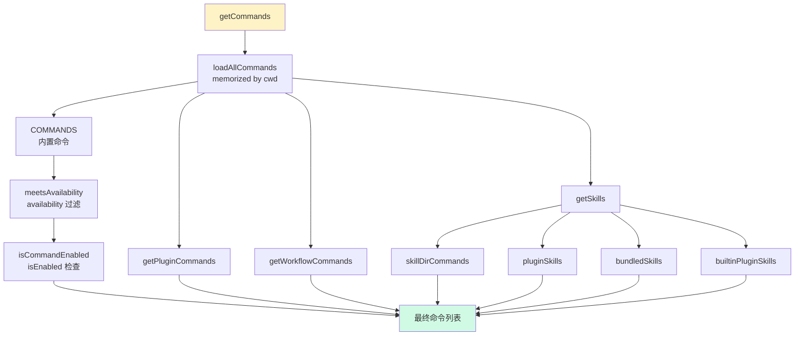
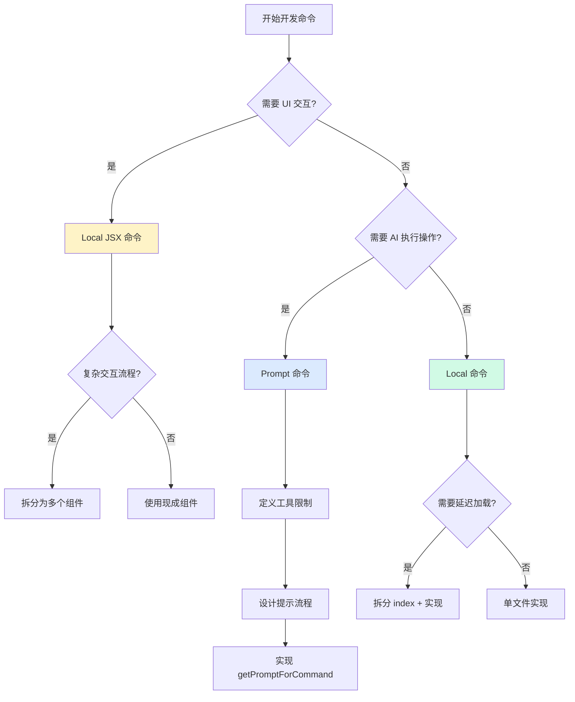

本文深入分析 Claude Code 中常用命令的实现机制、架构模式与最佳实践，帮助开发者理解命令系统的设计原理并掌握自定义命令开发的核心技巧。命令系统采用类型驱动的架构设计，通过三种核心命令类型（`local`、`local-jsx`、`prompt`）支持不同场景的需求，结合延迟加载、上下文注入、特性开关等机制构建了灵活而强大的命令框架。

## 命令类型系统架构

Claude Code 的命令系统建立在 TypeScript 类型系统之上，通过联合类型定义三种命令类型，每种类型对应不同的使用场景和实现模式。命令类型定义采用可辨识联合（Discriminated Union）模式，通过 `type` 字段在运行时区分命令类型。

### 命令类型定义与继承关系

命令系统的基础架构从 `CommandBase` 开始，该接口定义了所有命令共有的属性：名称、描述、启用状态、可见性、参数提示等。三种具体命令类型（`PromptCommand`、`LocalCommand`、`LocalJSXCommand`）通过类型联合构成最终的 `Command` 类型。这种设计既保证了类型安全，又为不同实现路径提供了清晰的契约。

**命令类型系统架构图**：


Sources: [command.ts](src/types/command.ts#L175-L217)

## Local 命令：简单文本返回模式

Local 命令是最简洁的命令类型，适用于快速返回文本信息、执行简单操作的场景。这类命令不涉及复杂 UI 渲染，通过异步函数返回结构化的文本结果。

### 典型实现模式：cost 命令

`cost` 命令展示了 Local 命令的标准实现：定义 `call` 函数接收参数和上下文，返回包含 `type` 和 `value` 的对象。命令通过 `isClaudeAISubscriber()` 检查用户订阅状态，根据不同状态返回相应的计费信息。命令定义采用 `satisfies Command` 确保类型安全，`load` 函数返回包含 `call` 方法的模块对象。

**cost 命令实现**：
```typescript
export const call: LocalCommandCall = async () => {
  if (isClaudeAISubscriber()) {
    let value: string
    if (currentLimits.isUsingOverage) {
      value = 'You are currently using your overages...'
    } else {
      value = 'You are currently using your subscription...'
    }
    return { type: 'text', value }
  }
  return { type: 'text', value: formatTotalCost() }
}
```

Sources: [cost.ts](src/commands/cost/cost.ts#L1-L25)

### 延迟加载机制

所有命令都采用延迟加载策略，`load` 函数返回 Promise，在实际调用时才加载实现模块。这种设计显著减少了启动时间，因为重型依赖只在命令被调用时才加载。`clear` 命令的实现展示了这一模式：`index.ts` 只定义元数据，`clear.ts` 包含实际实现，通过 `load: () => import('./clear.js')` 实现按需加载。

**clear 命令的延迟加载结构**：
```typescript
// index.ts - 仅元数据
const clear = {
  type: 'local',
  name: 'clear',
  description: 'Clear conversation history and free up context',
  load: () => import('./clear.js'),
} satisfies Command

// clear.ts - 实际实现
export const call: LocalCommandCall = async (_, context) => {
  await clearConversation(context)
  return { type: 'text', value: '' }
}
```

Sources: [index.ts](src/commands/clear/index.ts#L1-L20), [clear.ts](src/commands/clear/clear.ts#L1-L8)

### 带参数的命令：advisor 命令

`advisor` 命令展示了如何处理命令参数和状态管理。命令通过 `args` 参数接收用户输入，使用 `parseUserSpecifiedModel` 和 `validateModel` 进行模型验证，通过 `context.getAppState()` 和 `context.setAppState()` 管理应用状态。命令还演示了 `isEnabled` 和 `isHidden` 的动态计算，根据 `canUserConfigureAdvisor()` 的结果决定命令可见性。

**advisor 命令的参数处理**：
```typescript
const call: LocalCommandCall = async (args, context) => {
  const arg = args.trim().toLowerCase()
  const baseModel = parseUserSpecifiedModel(
    context.getAppState().mainLoopModel ?? getDefaultMainLoopModelSetting(),
  )
  
  if (arg === 'unset' || arg === 'off') {
    context.setAppState(s => ({ ...s, advisorModel: undefined }))
    updateSettingsForSource('userSettings', { advisorModel: undefined })
    return { type: 'text', value: 'Advisor disabled.' }
  }
  // ... 验证和设置逻辑
}
```

Sources: [advisor.ts](src/commands/advisor.ts#L1-L110)

## Local JSX 命令：UI 组件渲染模式

Local JSX 命令用于需要复杂交互界面的场景，通过 React 组件构建终端 UI，提供丰富的用户体验。这类命令返回 React 组件树，通过 `onDone` 回调通知命令完成。

### 标准组件封装：config 与 status 命令

`config` 和 `status` 命令展示了最简单的 JSX 命令模式：直接渲染现成的设置组件，通过 `defaultTab` 参数区分不同视图。命令实现非常简洁，只需返回对应的 React 组件并传递 `onDone` 回调。这种模式体现了命令系统的高度可组合性——命令只是 UI 组件的入口点，实际 UI 逻辑由独立组件实现。

**config 命令的简洁实现**：
```typescript
export const call: LocalJSXCommandCall = async (onDone, context) => {
  return <Settings onClose={onDone} context={context} defaultTab="Config" />;
};
```

Sources: [config.tsx](src/commands/config/config.tsx#L1-L7), [status.tsx](src/commands/status/status.tsx#L1-L8)

### 复杂交互流程：login 命令

`login` 命令展示了包含业务逻辑和状态更新的 JSX 命令实现。命令在 `call` 函数中定义完整的登录后处理流程：清除签名块、重置成本状态、刷新远程管理设置、更新特性开关、注册可信设备等。通过 `context.setMessages` 和 `context.setAppState` 更新应用状态，`onChangeAPIKey` 触发 API 密钥变更通知。

**login 命令的状态管理流程**：


Sources: [login.tsx](src/commands/login/login.tsx#L1-L104)

### 模型选择器：model 命令

`model` 命令展示了更复杂的 UI 交互和状态同步逻辑。命令使用 `ModelPicker` 组件提供模型选择界面，在选择处理器中处理模型切换、快速模式状态、额外用量计费等复杂逻辑。通过 `useAppState` 和 `useSetAppState` hooks 访问和更新状态，使用 `logEvent` 记录分析事件。

**model 命令的交互处理**：
```typescript
function handleSelect(model, effort) {
  setAppState(prev => ({
    ...prev,
    mainLoopModel: model,
    mainLoopModelForSession: null
  }));
  
  let message = `Set model to ${chalk.bold(renderModelLabel(model))}`;
  if (isFastModeEnabled() && isFastModeSupportedByModel(model)) {
    message += " · Fast mode ON";
  }
  if (isBilledAsExtraUsage(model)) {
    message += " · Billed as extra usage";
  }
  onDone(message);
}
```

Sources: [model.tsx](src/commands/model/model.tsx#L1-L100)

## Prompt 命令：AI 提示生成模式

Prompt 命令是最强大的命令类型，用于生成发送给 AI 模型的动态提示内容。这类命令在调用时生成提示文本，由系统将提示注入对话上下文，AI 模型随后执行相应操作。

### 项目初始化：init 命令

`init` 命令展示了 Prompt 命令的典型结构：定义 `type: 'prompt'`、`progressMessage`（用户反馈）、`getPromptForCommand` 方法（生成提示）。命令通过多阶段流程引导用户配置项目：询问配置范围、探索代码库、填写缺失信息、编写 CLAUDE.md 文件、创建技能和钩子、优化环境配置。

**init 命令的多阶段提示流程**：


Sources: [init.ts](src/commands/init.ts#L1-L257)

### Git 提交自动化：commit 命令

`commit` 命令展示了如何结合动态内容生成和工具限制。命令通过 `allowedTools` 限制 AI 可用的工具集（仅允许 git 相关命令），在提示中嵌入 Shell 命令执行（`!git status`），使用 HEREDOC 语法生成规范的提交消息。`getPromptForCommand` 方法调用 `executeShellCommandsInPrompt` 在运行时解析提示中的 Shell 命令。

**commit 命令的工具限制与动态内容**：
```typescript
const ALLOWED_TOOLS = [
  'Bash(git add:*)',
  'Bash(git status:*)',
  'Bash(git commit:*)',
]

async getPromptForCommand(_args, context) {
  const promptContent = getPromptContent()
  const finalContent = await executeShellCommandsInPrompt(
    promptContent,
    {
      ...context,
      getAppState() {
        return {
          ...context.getAppState(),
          toolPermissionContext: {
            alwaysAllowRules: { command: ALLOWED_TOOLS }
          }
        }
      }
    },
    '/commit',
  )
  return [{ type: 'text', text: finalContent }]
}
```

Sources: [commit.ts](src/commands/commit.ts#L1-L93)

## 命令注册与聚合机制

命令系统通过中心化的注册机制聚合来自多个源的命令：内置命令、插件命令、技能目录命令、工作流命令等。`commands.ts` 文件作为注册中心，使用 `memoize` 优化命令加载性能。

### 多源命令聚合流程

**命令聚合架构**：


Sources: [commands.ts](src/commands.ts#L449-L500)

### 可用性过滤系统

命令可以通过 `availability` 字段声明所需的认证环境：`'claude-ai'`（Claude AI 订阅用户）或 `'console'`（直接 API 密钥用户）。`meetsAvailabilityRequirement` 函数在每次 `getCommands` 调用时执行，确保认证状态变化后立即生效。这种设计将静态的可用性声明与动态的功能开关（`isEnabled`）分离，提供了细粒度的命令访问控制。

**可用性检查逻辑**：
```typescript
export function meetsAvailabilityRequirement(cmd: Command): boolean {
  if (!cmd.availability) return true
  for (const a of cmd.availability) {
    switch (a) {
      case 'claude-ai':
        if (isClaudeAISubscriber()) return true
        break
      case 'console':
        if (!isClaudeAISubscriber() && 
            !isUsing3PServices() && 
            isFirstPartyAnthropicBaseUrl())
          return true
        break
    }
  }
  return false
}
```

Sources: [commands.ts](src/commands.ts#L417-L443)

## 上下文注入与状态管理

所有命令都通过上下文参数访问应用状态和服务，这种依赖注入模式使命令实现更加清晰和可测试。上下文对象包含 `getAppState`、`setAppState`、`setMessages`、`onChangeAPIKey` 等方法，以及各种配置选项。

### LocalJSXCommandContext 结构

Local JSX 命令的上下文扩展了基础 `ToolUseContext`，添加了 UI 相关的方法和选项。`setMessages` 允许命令修改消息列表，`options` 包含动态 MCP 配置、IDE 安装状态、主题等 UI 相关配置，`resume` 方法支持会话恢复功能。

**上下文类型定义**：
```typescript
export type LocalJSXCommandContext = ToolUseContext & {
  canUseTool?: CanUseToolFn
  setMessages: (updater: (prev: Message[]) => Message[]) => void
  options: {
    dynamicMcpConfig?: Record<string, ScopedMcpServerConfig>
    ideInstallationStatus: IDEExtensionInstallationStatus | null
    theme: ThemeName
  }
  onChangeAPIKey: () => void
  onChangeDynamicMcpConfig?: (config) => void
  onInstallIDEExtension?: (ide: IdeType) => void
  resume?: (sessionId, log, entrypoint) => Promise<void>
}
```

Sources: [command.ts](src/types/command.ts#L80-L98)

### 状态更新模式

命令通过函数式更新修改应用状态，确保状态变更的可预测性和可追溯性。`setAppState` 接收更新函数，可以访问前一个状态并返回新状态。这种模式避免了直接状态突变，支持状态变更的批处理和优化。

**状态更新的函数式模式**：
```typescript
context.setAppState(prev => ({
  ...prev,
  authVersion: prev.authVersion + 1
}))
```

## 命令完成回调机制

Local JSX 命令通过 `onDone` 回调通知系统命令执行完成，回调支持多种显示模式和后续操作。`onDone` 的第二个参数可以指定消息显示方式（`'skip'`、`'system'`、`'user'`）、是否触发查询、添加元消息、设置下一个输入等。

### 回调选项详解

**onDone 回调签名**：
```typescript
type LocalJSXCommandOnDone = (
  result?: string,
  options?: {
    display?: 'skip' | 'system' | 'user'  // 默认 'user'
    shouldQuery?: boolean                  // 是否发送给模型
    metaMessages?: string[]                // 元消息
    nextInput?: string                     // 下一个输入
    submitNextInput?: boolean              // 是否自动提交
  }
) => void
```

Sources: [command.ts](src/types/command.ts#L117-L126)

### 实际应用示例

`brief` 命令展示了如何使用不同的显示模式：当用户无权使用 brief 功能时，使用 `display: 'system'` 显示系统消息；成功切换时使用默认的 `'user'` 模式显示用户可见消息。`login` 命令在登录成功后显示简单文本结果，系统自动以用户消息形式展示。

**brief 命令的回调使用**：
```typescript
if (newState && !isBriefEntitled()) {
  onDone('Brief tool is not enabled for your account', {
    display: 'system',
  })
  return null
}

onDone(`Set model to ${chalk.bold(model)}`)
```

Sources: [brief.ts](src/commands/brief.ts#L1-L100)

## 特性开关与条件注册

命令系统支持多种条件注册机制，确保命令只在合适的环境中显示和启用。通过 `isEnabled` 函数、`isHidden` 属性、`availability` 数组、feature flags 等机制，实现了灵活的命令可见性控制。

### 特性标志集成

命令通过 `bun:bundle` 的 `feature` 函数检查特性标志，决定命令是否可用。这种机制允许运行时动态启用或禁用功能，支持灰度发布和 A/B 测试。`brief` 命令结合特性标志和 GrowthBook 配置，通过 `getBriefConfig().enable_slash_command` 判断是否启用命令。

**特性标志检查模式**：
```typescript
const brief = {
  type: 'local-jsx',
  name: 'brief',
  isEnabled: () => {
    if (feature('KAIROS') || feature('KAIROS_BRIEF')) {
      return getBriefConfig().enable_slash_command
    }
    return false
  },
  // ...
}
```

Sources: [brief.ts](src/commands/brief.ts#L47-L56)

### 条件导入与代码消除

`commands.ts` 使用条件导入实现代码消除，未启用的功能不会打包进最终产物。通过 `require()` 动态导入和 `feature()` 检查组合，确保只有需要的代码才被加载。`immediate` 属性标记立即执行的命令，这类命令绕过队列直接执行。

**条件导入示例**：
```typescript
const voiceCommand = feature('VOICE_MODE')
  ? require('./commands/voice/index.js').default
  : null
```

Sources: [commands.ts](src/commands.ts#L60-L123)

## 实现最佳实践

基于对现有命令的分析，总结出以下最佳实践指导自定义命令开发。

### 命令类型选择决策树

**命令类型选择流程**：


### 代码组织建议

| 命令复杂度 | 文件组织 | 加载策略 | 示例 |
|-----------|---------|---------|------|
| 简单（<50 行） | 单文件 | 直接返回 | `version.ts` |
| 中等（50-200 行） | index + 实现 | 延迟导入 | `clear/` |
| 复杂（>200 行） | 目录 + 多文件 | 分模块延迟 | `init-verifiers.ts` |
| UI 交互 | 目录 + 组件 | 组件延迟 | `plugin/` |

### 状态管理准则

1. **使用函数式更新**：通过 `prev => newState` 模式更新状态，避免直接突变
2. **最小化状态访问**：只获取必要的状态片段，减少不必要的渲染
3. **批量状态更新**：多个相关状态变更合并为单次 `setAppState` 调用
4. **清理副作用**：在命令完成时清理定时器、订阅等资源

### 错误处理模式

命令实现应优雅处理错误，避免未捕获的异常导致应用崩溃。对于预期内的错误（如验证失败、权限不足），返回用户友好的文本消息；对于意外错误，记录日志并显示通用错误提示。

**错误处理最佳实践**：
```typescript
export const call: LocalCommandCall = async (args, context) => {
  try {
    const result = await riskyOperation(args)
    return { type: 'text', value: result }
  } catch (error) {
    logError(toError(error))
    return { 
      type: 'text', 
      value: 'Operation failed. Please try again.' 
    }
  }
}
```

Sources: [commands.ts](src/commands.ts#L360-L397)

## 扩展阅读与后续探索

命令系统与多个核心模块紧密协作，建议继续探索以下主题以获得更深入的理解：

- **命令注册与路由机制**：深入了解命令如何被解析、匹配和调用的完整流程
- **技能系统与插件架构**：学习如何通过技能和插件扩展命令系统
- **工具系统设计与编排**：理解 Prompt 命令中工具限制的实现机制
- **应用状态管理架构**：掌握状态管理模式和最佳实践

这些主题共同构成了 Claude Code 强大而灵活的命令系统基础，为开发者提供了丰富的定制和扩展能力。