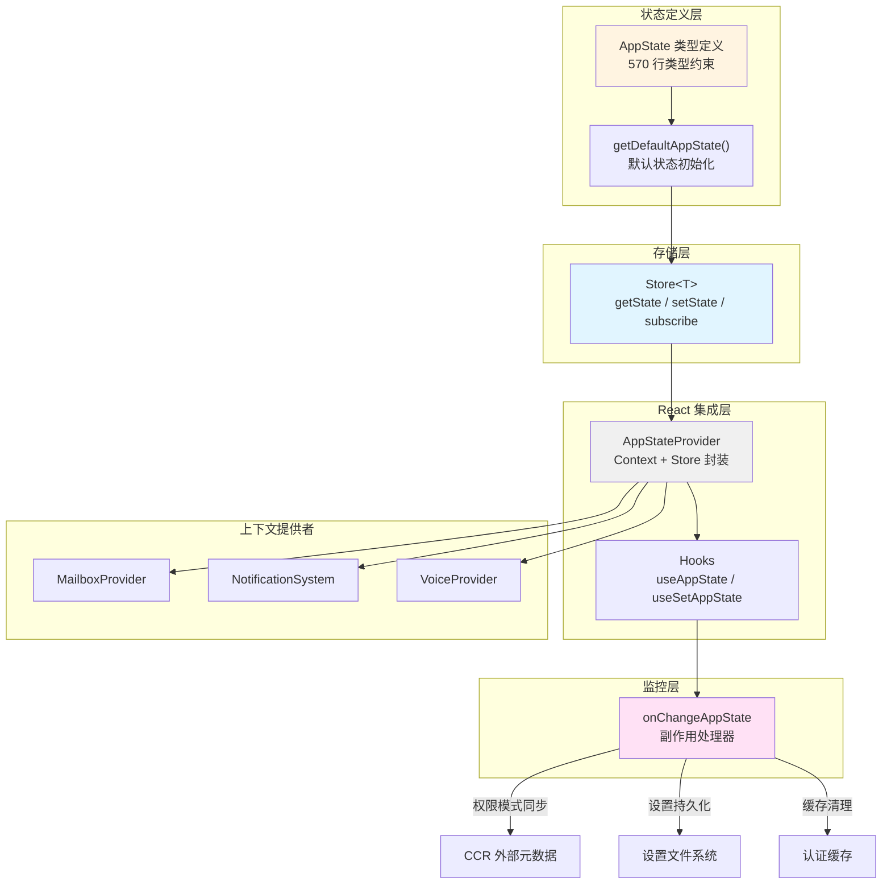

Claude Code 的状态管理架构采用**单一数据流**设计范式，通过不可变状态树与响应式订阅机制构建了高度可预测的状态演化系统。整个架构由核心 Store 实现、React 集成层、状态变更监控器三大支柱构成，在保证类型安全的前提下实现了细粒度的组件更新控制。

## 核心设计理念

应用状态管理遵循 **最小化抽象原则** —— Store 实现仅 34 行代码，提供 `getState`、`setState`、`subscribe` 三个核心方法。这种克制的设计使得状态演化路径完全透明，避免了 Redux 式的样板代码负担。所有状态更新通过不可变模式实现，利用 `Object.is` 进行变更检测，确保只有在状态真实变化时才触发组件重新渲染。这种设计消除了不必要的渲染周期，在包含数百个子任务的并发场景下仍能保持流畅的用户交互体验。

状态架构的设计哲学体现在三个关键决策：首先，**单一状态树** 将所有应用状态集中管理，包括任务列表、权限上下文、MCP 连接、插件系统、团队协作、通知队列等 50 余个顶级字段，这种中心化管理使得跨模块的状态共享变得自然且高效；其次，**选择性订阅机制** 通过 `useAppState(selector)` 允许组件仅订阅其关心的状态切片，而非整个状态树，配合 React Compiler 的记忆化优化，实现了组件级别的精确更新控制；最后，**副作用集中管理** 通过 `onChangeAppState` 回调将状态变更的副作用（如权限模式同步、设置持久化、缓存清理）统一收敛，避免了副作用逻辑分散在各处的维护难题。

Sources: [store.ts](src/state/store.ts#L1-L34), [AppStateStore.ts](src/state/AppStateStore.ts#L89-L452), [AppState.tsx](src/state/AppState.tsx#L142-L162), [onChangeAppState.ts](src/state/onChangeAppState.ts#L43-L171)

## 架构层次与数据流

状态管理系统分为四个清晰的层次：**存储层**（Store）负责状态的持有与通知机制，是最底层的抽象；**状态定义层**（AppState）通过 TypeScript 类型系统约束状态结构，并提供默认值初始化；**React 集成层**（AppStateProvider + Hooks）将 Store 适配为 React 的响应式系统；**监控层**（onChangeAppState）拦截所有状态变更并执行副作用。这种分层设计使得每一层都可以独立测试和替换，同时保持了整体架构的简洁性。

Sources: [AppStateStore.ts](src/state/AppStateStore.ts#L456-L569), [AppState.tsx](src/state/AppState.tsx#L37-L110), [onChangeAppState.ts](src/state/onChangeAppState.ts#L65-L92)

## 核心存储实现

Store 的实现体现了 **函数式编程** 的纯粹性 —— 它不关心具体的状态类型，通过泛型 `Store<T>` 提供类型安全的抽象。`setState` 接受一个更新函数 `(prev: T) => T`，这种设计强制了不可变更新模式：调用者必须返回一个新的状态对象，而非修改现有状态。变更检测通过 `Object.is(next, prev)` 实现，只有当新状态与旧状态在引用上不同时，才会通知监听器。这种机制与 React 的 `useSyncExternalStore` 完美契合，确保了只有在状态真实变化时才触发组件更新。

监听器管理采用 `Set` 数据结构，提供了 `O(1)` 的添加和删除复杂度。`subscribe` 返回一个取消订阅函数，这种设计使得 React 的 `useEffect` 可以自然地管理订阅生命周期：`useEffect(() => subscribe(listener), [subscribe])`。Store 还支持可选的 `onChange` 回调，该回调在状态变更后、监听器通知前执行，适合执行日志记录、遥测上报等观察性逻辑，而不会干扰正常的响应式更新流程。

Sources: [store.ts](src/state/store.ts#L10-L34)

## AppState 状态结构

AppState 的类型定义是一个**高度结构化**的不可变对象，通过 `DeepImmutable` 包装器递归地冻结所有嵌套属性，在类型层面保证了状态的不可变性。状态结构设计遵循 **领域驱动设计** 的思想，将相关状态聚合为逻辑内聚的子对象，如 `mcp` 包含 MCP 服务器连接、工具、命令和资源，`plugins` 管理插件的启用列表、禁用列表、命令和安装状态，`teamContext` 存储团队协作的上下文信息。

状态结构可以划分为几个核心领域：**会话状态**（settings、verbose、mainLoopModel、statusLineText）控制当前会话的配置和显示状态；**任务管理**（tasks、agentNameRegistry、foregroundedTaskId、viewingAgentTaskId）管理并发任务的执行和视图切换；**工具与权限**（toolPermissionContext、mcp、plugins）控制工具调用权限和扩展系统；**远程与桥接**（replBridge*、remote*）处理远程会话和 Bridge 模式的连接状态；**团队协作**（teamContext、teammates、inbox）支持多智能体协作和消息路由；**通知与提示**（notifications、promptSuggestion、speculation）管理用户交互的反馈和预测性建议。

| 状态领域 | 关键字段 | 用途说明 |
|---------|---------|---------|
| **会话配置** | settings, mainLoopModel, verbose | 用户设置、模型选择、详细模式开关 |
| **任务管理** | tasks, foregroundedTaskId, viewingAgentTaskId | 任务字典、前台任务、查看的任务 |
| **工具权限** | toolPermissionContext, mcp, plugins | 权限模式、MCP 连接、插件状态 |
| **远程连接** | replBridgeEnabled, replBridgeConnected, remoteSessionUrl | Bridge 开关、连接状态、会话 URL |
| **团队协作** | teamContext, teammates, inbox | 团队上下文、队友信息、消息收件箱 |
| **通知系统** | notifications, promptSuggestion | 通知队列、提示建议 |
| **投机执行** | speculation, speculationSessionTimeSavedMs | 投机状态、节省时间累计 |

Sources: [AppStateStore.ts](src/state/AppStateStore.ts#L89-L399), [AppStateStore.ts](src/state/AppStateStore.ts#L456-L569)

## React 集成模式

React 集成通过 **AppStateProvider** 组件和自定义 Hooks 实现，采用了 React 18 的 `useSyncExternalStore` API 来桥接 Store 的订阅机制与 React 的渲染周期。`AppStateProvider` 在组件树顶层创建 Store 实例，通过 Context API 向下传递，同时嵌套了 `MailboxProvider` 和 `VoiceProvider` 等子上下文提供者。这种嵌套结构确保了状态管理的完整性：所有子组件都能通过 Hooks 访问状态，同时也能通过专门的 Context 获取服务对象（如 Mailbox 实例）。

`useAppState(selector)` 是最核心的 Hook，它接受一个选择器函数，仅订阅状态的一个切片。选择器的正确使用对性能至关重要：应该返回一个已存在的对象引用，而非每次调用都创建新对象。例如 `useAppState(s => s.promptSuggestion)` 是正确的用法，它返回状态中已存在的 `promptSuggestion` 对象；而 `useAppState(s => ({ text: s.text, id: s.id }))` 是反模式，因为每次调用都创建新对象，导致 `Object.is` 检测失败并触发不必要的重渲染。对于需要修改状态的场景，`useSetAppState()` 返回 `setState` 函数的稳定引用，组件使用此 Hook 不会因为状态变更而重渲染。

Sources: [AppState.tsx](src/state/AppState.tsx#L37-L110), [AppState.tsx](src/state/AppState.tsx#L142-L172), [App.tsx](src/components/App.tsx#L19-L55)

## 状态变更监控与副作用管理

`onChangeAppState` 实现了 **集中式副作用管理**，将所有需要响应状态变更的逻辑收敛到一个函数中。这种设计避免了副作用逻辑分散在各处导致的维护困难和竞态条件。监控器主要处理三类副作用：**外部系统同步**（权限模式变更同步到 CCR 外部元数据，通知 SDK 状态流），**持久化操作**（模型选择写入设置文件，展开视图状态写入全局配置），**缓存清理**（设置变更时清空 API Key、AWS/GCP 凭证的内存缓存，环境变量重新应用）。

权限模式的同步逻辑尤为关键，它需要处理内部模式名称到外部模式名称的映射。内部模式包括 `default`、`plan`、`bubble`、`ungated_auto` 等，而外部模式（CCR 和 SDK 可见的）只有 `default`、`plan`、`auto`。监控器通过 `toExternalPermissionMode` 函数进行映射，只有当外部模式真正变化时才通知 CCR，避免了无意义的网络请求。对于 Ultraplan 模式，首次进入 plan 模式时会原子性地设置 `isUltraplanMode` 标志，该标志通过 `onChangeAppState` 推送到 CCR 的外部元数据中。

Sources: [onChangeAppState.ts](src/state/onChangeAppState.ts#L43-L171), [onChangeAppState.ts](src/state/onChangeAppState.ts#L65-L92)

## 选择器模式与派生状态

选择器模式用于从 AppState 中计算派生状态，遵循 **纯函数原则** —— 不产生副作用，不修改输入，相同输入总是返回相同输出。`selectors.ts` 提供了两个核心选择器：`getViewedTeammateTask` 获取当前正在查看的队友任务，处理了所有边缘情况（ID 不存在、任务类型不匹配等）；`getActiveAgentForInput` 确定用户输入应该路由到哪个智能体，返回一个判别联合类型 `{ type: 'leader' } | { type: 'viewed', task } | { type: 'named_agent', task }`，使得调用方可以通过类型守卫安全地处理不同场景。

选择器的设计强调 **类型安全导航**。例如 `getActiveAgentForInput` 的返回类型不仅包含了智能体信息，还通过 `type` 字段区分了三种不同的场景，使得调用方可以用 `switch` 或 `if` 语句进行穷举式处理，TypeScript 编译器会检查是否覆盖了所有可能的情况。这种模式消除了运行时类型检查的需要，将错误提前到编译期捕获。选择器还支持 **部分状态提取**，如 `getViewedTeammateTask` 的参数类型是 `Pick<AppState, 'viewingAgentTaskId' | 'tasks'>`，表明它只依赖这两个字段，便于测试和优化。

Sources: [selectors.ts](src/state/selectors.ts#L1-L77)

## 状态转换辅助函数

`teammateViewHelpers.ts` 提供了 **状态转换函数**，封装了常见的状态修改模式，使得复杂的 UI 交互逻辑可以以声明式的方式表达。`enterTeammateView(taskId, setAppState)` 将 UI 切换到查看特定队友的转录视图，它会自动处理之前的观看状态（释放之前查看的任务），设置 `retain: true` 以防止任务被驱逐，清除 `evictAfter` 以保持任务活跃。`exitTeammateView(setAppState)` 退出队友视图返回主视图，释放任务资源并可能设置驱逐延迟。`stopOrDismissAgent(taskId, setAppState)` 根据任务状态执行不同操作：运行中的任务会被中止，已完成的任务会被标记为立即驱逐（`evictAfter: 0`），如果正在查看被驱逐的任务，也会自动退出视图。

这些辅助函数体现了 **命令模式** 的思想：每个函数封装了一个完整的状态修改操作，调用方无需关心具体的状态结构细节。例如 `enterTeammateView` 内部需要处理 `viewingAgentTaskId`、`viewSelectionMode`、`tasks` 三个字段的协调更新，如果手动调用 `setAppState` 很容易遗漏某个字段或引入不一致状态。辅助函数还内置了 **幂等性保护**，如果状态已经是目标状态，函数会直接返回原状态（`if (!needsRetain && !needsView && !switching) return prev`），避免不必要的重新渲染。

Sources: [teammateViewHelpers.ts](src/state/teammateViewHelpers.ts#L46-L141)

## Context 提供者集成

除了核心的 AppState 管理，系统还通过独立的 Context 提供者管理 **服务对象** 和 **UI 状态**。`MailboxProvider` 提供消息路由服务，允许组件发送和接收消息而不依赖全局状态；`NotificationSystem` 通过 `useNotifications` Hook 提供通知管理能力，支持优先级队列、自动过期、通知合并等功能；`VoiceProvider` 管理语音模式的状态和服务。这些 Context 与 AppStateProvider 形成互补：AppState 管理数据状态（需要序列化、持久化、跨组件共享），Context 管理服务对象和瞬时状态（不需要持久化、生命周期与组件树绑定）。

Notification 系统展示了 **队列化状态管理** 的复杂模式。通知有四个优先级：`low`、`medium`、`high`、`immediate`，其中 `immediate` 会立即显示并清除当前正在显示的通知。通知支持 `invalidates` 字段，可以声明当前通知应该清除哪些其他通知。通知还支持 `fold` 函数，实现类似 `Array.reduce` 的合并逻辑，例如多个相同类型的错误可以合并为一个汇总通知。Notification 系统通过 AppState 的 `notifications.current` 和 `notifications.queue` 字段存储状态，通过 `setTimeout` 实现自动过期，并确保在组件卸载时清理定时器。

Sources: [mailbox.tsx](src/context/mailbox.tsx#L8-L37), [notifications.tsx](src/context/notifications.tsx#L38-L100), [AppState.tsx](src/state/AppState.tsx#L94-L110)

## Bootstrap 状态与全局配置

Bootstrap 状态（`bootstrap/state.ts`）管理 **进程级别的全局状态**，这些状态的生命周期与进程相同，不需要通过 React 的状态管理系统。Bootstrap 状态包括：遥测配置（meter、loggerProvider、tracerProvider），性能统计（totalCostUSD、modelUsage、startTime），会话标识（sessionId、parentSessionId），智能体颜色映射（agentColorMap），插件管理（inlinePlugins、registeredHooks），以及各种会话级标志（sessionBypassPermissionsMode、scheduledTasksEnabled、sessionCreatedTeams 等）。

Bootstrap 状态与 AppState 的分工遵循 **作用域原则**：Bootstrap 状态是进程全局的，在进程启动时初始化，在进程退出时销毁，适合存储遥测数据、性能统计、会话标识等；AppState 是 React 组件树级别的，在 `AppStateProvider` 挂载时创建，在卸载时销毁，适合存储 UI 状态、任务列表、用户设置等。Bootstrap 状态通过 `createSignal` 实现响应式更新，允许非 React 代码订阅状态变更。两者之间通过同步函数桥接，例如 `mainLoopModelOverride` 的变更会同步到 AppState 的 `mainLoopModel` 字段。

Sources: [bootstrap/state.ts](src/bootstrap/state.ts#L45-L200)

## 最佳实践与架构模式

状态管理架构的成功依赖于几个关键实践：**选择器优化** 是性能的基石，应该始终返回状态中已存在的对象引用，避免在 `useAppState` 的选择器中创建新对象；**副作用隔离** 保证了可预测性，所有状态变更的副作用都应该通过 `onChangeAppState` 集中管理，避免在组件或业务逻辑中直接执行副作用；**类型安全导航** 消除了运行时错误，通过 TypeScript 的类型系统确保状态访问的正确性，使用判别联合类型和类型守卫处理复杂的状态分支；**不可变更新** 是架构约束，所有状态更新必须通过 `setState(prev => newState)` 模式，严禁直接修改状态对象。

对于状态结构的设计，应该遵循 **扁平化原则**：尽量减少状态树的深度，避免过度嵌套导致的更新路径复杂化。例如 `tasks` 是一个扁平的字典 `{ [taskId: string]: TaskState }`，而非嵌套的任务树结构。对于相关联的状态，可以聚合为一个子对象，但要确保该子对象是一个**语义完整的整体**，如 `mcp` 对象包含 MCP 相关的所有状态，修改任何一个字段都应该替换整个 `mcp` 对象。对于需要跨组件共享但不需要持久化的状态，使用 Context 而非 AppState，如 `Mailbox` 实例、`FpsMetrics` 提供者等。

Sources: [AppState.tsx](src/state/AppState.tsx#L126-L141), [onChangeAppState.ts](src/state/onChangeAppState.ts#L50-L64), [selectors.ts](src/state/selectors.ts#L59-L76)

## 与其他系统的集成

应用状态管理与系统的其他核心模块紧密集成：**查询引擎** 通过 AppState 获取模型设置、权限上下文、任务状态，并通过 `useSetAppState` 更新任务状态和消息；**工具系统** 从 AppState 读取工具权限上下文、MCP 工具列表、插件命令，并将工具执行结果写回状态；**命令系统** 可以通过 `useSetAppState` 修改任何状态字段，实现命令驱动的状态转换；**MCP 集成** 将服务器连接状态、工具、命令、资源同步到 AppState，并通过 `pluginReconnectKey` 触发重新连接；**远程会话** 通过一系列 `replBridge*` 状态字段管理 Bridge 模式的连接状态和权限回调。

这种广泛集成带来了 **状态一致性** 的保证：所有模块通过统一的接口访问和修改状态，避免了状态分散导致的不一致问题。例如，权限模式的变更通过 `toolPermissionContext.mode` 统一管理，查询引擎、工具系统、命令系统、MCP 集成都从同一来源读取权限模式，确保了整个系统的权限判断一致性。同时，状态变更的副作用（如同步到 CCR、持久化到设置文件）自动触发，无需各模块手动处理，降低了出错风险。

Sources: [App.tsx](src/components/App.tsx#L1-L55), [main.tsx](src/main.tsx#L87-L92), [AppStateStore.ts](src/state/AppStateStore.ts#L158-L216)

## 架构演进与未来方向

当前的状态管理架构已经相当成熟，但仍有一些演进方向值得探索：**状态切片模块化** 可以进一步拆分庞大的 AppState 类型定义，将每个领域（如 MCP、团队协作、远程连接）的状态定义独立为模块，通过类型组合构建完整的 AppState，这样可以提高代码的可维护性和可测试性；**选择器性能优化** 可以引入 memoization 机制，缓存选择器的计算结果，对于复杂的选择器（如遍历整个任务列表）可以显著提升性能；**状态快照与时光旅行** 可以在 Store 层面增加快照能力，支持调试时回滚到之前的状态，这对于理解复杂的状态变更序列非常有帮助。

另一个重要方向是 **状态迁移工具**，随着应用的发展，状态结构会发生变化（如字段重命名、类型变更、结构重组），需要一套工具来管理状态迁移，确保用户升级后旧的序列化状态能够正确迁移到新结构。当前系统通过 migrations 目录下的迁移脚本处理设置迁移，未来可以扩展到整个 AppState 的迁移。**离线状态管理** 也是一个潜在方向，当前的 Bridge 模式已经实现了部分离线能力（通过 `replBridgeReconnecting` 状态处理连接断开），未来可以进一步增强离线场景下的状态管理能力，如本地缓存、冲突解决、同步策略等。